
 

# 
COURSE PROJECT

    <strong>Universidad Peruana de Ciencias Aplicadas</strong> 
    </img> 
    <strong>Ingeniería de Software - 2024-1</strong> 
    <strong>Desarrollo de Aplicaiones Open Source - WX56</strong> 
    <strong>Profesor: Mori Paiva, Hugo Allan</strong> 
     INFORME DE TRABAJO FINAL - TB2

    <strong>Producto:Wanderlog</strong>

    <h3>Team Members:</h3>
    <table align="center">
        <tr>
            <th style="text-align:center;">Member</th>
            <th style="text-align:center;">Code</th>
        </tr>
        <tr>
            <td>Cortés Casas, Joaquin Marcelo</td>
            <td>U202114545</td>
        </tr>
        <tr>
            <td>Diaz Silva, Fernando Josué</td>
            <td>U202112722</td>
        </tr>
        <tr>
            <td>Castilla Pachas Cesar Antonio</td>
            <td>U202218735</td>
        </tr>
        <tr>
            <td>Medina Chocce Karito Dianeth</td>
            <td>U20221C769</td>
        </tr>
    </table>

    <strong>Junio, 2024</strong>

 

<h1 align="center">Registro de versiones del Informe</h1>
 
<table>
        <thead>
            <tr>
                <th>Versión</th>
                <th>Fecha</th>
                <th>Autor</th>
                <th>Descripción de modificaciones</th>
            </tr>
        </thead>
        <tbody>
            <tr>
                <th>TB1</th>
                <td>04/04/2024</td>
                <td>Cortés Casas Joaquin Marcelo, Diaz Silva Fernando Josué, Cesar Castilla Pachas, Medina Chocce Karito Dianeth.</td>
                <td>Adición de la sección y documentación del Sprint 1   
                Adición de la estructura esencial del informe, incluyendo su documentación, de los siguientes componentes:
                   - La carátula.
                  - El registro de versiones.
                  - La tabla de contenidos.
                  - La tabla de Student Outcomes.
                  - Capítulo I: Introducción.
                  - Capítulo II: Requirements Elicitation & Analysis.
                  - Capítulo III: Requirements Specification.
                  - Capítulo IV: Product Design.
                  - Capítulo V: Product Implementation, Validation & Deployment.
                  - El Sprint 1.
                  - Las conclusiones y recomendaciones.
                  - La bibliografía.
                  - Los anexos.</td>
            </tr>
            <tr>                
                <th>TP</th>
                <td>02/05/2024</td>
                <td>Cortés Casas Joaquin Marcelo, Diaz Silva Fernando Josué, Cesar Castilla Pachas, Medina Chocce Karito Dianeth.</td>
                <td>Adición de la sección y documentación del Sprint 3.
                 A producto de la autocrítica del equipo y la retroalimentación recibida del docente: 
                   - Mejora del componente “Registro de Versiones del Informe” para ser más descriptivo en el contenido realizado en cada versión del informe.
                  - Mejora del componente “Student Outcome” para mejorar el nivel de detalle relacionado a la participación de los integrantes del grupo en cada versión del informe.
                  - Mejora de la sección 4.6
                  - Mejora de la sección 4.7
                  - Mejora de la sección 4.8
                  - Mejoras de la sección  5.2.1. Sprint 1,
                  - Mejoras de la sección  5.2.2. Sprint 2, 
                  - Mejora del componente “Conclusiones”, agregando nuevas conclusiones y recomendaciones.
                  - Mejora del componente “Bibliografía”
                  - Mejora del componente “Anexos”</td>
            </tr>
            <tr>
                <th>TB2</th>
                <td>07/06/2024</td>
                <td>Cortés Casas Joaquin Marcelo, Diaz Silva Fernando Josué, Cesar Castilla Pachas, Medina Chocce Karito Dianeth.</td>
                <td></td>
            </tr> 
            <tr>                
                <th>TF</th>
                <td></td>
                <td>Cortés Casas Joaquin Marcelo, Diaz Silva Fernando Josué, Cesar Castilla Pachas, Medina Chocce Karito Dianeth.</td>
                <td></td>
             </tr>  
        </tbody>
</table>

  
<table>
        <thead>
            <tr>
                <th>Criterio específico</th>
                <th>Acciones realizadas</th>
                <th>Conclusiones</th>
            </tr>
        </thead>
        <tbody>
            <tr>
                <td>Participa en equipos multidisciplinarios con eficacia, eficiencia y objetividad, en el marco de un proyecto en soluciones de ingeniería de software</td>
                <td>Cortés Casas, Joaquín Marcelo
                  TB1 
                Ha participado en la investigación de los principales competidores, además del desarrollo de los diagramas C4 y  de base de datos.
                  TP 
                xxx
                  TB2 
                xxx
                   Díaz Silva, Fernando Josué
                  TB1 
                He desarrollado el capítulo 3, Requirements Specification y la documentación del landing page del capítulo 4.
                  TP 
                xxx
                  TB2 
                xxx
                   Castilla Pachas Cesar Antonio
                  TB1 
                He participado en :
                  - Capitulo 1
                  - Landing Page
                  - Web applications
                  TP 
                  - Mejora del Landing Page
                  - Creación del menú principal del aplicativo web
                  TB2 
                xxx
                   Medina Chocce Karito Dianeth
                  TB1 
                He participado haciendo el capítulo 2 y la parte del 4.7
                  TP 
                xxx
                  TB2 
                xxx</td>
                <td>Nos aseguramos de trabajar de forma coordinada y eficaz, avanzando lo más posible en una cantidad de tiempo límite. Para lograrlo, tuvimos que trabajar como equipo y discutir las decisiones importantes de manera organizada y objetiva. Para la realización de este trabajo hemos coordinado satisfactoriamente cada punto de este informe.</td>
            </tr>
            <tr>
                <td>Conoce al menos un sector empresarial o dominio de aplicación de soluciones de software.</td>
                <td>Cortés Casas, Joaquín Marcelo
                  TB1 
                Ha participado en la investigación de los principales competidores, además del desarrollo de los diagramas C4 y  de base de datos.
                  TP 
                xxx
                  TB2 
                xxx
                   Díaz Silva, Fernando Josué
                  TB1 
                He desarrollado el capítulo 3, Requirements Specification y la documentación del landing page del capítulo 4.
                  TP 
                xxx
                  TB2 
                xxx
                   Castilla Pachas Cesar Antonio
                  TB1 
                He participado en :
                  - Capitulo 1
                  - Landing Page
                  - Web applications
                   TP 
                xxx
                  TB2 
                xxx
                   Medina Chocce Karito Dianeth
                  TB1 
                He participado haciendo el capítulo 2 y la parte del 4.7
                  TP 
                xxx
                  TB2 
                xxx</td>
                <td>
                    Nos aseguramos de tener toda la información necesaria para entender el sector empresarial en el que nos vamos a involucrar, y poder usarla correctamente para el desarrollo de nuestra solución. Para hacerlo tuvimos que investigar sobre los problemas del sector, y las herramientas que usamos.</td>
            </tr> 
        </tbody>
</table>

# Índice

- [Capítulo I: Introducción]()
  - [1.1. StartUp Profile](#11-startup-profile)
    - [1.1.1. Descripción de la StartUp](#111-descripción-de-la-startup)
    - [1.1.2. Perfiles de Integrantes del equipo](#112-perfiles-de-integrantes-del-equipo)
  - [1.2. Solution Profile](#12-solution-profile)
    - [1.2.1. Antecedentes y Problemática](#121-antecedentes-y-problemática)
    - [1.2.2. Lean UX Process](#122-lean-ux-process)
      - [1.2.2.1. Lean UX Problem Statements](#1221-lean-ux-problem-statements)
      - [1.2.2.2. Lean UX Assumptions](#1222-lean-ux-assumptions)
      - [1.2.2.3. Lean UX Hyphotesis Statements](#1223-lean-ux-hyphotesis-statements)
      - [1.2.2.4. Lean UX Canvas](#1224-lean-ux-canvas)
  - [1.3. Segmentos objetivo](#13-segmentos-objetivo)
- [Capítulo II: Requirements Elicitation & Analysis]()
  - [2.1. Competidores](#21-competidores)
    - [2.1.1 Análisis competitivo](#211-análisis-competitivo)
    - [2.1.2. Estrategias y tácticas frente a competidores](#212-estrategias-y-tácticas-frente-a-competidores)
  - [2.2. Entrevistas](#22-entrevistas)
    - [2.2.1 Diseño de entrevistas](#221-diseño-de-entrevistas)
    - [2.2.2. Registro de entrevistas](#222-registro-de-entrevistas)
    - [2.2.3. Análisis de entrevistas](#223-análisis-de-entrevistas)
  - [2.3. Needfinding](#23-needfinding)
    - [2.3.1. User Persona](#231-user-persona)
    - [2.3.2. User Task Matrix](#232-user-task-matrix)
    - [2.3.3. User Journey Mapping](#233-user-journey-mapping)
    - [2.3.4. Empathy Mapping](#234-empathy-mapping)
    - [2.3.5. As-is Scenario Mapping](#235-as-is-scenario-mapping)
    - [2.3.6. Ubiquitous Language](#236-ubiquitous-language)
- [Capítulo III: Requirements Specification]()
  - [3.1. To-Be Scenario Mapping](#31-to-be-scenario-mapping)
  - [3.2. User Stories](#32-user-stories)
  - [3.3. Impact Mapping](#33-impact-mapping)
  - [3.4. Product Backlog](#34-product-backlog)
- [Capítulo IV: Product Design]()
  - [4.1. Style Guidelines](#41-style-guidelines)
    - [4.1.1. General Style Guidelines](#411-general-style-guidelines)
    - [4.1.2. Web Style Guidelines](#412-web-style-guidelines)
  - [4.2. Information Architecture](#42-information-architecture)
    - [4.2.1. Organization Systems](#421-organization-systems)
    - [4.2.2. Labeling Systems](#422-labeling-systems)
    - [4.2.3. SEO Tags and Meta Tags](#423-seo-tags-and-meta-tags)
    - [4.2.4. Searching Systems](#424-searching-systems)
    - [4.2.5. Navigation Systems](#425-navigation-systems)
  - [4.3. Landing Page UI Design](#43-landing-page-ui-design)
    - [4.3.1. Landing Page Wireframe](#431-landing-page-wireframe)
    - [4.3.2. Landing Page Mock-up](#432-landing-page-mock-up)
  - [4.4. Web Applications UX/UI Design](#44-web-applications-uxui-design)
    - [4.4.1. Web Applications Wireframes](#441-web-applications-wireframes)
    - [4.4.2. Web Applications Wireflow Diagrams](#442-web-applications-wireflow-diagrams)
    - [4.4.3. Web Applications Mock-ups](#443-web-applications-mock-ups)
    - [4.4.4. Web Applications User Flow Diagrams](#444-web-applications-user-flow-diagrams)
  - [4.5. Web Applications Prototyping](#45-web-applications-prototyping)
  - [4.6. Domain-Driven Software Architecture](#46-domain-driven-software-architecture)
    - [4.6.1. Software Architecture Context Diagram](#461-software-architecture-context-diagram)
    - [4.6.2. Software Architecture Container Diagrams](#462-software-architecture-container-diagrams)
    - [4.6.3. Software Architecture Components Diagrams](#463-software-architecture-components-diagrams)
  - [4.7. Software Object-Oriented Design](#47-software-object-oriented-design)
    - [4.7.1. Class Diagrams](#471-class-diagrams)
    - [4.7.2. Class Dictionary](#472-class-dictionary)
  - [4.8. Database Design](#48-database-design)
    - [4.8.1. Database Diagram](#481-database-diagram)
- [Capítulo V: Product Implementation, Validation & Deployment]()
  - [5.1. Software Configuration Management](#51-software-configuration-management)
    - [5.1.1. Software Development Environment Configuration](#511-software-development-environment-configuration)
    - [5.1.2. Source Code Management](#512-source-code-management)
    - [5.1.3. Source Code Style Guide & Conventions](#513-source-code-style-guide--conventions)
    - [5.1.4. Software Deployment Configuration](#514-software-deployment-configuration)
  - [5.2. Landing Page, Services & Applications Implementation](#52-landing-page-services--applications-implementation)
    - [5.2.1. Sprint 1](#521-sprint-1)
      - [5.2.1.1. Sprint Planning 1](#5211-sprint-planning-1)
      - [5.2.1.2. Sprint Backlog 1](#5212-sprint-backlog-1)
      - [5.2.1.3. Development Evidence for Sprint Review](#5213-development-evidence-for-sprint-review)
      - [5.2.1.4. Testing Suite Evidence for Sprint Review](#5214-testing-suite-evidence-for-sprint-review)
      - [5.2.1.5. Execution Evidence for Sprint Review](#5215-execution-evidence-for-sprint-review)
      - [5.2.1.6. Services Documentation Evidence for Sprint Review](#5216-services-documentation-evidence-for-sprint-review)
      - [5.2.1.7. Software Deployment Evidence for Sprint Review](#5217-software-deployment-evidence-for-sprint-review)
      - [5.2.1.8. Team Collaboration Insights during Sprint](#5218-team-collaboration-insights-during-sprint)
- [Conclusiones](#conclusiones)
  - [Conclusiones y recomendaciones](#conclusiones-y-recomendaciones)
- [Bibliografía](#bibliografía)
- [Anexos](#anexos)

  

# Capítulo I: Introducción
## 1.1. Startup Profile
### 1.1.1. Descripción de la Startup
WanderLog es una startup que surge para ayudar a aquellas personas que necesitan simplificar la planificación de sus viajes de principio a fin, ya sea un viaje largo o corto por motivos de un viaje urgente o poco tiempo para planificar un viaje por ellos mismos.

**Misión:** Nuestra misión es hacer que viajar se sienta mucho más fácil, accesible y emocionante para todos nuestros usuarios. Por ellos nos comprometemos a ofrecer a nuestros usuarios una plataforma fácil de usar y personalizada que simplifique la planificación de viajes, permitiendo a nuestros usuarios descubrir el mundo sin muchas complicaciones.

**Visión:** En WanderLog visualizamos un mundo donde cada viaje que haga nuestros usuarios sea una experiencia muy agradable y sin muchas complicaciones. Por ello nos esforzamos por ser una gran industria de las planificaciones de viajes, creando soluciones innovadoras que además promuevan el turismo.

### 1.1.2. Perfiles de integrantes del equipo

<table>
  <tr>
    <th>Información</th>
    <th>Foto</th>
  </tr>
  <tr>
    <td>
      <h2>[Cortés Casas, Joaquin Marcelo]</h2>
      
[U202114545 - Ingeniería de Software]

      
 [ 
      Mi edad es de 20 años, soy un estudiante de la carrera de Ingeniería de Software en la UPC. Desde una edad temprana, he tenido un interés por el manejo de la tecnología y la interacción con los videojuegos. Tengo un fuerte sentido de liderazgo al asumir la responsabilidad de coordinar y motivar a los equipos de trabajo en momentos clave. Siempre estoy dispuesto a enfrentar nuevos desafíos y desarrollar mis conocimientos en el entorno del Software.
]

    </td>
    <td></img></td>
  </tr>
  <tr>
    <td>
      <h2>[Castilla Pachas, Cesar Antonio]</h2>
      
[U202218735 - Ingeniería de Software]

      
 [ 
        Tengo 20 años y estudió la carrera de Ingeniería de Software en la Universidad Peruana de Ciencias Aplicadas (UPC). Me encanta crear páginas web y dar soluciones creativas, soy una persona responsable y puntual. Además me encanta trabajar en equipo. Cada día me gusta aprender algo nuevo y poder ampliar mis conocimientos.
      ]

    </td>
   <td></img></td>

  </tr>
  <tr>
    <td>
      <h2>[Medina Chocce, Karito Dianeth]</h2>
      
[U20221C769 - Ingeniería de Software]

      
 [ 
        Tengo 20 años y me encuentro realizando mis estudios de Ingeniería de Software en la Universidad Peruana de Ciencias Aplicadas (UPC). Desde muy pequeña me ha encantado el diseño de páginas web, la interacción de videojuegos y la inteligencia artificial. Soy una persona amable, responsable y comprometida.]

    </td>
<td></img></td>
  </tr>
 <tr>
    <td>
      <h2>[Diaz Silva, Fernando Josué]</h2>
      
[U202112722 - Ingeniería de Software]

      
 [ 
        Soy Fernando Diaz, tengo 20 años, me apasiona la tecnología, actualmente estudio la carrera de  ingeniería de software en la Universidad Peruana de Ciencias Aplicadas(UPC). A lo largo de la carrera he desarrollado distintas habilidades, mi principal enfoque en esta carrera parte del software como tal y el ámbito empresarial, para lo cual planeo realizar un MBA. Soy una persona proactiva, responsable y disciplinada. Estoy preparado para desarrollar un buen trabajo junto a mi equipo y aplicar todo el conocimiento adquirido a lo largo de mi carrera. ]

    </td>
<td></img></td>
  </tr>
</table>

## 1.2. Solution Profile
### 1.2.1 Antecedentes y problemática
Actualmente el sector del turismo ha experimentado un gran crecimiento en los últimos años , con un número cada vez más grande de personas viajando ya sea por placer o por temas de trabajo. Sin embargo, cada vez que aumenta la demanda de viajes también aumentan los desafíos asociados con la planificación y organización de viajes. Normalmente la planificación de un viaje requiere una gran cantidad de tiempo y esfuerzo por parte de la persona que quiere viajar, ya sea desde la búsqueda de vuelos y lugar donde hospedarse hasta la selección de actividades y restaurantes en el destino, lo que puede resultar una tarea estresante, especialmente para las personas que tienen horarios muy llenos o sin experiencia de cómo planificar un viaje.
Para definir mejor la problemática, se usará la técnica de las 5W y 2H:
 

<table>
    <tr>
        <th>What (Qué)</th>
        <td>La planificación de algún viaje sigue siendo una tarea muy compleja y que toma mucho tiempo para muchas personas que quieren viajar.</td>
    </tr>
    <tr>
        <th>When (Cuándo)</th>
        <td>Esta problemática llega en el momento en que una persona o grupo de amigos o familiares decide emprender un viaje, lo que puede ser días o semanas antes de la fecha de partida de su viaje previsto.</td>
    </tr>
    <tr>
        <th>Where (Dónde)</th>
        <td>Este problema afecta a todos los viajeros de todo el mundo, ya que la planificación de viajes es una necesidad común independientemente del destino elegido.</td>
    </tr>
    <tr>
        <th>Who (Quién)</th>
        <td>La problemática afecta a una gran cantidad de personas, ya sean viajeros novatos o hasta expertos, las cuales buscan una solución eficiente para organizar sus viajes de manera efectiva.</td>
    </tr>
    <tr>
        <th>Why (Por qué)</th>
        <td>Lo complejo que puede ser buscar mucha información relacionadas con la planificación de un viaje pueden llegar a ser muy abrumadoras, generando estrés y ansiedad en los viajeros y bajando mucho la calidad de la experiencia de viaje.</td>
    </tr>
    <tr>
        <th>How (Cómo)</th>
        <td>Coordinar múltiples aspectos del viaje, como transporte, alojamiento y actividades, puede llegar a ser complicado y consumir mucho tiempo, especialmente para destinos desconocidos.</td>
    </tr>
    <tr>
        <th>How much (Cuánto)</th>
        <td>La cantidad de tiempo y esfuerzo que se requieren para planificar un viaje varía según la complejidad del itinerario y las preferencias del viajero, pero puede llevar horas o incluso días completos de investigación y reserva del viaje.</td>
    </tr>
</table>

### 1.2.2. Lean UX Process

#### 1.2.2.1 Lean Ux Problem Statements
Las personas que desean realizar un viaje se enfrentan a una experiencia complicada y estresante al planificar sus viajes que tanto han esperado debido a la falta a la falta de herramientas eficientes y personalizadas que simplifique la organización de itinerarios completos, ya sea desde la reserva de un vuelo y lugar de hospedaje hasta la selección de lugares turísticos al cual visitar. 
Para solucionarlo queremos proporcionar a los viajeros una solución fácil de usar que les permita planificar y organizar sus viajes de manera más eficiente, teniendo en cuenta sus preferencias individuales y ofreciendo recomendaciones personalizadas para una experiencia de viaje inolvidable.

#### 1.2.2.2. Lean UX Assumptions
**Business Assumptions**
1. Los usuarios valoran la conveniencia y la personalización en la planificación de sus viajes, buscando soluciones que les permitan organizar fácilmente cada aspecto de su itinerario y realizar reservas de manera más fácil.
2. Proporcionar información precisa y actualizada sobre vuelos, buses, hoteles, restaurantes y  varias actividades recreativas aumentará la confianza del usuario en nuestro servicio y mejorará su experiencia.
3. Una interfaz de usuario intuitiva y fácil de usar aumentará la satisfacción del usuario y la adaptación del servicio.
4. La integración con múltiples proveedores de servicios de viaje asegurará una amplia variedad de opciones para los usuarios y aumentará la competitividad del servicio en el mercado.
5. Al satisfacer las necesidades de los usuarios de manera efectiva, podemos expandir nuestra base de usuarios.
6. La retroalimentación continua de los usuarios nos permitirá mejorar y adaptar nuestro servicio para satisfacer sus necesidades en constante evolución y mantenernos competitivos en el mercado.

  

**User Assumptions**
***¿Quién es el usuario?***
- Nuestros usuarios son personas que disfrutan mucho viajar pero que encuentran muy estresante la planificación de viajes debido a la gran cantidad de detalles que deben tener en cuenta.

***¿Dónde encaja nuestro servicio en su vida?***
- WanderLog se integra en la planificación de viajes de los usuarios, proporcionando una herramienta centralizada para organizar y gestionar cada aspecto de su itinerario y realizar reservaciones a través de nuestro aplicativo.

***¿Qué problema tiene nuestro servicio y cómo se pueden resolver?***
- Resuelve la dificultad y la complejidad que da la planificación de viajes al proporcionar una solución fácil que genera itinerarios personalizados y reservaciones en función del destino y las preferencias de los usuarios.

***¿Cuándo y cómo es usado nuestro servicio?***
- Se utiliza principalmente durante la fase de planificación del viaje de nuestros usuarios, donde los usuarios necesitan organizar ya sea vuelos, buses, alojamiento, actividades y opciones de restauración para cada día de su viaje.

***User Outcomes***
- Los usuarios pueden planificar fácilmente cada aspecto de su viaje, desde vuelos/buses hasta actividades recreativas, ahorrando tiempo y esfuerzo en la planificación.
- Los usuarios disfrutan de una experiencia de viaje más personalizada y adaptada a sus intereses y preferencias individuales.
- Los usuarios pueden descubrir nuevas experiencias y destinos gracias a las recomendaciones y sugerencias proporcionadas por el aplicativo.

***Business Outcomes***
- Aumento de la satisfacción del usuario debido a la conveniencia y personalización del servicio, lo que puede llevar a una mayor retención de usuarios y recomendaciones positivas.
- Generación de ingresos a través de acuerdos de afiliación con proveedores de servicios de viaje y posibles modelos de suscripción premium.
- Expansión de la base de usuarios a medida que el servicio se vuelve más conocido y valioso para viajeros de todo el mundo.

***Features***
***¿Qué características son importantes?***
- Generación automática de itinerarios en base al destino y las preferencias del usuario.
- Integración con múltiples proveedores de servicios de viaje para reservas de vuelos/buses, hoteles y actividades.
- Funcionalidad de planificación de día a día, que permite a los usuarios organizar actividades, restaurantes y lugares de interés para cada día de su viaje.

***¿Cómo debería verse y comportarse nuestro servicio?***
- Debe tener un diseño intuitivo y fácil de usar, con una navegación clara y opciones de búsqueda avanzadas para encontrar fácilmente información relevante y opciones de viaje.
- Debe proporcionar recomendaciones personalizadas y sugerencias basadas en las preferencias y actividades pasadas del usuario, ofreciendo una experiencia de usuario altamente relevante y atractiva.

#### 1.2.2.3. Lean UX Hypthesis Statements
1. Creemos que al ofrecer a nuestros usuarios itinerarios de viaje altamente personalizados basados en el destino elegido por el usuario y sus preferencias, aumentaremos aún más la probabilidad de que nuestros usuarios utilicen aun mas nuestros servicios para planificar sus viajes.
2. Suponemos que al proporcionar información nutricional precisa y detallada sobre las opciones de alimentos en diversos restaurantes recomendados en nuestros itinerarios de viaje, aumentaremos la confianza del usuario en nuestro servicio y mejoramos su experiencia en su viaje.
3. Si proporcionamos una interfaz de usuario creativa y fácil de usar, así como un sistema de filtrado avanzado para ayudar a los usuarios a encontrar mas rápido la información relevante y las opciones de viaje, aumentaremos la satisfacción del usuario y la adaptación al servicio.
4. Creemos que al agregar múltiples proveedores de servicios de viaje para vuelos o buses, alojamiento, actividades y restaurantes, aseguraremos una amplia variedad de opciones para los usuarios y aumentaremos la competitividad del servicio en el mercado.
5. Suponemos que al leer continuamente comentarios y sugerencias de los usuarios y utilizarlos para mejorar y adaptar nuestro servicio, podemos mantenernos competitivos en el mercado y satisfacer las necesidades de nuestros usuarios.

#### 1.2.2.4. Lean UX Canvas
</img>

## 1.3. Segmentos Objetivo
Nuestro segmento objetivo está compuesto por dos tipos de usuarios:
 

**Viajeros Turísticos:**
Personas que viajan ocasionalmente ya sea por placer, vacaciones o negocios. Suelen tener muy poca experiencia en la planificación de viajes y por ello buscan soluciones que les pueda facilitar organizar sus itinerarios de manera rápida y eficiente.
</img>

**Viajes escolares:**
Padres de familia que desean planificar los viajes de los estudiantes de una promoción escolar, necesitando coordinar paquetes que incluyan a un conjunto de chicos menores de edad, respetando su presupuesto limitado.
</img>
=======
| Criterio Específico   | Acciones Realizadas  | Conclusiones   |
| ----------------------| ---------------------|----------------|
| Participa en equipos multidisciplinarios con eficacia, eficiencia y objetividad, en el marco de un proyecto en soluciones de ingeniería de software. | **Cortés Casas, Joaquín Marcelo** TB1:Ha participado en la investigación de los principales competidores, además del desarrollo de los diagramas C4 y  de base de datos. **Díaz Silva, Fernando Josué** TB1: He desarrollado el capítulo 3, Requirements Specification y la documentación del landing page del capítulo 4. **Castilla Pachas Cesar Antonio** TB1: He participado en la implementación del capitulo I, Implementación delLanding Page y Web applications  **Medina Chocce Karito Dianeth** TB1: He participado haciendo el capítulo 2 y la parte del 4.7. | Nos aseguramos de trabajar de forma coordinada y eficaz, avanzando lo más posible en una cantidad de tiempo límite. Para lograrlo, tuvimos que trabajar como equipo y discutir las decisiones importantes de manera organizada y objetiva.
| Conoce al menos un sector empresarial o dominio de aplicación de soluciones de software.                                                             | **Cortés Casas, Joaquín Marcelo** TB1:Ha participado en la investigación de los principales competidores, además del desarrollo de los diagramas C4 y  de base de datos. **Díaz Silva, Fernando Josué** TB1: He desarrollado el capítulo 3, Requirements Specification y la documentación del landing page del capítulo 4. **Castilla Pachas Cesar Antonio** TB1: He participado en la implementación del capitulo I, Implementación delLanding Page y Web applications  **Medina Chocce Karito Dianeth** TB1: He participado haciendo el capítulo 2 y la parte del 4.7.  |                                                                                                                                                                                                                                            |

# Capítulo V: Product Implementation, Validation & Deployment
## 5.1. Software Configuration Management
Aquí tienes una versión ampliada y detallada de la sección 5.1.1. Software Development Environment Configuration de tu proyecto:

### 5.1.1. Software Development Environment Configuration
En la siguiente sección se describe la ruta de referencia de cada uno de los productos de software que utilizaremos en el proyecto, de modo que cualquier miembro del equipo pueda desarrollar cada punto del trabajo de manera eficiente y coherente.

**UXPressia**
UXPressia es una plataforma en línea que nos permitirá crear user stories y realizar múltiples mapas para evaluar sus prioridades. Ofrece herramientas gráficas avanzadas que mejoran el aspecto visual de nuestro trabajo, facilitando la comprensión y comunicación de las historias de usuario y otros elementos clave del diseño de UX.

Se puede acceder a la plataforma en el siguiente enlace: https://uxpressia.com 

**Figma**
Es una herramienta colaborativa de diseño que permite a nuestro equipo desarrollar wireframes y mockups de nuestra Landing Page en tiempo real. Figma facilita la colaboración entre diseñadores y desarrolladores al permitir comentarios y ediciones simultáneas, asegurando que todos los miembros del equipo estén en la misma página durante el proceso de diseño.

Se puede acceder a la plataforma en el siguiente enlace: https://figma.com 

**Vertabelo**
Es una plataforma de modelado de bases de datos que nos permitirá diseñar y visualizar nuestro Diagrama de Base de Datos. La herramienta proporciona una interfaz intuitiva para crear y modificar esquemas de bases de datos, lo cual es esencial para el desarrollo estructurado y eficiente de nuestro sistema de gestión de datos.

Se puede acceder a la plataforma en el siguiente enlace: https://vertabelo.com

**LucidChart**
Es una aplicación web destinada a la creación de diagramas y gráficos de flujo, incluyendo wireflows, Lean UX Canvas, User Flows y diagramas de clases. Esta herramienta facilita la visualización de procesos y estructuras complejas, mejorando la planificación y comunicación dentro del equipo.

Se puede acceder a la plataforma en el siguiente enlace: https://lucidchart.com

**GitHub**
Es un repositorio colaborativo en la nube utilizado para almacenar y gestionar el código fuente de nuestro proyecto. Permite el control de versiones, facilitando la colaboración entre los desarrolladores y asegurando que todos los cambios se registren y puedan ser revertidos si es necesario.

Se puede acceder a la plataforma en el siguiente enlace: https://github.com

**Visual Studio Code**
Es un entorno de desarrollo integrado (IDE) utilizado por nuestro equipo para la programación y desarrollo del proyecto. VS Code soporta una amplia gama de extensiones y configuraciones que mejoran la productividad, incluyendo depuración, control de versiones integrado y múltiples lenguajes de programación.

Se puede acceder a la plataforma en el siguiente enlace: https://code.visualstudio.com 

**GitHub Pages**
Es una plataforma que permite realizar despliegues (deployments) sencillos y rápidos para nuestras páginas web directamente desde un repositorio de GitHub. Es ideal para alojar proyectos de sitios web estáticos y proporciona una forma eficiente de compartir nuestro progreso y versiones finales con los interesados.

Se puede acceder a la plataforma en el siguiente enlace: https://pages.github.com 

**HTML5**
Es un lenguaje de marcado utilizado para la estructura y contenido de nuestra página web. Ofrece nuevas funcionalidades y mejoras respecto a versiones anteriores de HTML, facilitando la creación de sitios web modernos y responsivos.

**CSS3**
Es la tecnología que utilizamos para aplicar estilos y diseño a nuestra página web. Proporciona una amplia gama de propiedades de estilo, animaciones y efectos, permitiendo un diseño visual atractivo y coherente con la identidad de nuestro proyecto.

  

Con esta información, cualquier miembro de nuestro equipo podrá familiarizarse rápidamente con las herramientas y plataformas utilizadas en el proyecto facilitando la colaboración y el desarrollo eficiente.

### 5.1.2. Source Code Management
El manejo del código fuente es crucial para el éxito del proyecto. Utilizamos Git como sistema de control de versiones y GitHub como plataforma para alojar nuestros repositorios. A continuación, se detalla el flujo de trabajo y las prácticas que seguimos:

- Organización del equipo: https://github.com/Open-Source-Wanderlog 
- Repositorio landing page:https://github.com/Open-Source-Wanderlog/landing-page 
- Despliegue de landing page en Netlify: https://graceful-mousse-7d861d.netlify.app 

### 5.1.3. Source Code Style Guide & Conventions

**HTML Style Guide and Coding Conventions**
Es necesario seguir convenciones estandarizadas de HTML como estructura de la web. Entre las principales de W3 Schools (https://www.w3schools.com/html/html5_syntax.asp) podemos mencionar:

- Siempre declarar el tipo de documento con <!DOCTYPE html>
- Usar siempre letras en minúsculas para los nombres de los elementos (como 
, <h1>, <section>, entre otros).
- Cerrar siempre con los elementos de HTML (por ejemplo 

)
- Siempre poner entre comillas los atributos dentro de un elemento html ( 

)
- Especificar alt, width, and height para imágenes.
- Espaciado y signo igual estandarizados.
- Evitar líneas de código extensas.
- No olvidar el “<title></title>” al principio.
- Es posible evitar el “<head></head>”.
- Utilizar meta tags al inicio.

**Google HTML/CSS Style Guide**
Algunas de las convenciones de Google en cuanto a HTML y CSS (https://google.github.io/styleguide/htmlcssguide.html) podemos mencionar:

- Usar la sintaxis y semántica de HTML5.
- Usar minúsculas para los nombres de elementos y atributos.
- Usar comillas dobles para los valores de atributos.
- Usar una nueva línea para cada elemento.
- Usar un espacio después de los dos puntos del nombre de cada propiedad.
- Usar códigos de color hexadecimal (#000000) en vez de nombres propios.
- Usar códigos de color hexadecimales abreviados siempre que sea posible.
- Evitar especificar unidades para valores 0. Por ejemplo, margin: 0px se incluye la unidad de pixeles.

**JavaScript:**

- Usamos ESLint para asegurar un código limpio y sin errores comunes.
- Adherimos a la guía de estilo de Airbnb para JavaScript.
- Usamos Prettier para formatear el código automáticamente.

### 5.1.4. Software Deployment Configuration
Se utilizará GitHub

</img>

## 5.2. Landing Page, Services & Applications Implementation
### 5.2.1. Sprint 1
#### 5.2.1.1. Sprint Planning 1
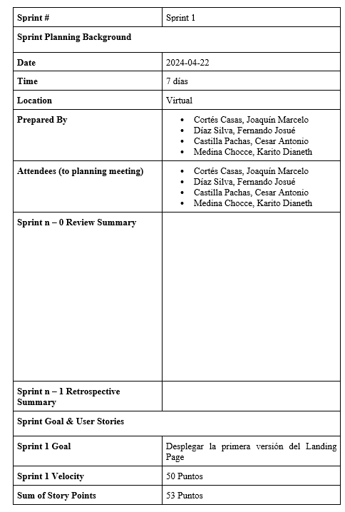</img>

#### 5.2.1.2. Sprint Backlog 1

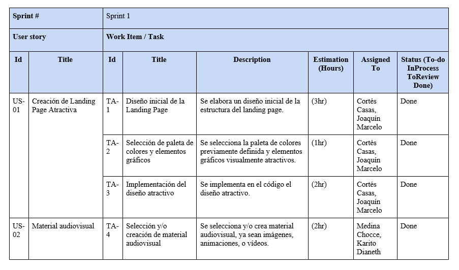</img>
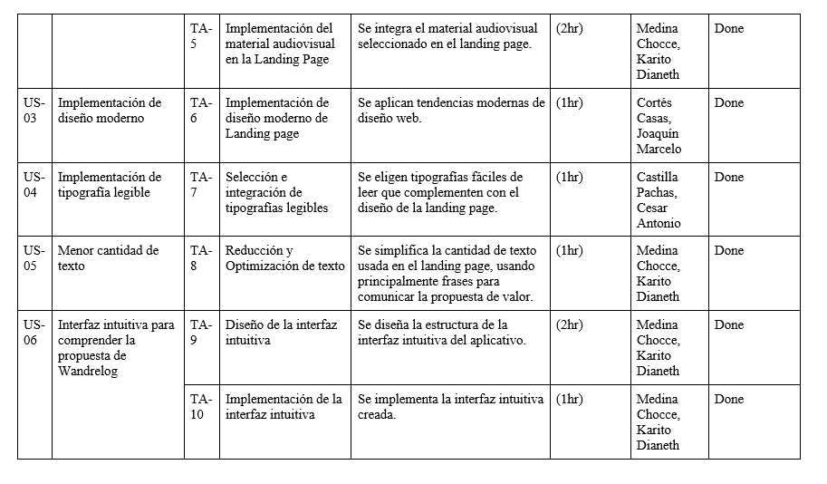</img>
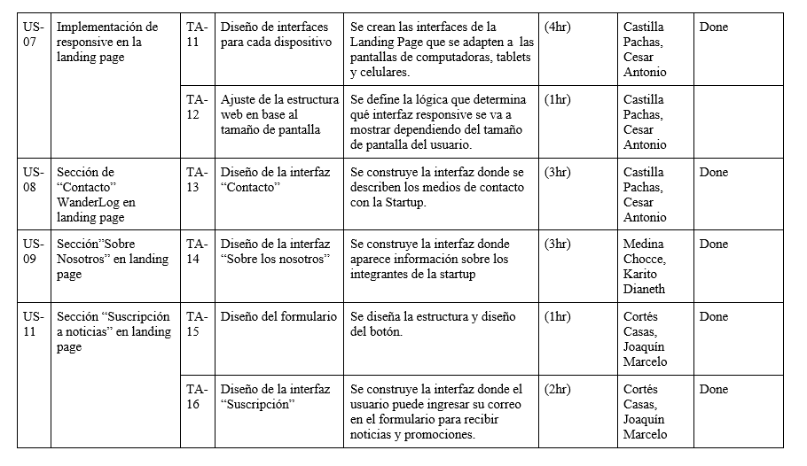</img>
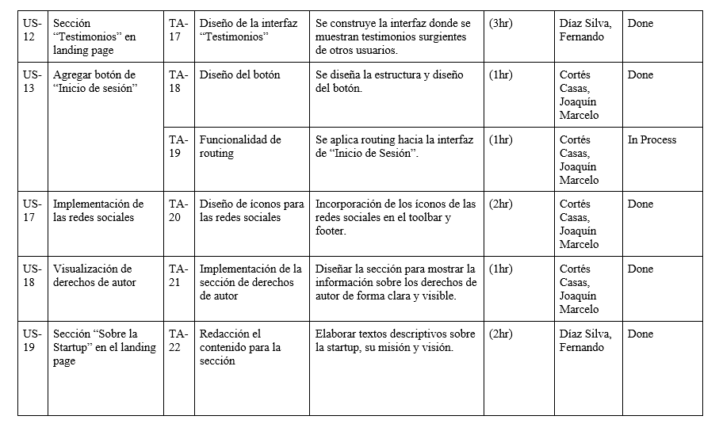</img>
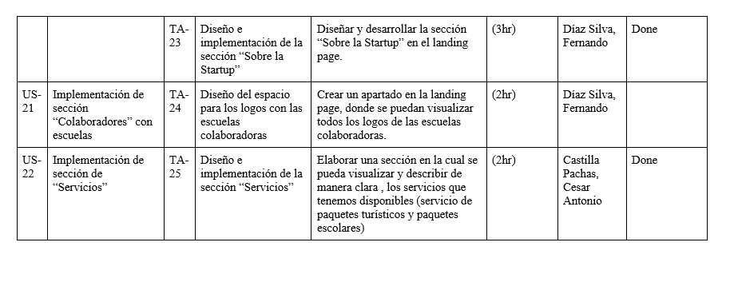</img>

#### 5.2.1.3. Development Evidence for Sprint Review

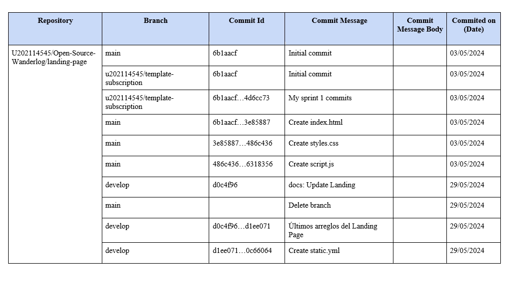</img>
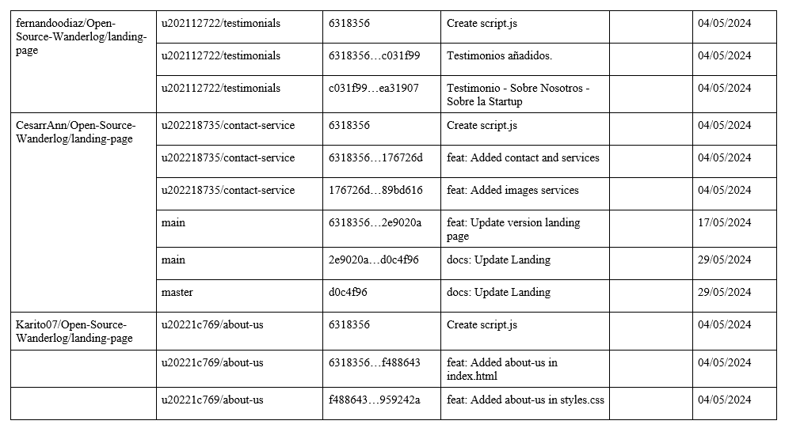</img>

#### 5.2.1.4. Testing Suite Evidence for Sprint Review
En el alcance del sprint 1, no se realizaron testing de la aplicación al haber solo trabajado en el landing page.

#### 5.2.1.5. Execution Evidence for Sprint Review

</img>
</img>
</img>
</img>

#### 5.2.1.6. Services Documentation Evidence for Sprint Review

#### 5.2.1.7. Software Deployment Evidence for Sprint Review
</img>

#### 5.2.1.8. Team Collaboration Insights during Sprint 
A continuación se presentan capturas de los insights del repositorio del landing page en Github:

</img>

### 5.2.2. Sprint 2
#### 5.2.2.1. Sprint Planning 2
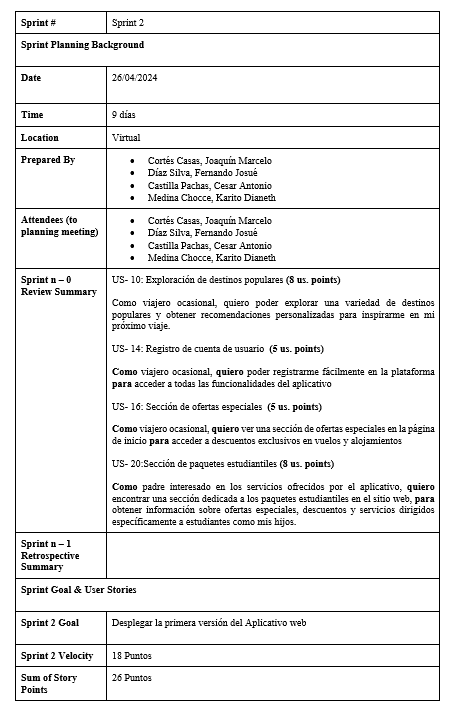</img>

#### 5.2.2.2. Sprint Backlog 2

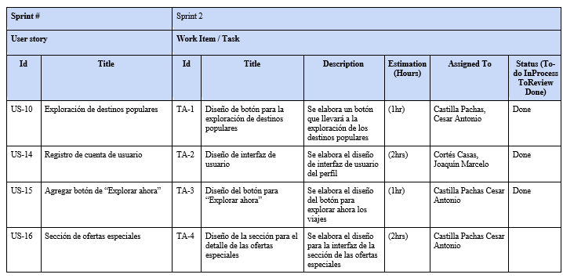</img>
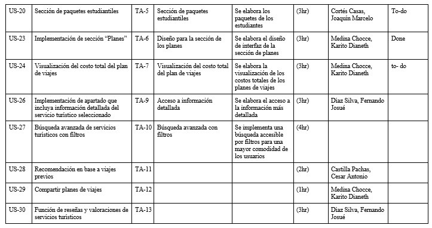</img>

#### 5.2.2.3. Development Evidence for Sprint Review

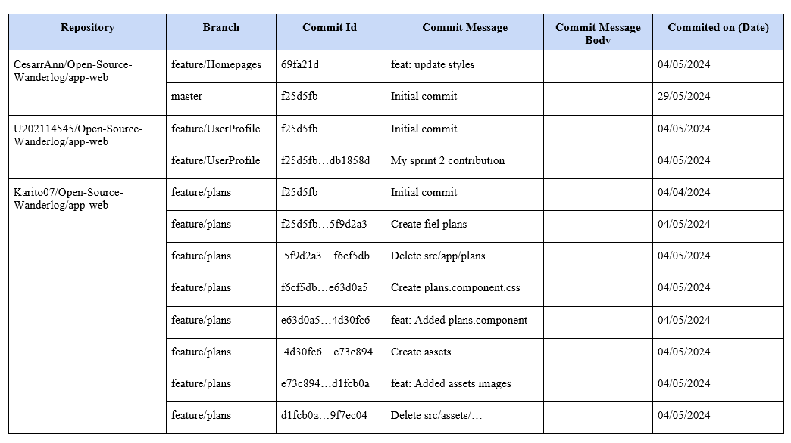</img>

#### 5.2.2.4. Testing Suite Evidence for Sprint Review
En el alcance del sprint 2, no se realizaron testing de la aplicación al haber solo trabajado en el landing page.

#### 5.2.2.5. Execution Evidence for Sprint Review

</img>
</img>
</img>
</img>

#### 5.2.2.6. Services Documentation Evidence for Sprint Review

#### 5.2.2.7. Software Deployment Evidence for Sprint Review
</img>

#### 5.2.2.8. Team Collaboration Insights during Sprint 
A continuación se presentan capturas de los insights del repositorio del landing page en Github:

</img>

### 5.2.3. Sprint 3
#### 5.2.3.1. Sprint Planning 3
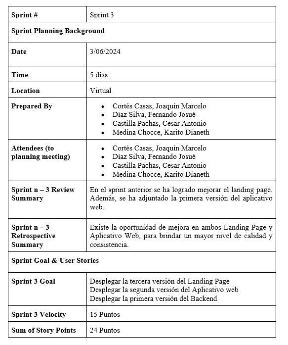</img>

#### 5.2.3.2. Sprint Backlog 3

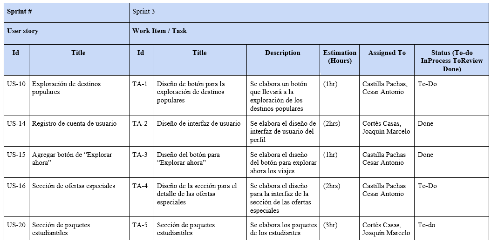</img>
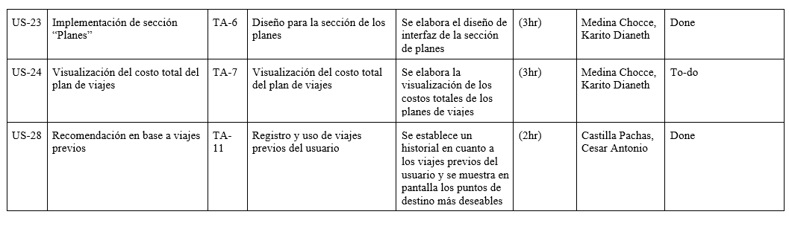</img>

#### 5.2.3.3. Development Evidence for Sprint Review

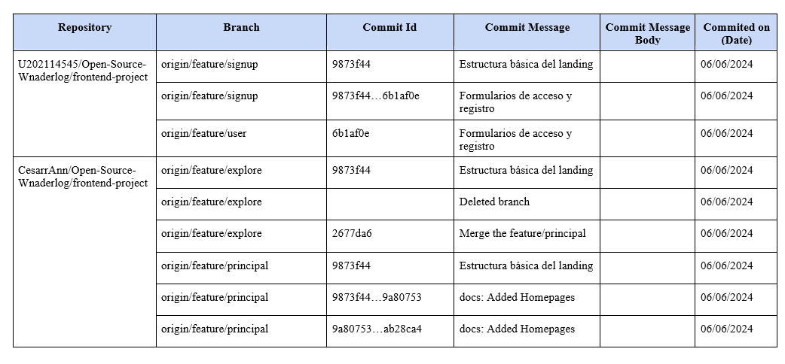</img>
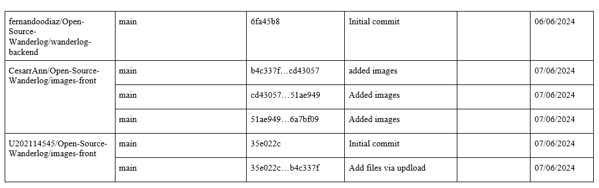</img>

#### 5.2.3.4. Testing Suite Evidence for Sprint Review
En el alcance del sprint 3, se realizaron testing del backend.

</img>
</img>
</img>
</img>

#### 5.2.3.5. Execution Evidence for Sprint Review

</img>
</img>
</img>
</img>
</img>
</img>
</img>
</img>

#### 5.2.3.6. Services Documentation Evidence for Sprint Review

#### 5.2.3.7. Software Deployment Evidence for Sprint Review
</img>

#### 5.2.3.8. Team Collaboration Insights during Sprint 
A continuación se presentan capturas de los insights del repositorio del landing page en Github:

</img>
</img>
</img>

# Bibliografía

- GitHub Documentation (2023). GitHub Pages. Retrieved from https://docs.github.com/en/pages 
- MDN Web Docs (2023). HTML: HyperText Markup Language. Retrieved from https://developer.mozilla.org/en-US/docs/Web/HTML 
- Nielsen, J., & Molich, R. (1990). Heuristic evaluation of user interfaces. Proceedings of the SIGCHI conference on Human factors in computing systems, 249-256. https://dl.acm.org/doi/10.1145/97243.97281 
- Cooper, A., Reimann, R., Cronin, D., & Noessel, C. (2014). About Face: The Essentials of Interaction Design. Wiley. https://www.wiley.com/en-us/About+Face%3A+The+Essentials+of+Interaction+Design%2C+4th+Edition-p-9781118766576 
- ISO/IEC 25010:2011. (2011). Systems and software engineering—Systems and software Quality Requirements and Evaluation (SQuaRE)—System and software quality models. International Organization for Standardization. https://www.iso.org/standard/35733.html 
- Krug, S. (2014). Don't Make Me Think, Revisited: A Common Sense Approach to Web Usability. New Riders. https://www.dontmakemethink.com 

# Conclusiones:

## TB1
En la primera parte del proyecto la TB1, se realizaron avances significativos en la elaboración del informe y en el desarrollo de la primera versión de la landing page de nuestro aplicativo WanderLog. Este periodo se centró en establecer las bases del proyecto, definiendo claramente los objetivos, los alcances y las herramientas que se utilizarán a lo largo del desarrollo.

***Avances del Informe:***

**Documentación Inicial:** Se completó una primera versión del informe que incluye una descripción detallada del entorno de desarrollo, la gestión del código fuente y las guías de estilo para asegurar la consistencia del código.
Configuración del Entorno: Se detallaron las herramientas y plataformas utilizadas, como UXPressia, Figma, Vertabelo, LucidChart, GitHub, Visual Studio Code, y GitHub Pages, proporcionando enlaces y explicaciones claras para que cualquier miembro del equipo pueda integrarse fácilmente al proyecto.

***Desarrollo de la Landing Page:***

**Diseño Inicial:** Se desarrolló la primera versión de la landing page utilizando HTML5 y CSS3, enfocándose en una estructura básica y una apariencia visual que atrajera a los usuarios.
Colaboración en Figma: Se utilizaron wireframes y mockups en Figma para planificar y validar el diseño de la landing page, permitiendo un desarrollo colaborativo y efectivo.

Estos avances sentaron las bases para el desarrollo futuro del aplicativo, asegurando que todos los miembros de nuestro equipo estén alineados y puedan trabajar de manera eficiente.

## TP
En la segunda parte del proyecto, correspondiente a la TP, se avanzó significativamente en la mejora de la landing page y en la implementación del aplicativo web. Este periodo se centró en refinar los elementos existentes y en avanzar en las funcionalidades clave del aplicativo, cumpliendo con los objetivos establecidos para el sprint 2.

***Mejora de la Landing Page:***

**Optimización y Mejora Visual:** Se realizaron mejoras en el diseño y la usabilidad de la landing page, basadas en el feedback recibido y en pruebas de usuario, utilizando herramientas como LucidChart para mapear user flows y asegurar una experiencia de usuario óptima.
Implementación de Nuevas Funcionalidades: Se añadieron funcionalidades adicionales a la landing page, mejorando la interactividad y el atractivo visual, utilizando técnicas avanzadas de CSS3 y JavaScript.

***Implementación del Aplicativo Web:***

**Desarrollo Inicial:** Se comenzó con la implementación del aplicativo web, abarcando todas las tareas planificadas para el sprint 2. Esto incluyó la implementación de las primeras funcionalidades del frontend.
Integración Continua: Se utilizó GitHub para el control de versiones y GitHub Pages para el despliegue continuo de la landing page, asegurando que las mejoras y nuevas características estén disponibles para ser revisadas y testeadas por el equipo y los stakeholders.

Estos logros representan un avance significativo hacia la finalización del proyecto WanderLog. La mejora continua de la landing page y la implementación progresiva del aplicativo web han preparado el camino para los próximos sprints, manteniendo un enfoque en la calidad y la usabilidad del producto final.

## Anexos:
https://upcedupe-my.sharepoint.com/:v:/g/personal/u202218735_upc_edu_pe/ER82WZRpdZlDkHibR3MJudYBZjXlHqDMQWRt9k4gOY2_pQ?nav=eyJyZWZlcnJhbEluZm8iOnsicmVmZXJyYWxBcHAiOiJPbmVEcml2ZUZvckJ1c2luZXNzIiwicmVmZXJyYWxBcHBQbGF0Zm9ybSI6IldlYiIsInJlZmVycmFsTW9kZSI6InZpZXciLCJyZWZlcnJhbFZpZXciOiJNeUZpbGVzTGlua0NvcHkifX0&e=xai08m 

About The Team Video: https://drive.google.com/file/d/1VWajPaKk_53zcs6x5cnhkcA_iXew0tTj/view?usp=sharing

About The Product Video: https://drive.google.com/file/d/1glcTdkEZDnHPymEBUvxey_MVqTIJaRQ3/view?usp=sharing

Exposition Video: https://drive.google.com/file/d/1MRwRPiJ1eD4CjcaDS3znNS6zAxdtaGHZ/view?usp=sharing
