
 

# 
COURSE PROJECT

    <strong>Universidad Peruana de Ciencias Aplicadas</strong> 
    </img> 
    <strong>Ingeniería de Software - 2024-1</strong> 
    <strong>Desarrollo de Aplicaiones Open Source - WX56</strong> 
    <strong>Profesor: Mori Paiva, Hugo Allan</strong> 
     INFORME DE TRABAJO FINAL - TF1

    <strong>Producto:Wanderlog</strong>

    <h3>Team Members:</h3>
    <table align="center">
        <tr>
            <th style="text-align:center;">Member</th>
            <th style="text-align:center;">Code</th>
        </tr>
        <tr>
            <td>Cortés Casas, Joaquin Marcelo</td>
            <td>U202114545</td>
        </tr>
        <tr>
            <td>Diaz Silva, Fernando Josué</td>
            <td>U202112722</td>
        </tr>
        <tr>
            <td>Castilla Pachas Cesar Antonio</td>
            <td>U202218735</td>
        </tr>
        <tr>
            <td>Medina Chocce Karito Dianeth</td>
            <td>U20221C769</td>
        </tr>
    </table>

    <strong>Junio, 2024</strong>

 

<h1 align="center">Registro de versiones del Informe</h1>

<table>
        <thead>
            <tr>
                <th>Versión</th>
                <th>Fecha</th>
                <th>Autor</th>
                <th>Descripción de modificaciones</th>
            </tr>
        </thead>
        <tbody>
            <tr>
                <th>TB1</th>
                <td>04/04/2024</td>
                <td>Cortés Casas Joaquin Marcelo, Diaz Silva Fernando Josué, Cesar Castilla Pachas, Medina Chocce Karito Dianeth.</td>
                <td>Adición de la sección y documentación del Sprint 1   
                Adición de la estructura esencial del informe, incluyendo su documentación, de los siguientes componentes:
                   - La carátula.
                  - El registro de versiones.
                  - La tabla de contenidos.
                  - La tabla de Student Outcomes.
                  - Capítulo I: Introducción.
                  - Capítulo II: Requirements Elicitation & Analysis.
                  - Capítulo III: Requirements Specification.
                  - Capítulo IV: Product Design.
                  - Capítulo V: Product Implementation, Validation & Deployment.
                  - El Sprint 1.
                  - Las conclusiones y recomendaciones.
                  - La bibliografía.
                  - Los anexos.</td>
            </tr>
            <tr>                
                <th>TP1</th>
                <td>02/05/2024</td>
                <td>Cortés Casas Joaquin Marcelo, Diaz Silva Fernando Josué, Cesar Castilla Pachas, Medina Chocce Karito Dianeth.</td>
                <td>Adición de la sección y documentación del Sprint 3.
                 A producto de la autocrítica del equipo y la retroalimentación recibida del docente: 
                   - Mejora del componente “Registro de Versiones del Informe” para ser más descriptivo en el contenido realizado en cada versión del informe.
                  - Mejora del componente “Student Outcome” para mejorar el nivel de detalle relacionado a la participación de los integrantes del grupo en cada versión del informe.
                  - Mejora de la sección 4.6
                  - Mejora de la sección 4.7
                  - Mejora de la sección 4.8
                  - Mejoras de la sección  5.2.1. Sprint 1,
                  - Mejoras de la sección  5.2.2. Sprint 2, 
                  - Mejora del componente “Conclusiones”, agregando nuevas conclusiones y recomendaciones.
                  - Mejora del componente “Bibliografía”
                  - Mejora del componente “Anexos”</td>
            </tr>
            <tr>
                <th>TB2</th>
                <td>07/06/2024</td>
                <td>Cortés Casas Joaquin Marcelo, Diaz Silva Fernando Josué, Cesar Castilla Pachas, Medina Chocce Karito Dianeth.</td>
                <td>Implementación de los bounded context correspondientes para el proyecto en Backend</td>
            </tr> 
            <tr>                
                <th>TF1</th>
                <td>26/06/2024</td>
                <td>Cortés Casas Joaquin Marcelo, Diaz Silva Fernando Josué, Cesar Castilla Pachas, Medina Chocce Karito Dianeth.</td>
                <td>Implementación del Backend en el Frontend y hacer el despliegue del mismo</td>
             </tr>  
        </tbody>
</table>

  
<table>
        <thead>
            <tr>
                <th>Criterio específico</th>
                <th>Acciones realizadas</th>
                <th>Conclusiones</th>
            </tr>
        </thead>
        <tbody>
            <tr>
                <td>Participa en equipos multidisciplinarios con eficacia, eficiencia y objetividad, en el marco de un proyecto en soluciones de ingeniería de software</td>
                <td>Cortés Casas, Joaquín Marcelo
                  TB1 
                Ha participado en la investigación de los principales competidores, además del desarrollo de los diagramas C4 y  de base de datos.
                  TP 
                 He participado en el desarrollo del nuevo landing page, además de la primera versión del aplicativo web.
                  TB2 
                He participado en el desarrollo de la tercera versión del landing page, incluyendo una segunda versión del app web y documentación del sprint 3.
                  TF1 
                He desarrollado e implementado la funcionalidad de student travel packages en el frontend y el backend.
                   Díaz Silva, Fernando Josué
                  TB1 
                He desarrollado el capítulo 3, Requirements Specification y la documentación del landing page del capítulo 4.
                  TP1 
                He colaborado con el desarrollo e implementación de la solución en aspectos como componentes y el ruteo de los mismo 
                  TB2 
                Todo el backend y el despliegue del mismo 
                  TF1 
                Despliegue del aplicativo frontend y backend, componentes login y registro
                   Castilla Pachas Cesar Antonio
                  TB1 
                He participado en :
                  - Capitulo 1
                  - Landing Page
                  - Web applications
                   TP1 
                Mejora del Landing Page y Creación del menú principal del aplicativo web
                  TB2 
                Creacion de la interfaz de homepage, special offers y popular trips 
                  TF1 
                Creacion de la interfaz explore-trip, explore-lodging, explore-attration, trip-result y actualizacion del backend flyCompany, touristicAttraction, touristic lodging
                   Medina Chocce Karito Dianeth
                  TB1 
                He participado haciendo el capítulo 2 y la parte del 4.7
                  TP1 
                He participado realizando la sección de Planes en el Frontend
                  TB2 
                Corrección de algunos aspectos del frontend y aportar en el informe
                  TF1 
                He participado en la creación del User Profile y del Subscription en el Frontend
                </td>
                <td>Nos aseguramos de trabajar de forma coordinada y eficaz, avanzando lo más posible en una cantidad de tiempo límite. Para lograrlo, tuvimos que trabajar como equipo y discutir las decisiones importantes de manera organizada y objetiva. Para la realización de este trabajo hemos coordinado satisfactoriamente cada punto de este informe.</td>
            </tr>
            <tr>
                <td>Conoce al menos un sector empresarial o dominio de aplicación de soluciones de software.</td>
                <td>Cortés Casas, Joaquín Marcelo
                  TB1 
                Ha participado en la investigación de los principales competidores, además del desarrollo de los diagramas C4 y  de base de datos.
                  TP1 
                He participado en el desarrollo del nuevo landing page, además de la primera versión del aplicativo web
                  TB2 
                He participado en el desarrollo de la tercera versión del landing page, incluyendo una segunda versión del app web y documentación del sprint 3.
                  TF1 
                He desarrollado e implementado la funcionalidad de student travel packages en el frontend y el backend.
                   Díaz Silva, Fernando Josué
                  TB1 
                He desarrollado el capítulo 3, Requirements Specification y la documentación del landing page del capítulo 4.
                  TP1 
                He colaborado con el desarrollo e implementación de la solución en aspectos como componentes y el ruteo de los mismo 
                  TB2 
                Todo el backend y el despliegue del mismo 
                  TF1 
                Despliegue del aplicativo frontend y backend, componentes login y registro
                   Castilla Pachas Cesar Antonio
                  TB1 
                He participado en :
                  - Capitulo 1
                  - Landing Page
                  - Web applications
                   TP1 
                Mejora del Landing Page y Creación del menú principal del aplicativo web
                  TB2 
                Creacion de la interfaz de homepage, special offers y popular trips 
                  TF1 
                Creacion de la interfaz explore-trip, explore-lodging, explore-attration, trip-result y actualizacion del backend flyCompany, touristicAttraction, touristic lodging
                   Medina Chocce Karito Dianeth
                  TB1 
                He participado haciendo el capítulo 2 y la parte del 4.7
                  TP 
                He participado realizando la sección de Planes en el Frontend
                  TB2 
                corrección de algunos aspectos del frontend y aportar en el informe
                  TF1 
                He participado en la creación del User Profile y del Subscription en el Frontend
                </td>
                <td>
                    Nos aseguramos de tener toda la información necesaria para entender el sector empresarial en el que nos vamos a involucrar, y poder usarla correctamente para el desarrollo de nuestra solución. Para hacerlo tuvimos que investigar sobre los problemas del sector, y las herramientas que usamos.</td>
            </tr> 
        </tbody>
</table>

# Índice

- [Capítulo I: Introducción]()
  - [1.1. StartUp Profile](#11-startup-profile)
    - [1.1.1. Descripción de la StartUp](#111-descripción-de-la-startup)
    - [1.1.2. Perfiles de Integrantes del equipo](#112-perfiles-de-integrantes-del-equipo)
  - [1.2. Solution Profile](#12-solution-profile)
    - [1.2.1. Antecedentes y Problemática](#121-antecedentes-y-problemática)
    - [1.2.2. Lean UX Process](#122-lean-ux-process)
      - [1.2.2.1. Lean UX Problem Statements](#1221-lean-ux-problem-statements)
      - [1.2.2.2. Lean UX Assumptions](#1222-lean-ux-assumptions)
      - [1.2.2.3. Lean UX Hyphotesis Statements](#1223-lean-ux-hyphotesis-statements)
      - [1.2.2.4. Lean UX Canvas](#1224-lean-ux-canvas)
  - [1.3. Segmentos objetivo](#13-segmentos-objetivo)
- [Capítulo II: Requirements Elicitation & Analysis]()
  - [2.1. Competidores](#21-competidores)
    - [2.1.1 Análisis competitivo](#211-análisis-competitivo)
    - [2.1.2. Estrategias y tácticas frente a competidores](#212-estrategias-y-tácticas-frente-a-competidores)
  - [2.2. Entrevistas](#22-entrevistas)
    - [2.2.1 Diseño de entrevistas](#221-diseño-de-entrevistas)
    - [2.2.2. Registro de entrevistas](#222-registro-de-entrevistas)
    - [2.2.3. Análisis de entrevistas](#223-análisis-de-entrevistas)
  - [2.3. Needfinding](#23-needfinding)
    - [2.3.1. User Persona](#231-user-persona)
    - [2.3.2. User Task Matrix](#232-user-task-matrix)
    - [2.3.3. User Journey Mapping](#233-user-journey-mapping)
    - [2.3.4. Empathy Mapping](#234-empathy-mapping)
    - [2.3.5. As-is Scenario Mapping](#235-as-is-scenario-mapping)
    - [2.3.6. Ubiquitous Language](#236-ubiquitous-language)
- [Capítulo III: Requirements Specification]()
  - [3.1. To-Be Scenario Mapping](#31-to-be-scenario-mapping)
  - [3.2. User Stories](#32-user-stories)
  - [3.3. Impact Mapping](#33-impact-mapping)
  - [3.4. Product Backlog](#34-product-backlog)
- [Capítulo IV: Product Design]()
  - [4.1. Style Guidelines](#41-style-guidelines)
    - [4.1.1. General Style Guidelines](#411-general-style-guidelines)
    - [4.1.2. Web Style Guidelines](#412-web-style-guidelines)
  - [4.2. Information Architecture](#42-information-architecture)
    - [4.2.1. Organization Systems](#421-organization-systems)
    - [4.2.2. Labeling Systems](#422-labeling-systems)
    - [4.2.3. SEO Tags and Meta Tags](#423-seo-tags-and-meta-tags)
    - [4.2.4. Searching Systems](#424-searching-systems)
    - [4.2.5. Navigation Systems](#425-navigation-systems)
  - [4.3. Landing Page UI Design](#43-landing-page-ui-design)
    - [4.3.1. Landing Page Wireframe](#431-landing-page-wireframe)
    - [4.3.2. Landing Page Mock-up](#432-landing-page-mock-up)
  - [4.4. Web Applications UX/UI Design](#44-web-applications-uxui-design)
    - [4.4.1. Web Applications Wireframes](#441-web-applications-wireframes)
    - [4.4.2. Web Applications Wireflow Diagrams](#442-web-applications-wireflow-diagrams)
    - [4.4.3. Web Applications Mock-ups](#443-web-applications-mock-ups)
    - [4.4.4. Web Applications User Flow Diagrams](#444-web-applications-user-flow-diagrams)
  - [4.5. Web Applications Prototyping](#45-web-applications-prototyping)
  - [4.6. Domain-Driven Software Architecture](#46-domain-driven-software-architecture)
    - [4.6.1. Software Architecture Context Diagram](#461-software-architecture-context-diagram)
    - [4.6.2. Software Architecture Container Diagrams](#462-software-architecture-container-diagrams)
    - [4.6.3. Software Architecture Components Diagrams](#463-software-architecture-components-diagrams)
  - [4.7. Software Object-Oriented Design](#47-software-object-oriented-design)
    - [4.7.1. Class Diagrams](#471-class-diagrams)
    - [4.7.2. Class Dictionary](#472-class-dictionary)
  - [4.8. Database Design](#48-database-design)
    - [4.8.1. Database Diagram](#481-database-diagram)
- [Capítulo V: Product Implementation, Validation & Deployment]()
  - [5.1. Software Configuration Management](#51-software-configuration-management)
    - [5.1.1. Software Development Environment Configuration](#511-software-development-environment-configuration)
    - [5.1.2. Source Code Management](#512-source-code-management)
    - [5.1.3. Source Code Style Guide & Conventions](#513-source-code-style-guide--conventions)
    - [5.1.4. Software Deployment Configuration](#514-software-deployment-configuration)
  - [5.2. Landing Page, Services & Applications Implementation](#52-landing-page-services--applications-implementation)
    - [5.2.1. Sprint 1](#521-sprint-1)
      - [5.2.1.1. Sprint Planning 1](#5211-sprint-planning-1)
      - [5.2.1.2. Sprint Backlog 1](#5212-sprint-backlog-1)
      - [5.2.1.3. Development Evidence for Sprint Review](#5213-development-evidence-for-sprint-review)
      - [5.2.1.4. Testing Suite Evidence for Sprint Review](#5214-testing-suite-evidence-for-sprint-review)
      - [5.2.1.5. Execution Evidence for Sprint Review](#5215-execution-evidence-for-sprint-review)
      - [5.2.1.6. Services Documentation Evidence for Sprint Review](#5216-services-documentation-evidence-for-sprint-review)
      - [5.2.1.7. Software Deployment Evidence for Sprint Review](#5217-software-deployment-evidence-for-sprint-review)
      - [5.2.1.8. Team Collaboration Insights during Sprint](#5218-team-collaboration-insights-during-sprint)
    - [5.2.2. Sprint 2](#522-sprint-2)
      - [5.2.2.1. Sprint Planning 2](#5221-sprint-planning-2)
      - [5.2.2.2. Sprint Backlog 2](#5222-sprint-backlog-2)
      - [5.2.2.3. Development Evidence for Sprint Review](#5223-development-evidence-for-sprint-review)
      - [5.2.2.4. Testing Suite Evidence for Sprint Review](#5224-testing-suite-evidence-for-sprint-review)
      - [5.2.2.5. Execution Evidence for Sprint Review](#5225-execution-evidence-for-sprint-review)
      - [5.2.2.6. Services Documentation Evidence for Sprint Review](#5226-services-documentation-evidence-for-sprint-review)
      - [5.2.2.7. Software Deployment Evidence for Sprint Review](#5227-software-deployment-evidence-for-sprint-review)
      - [5.2.2.8. Team Collaboration Insights during Sprint](#5228-team-collaboration-insights-during-sprint)
    - [5.2.3. Sprint 3](#523-sprint-3)
      - [5.2.3.1. Sprint Planning 3](#5231-sprint-planning-3)
      - [5.2.3.2. Sprint Backlog 3](#5232-sprint-backlog-3)
      - [5.2.3.3. Development Evidence for Sprint Review](#5233-development-evidence-for-sprint-review)
      - [5.2.3.4. Testing Suite Evidence for Sprint Review](#5234-testing-suite-evidence-for-sprint-review)
      - [5.2.3.5. Execution Evidence for Sprint Review](#5235-execution-evidence-for-sprint-review)
      - [5.2.3.6. Services Documentation Evidence for Sprint Review](#5236-services-documentation-evidence-for-sprint-review)
      - [5.2.3.7. Software Deployment Evidence for Sprint Review](#5237-software-deployment-evidence-for-sprint-review)
      - [5.2.3.8. Team Collaboration Insights during Sprint](#5238-team-collaboration-insights-during-sprint)
    - [5.2.4. Sprint 4](#524-sprint-4)
      - [5.2.4.1. Sprint Planning 4](#5241-sprint-planning-4)
      - [5.2.4.2. Sprint Backlog 3](#5242-sprint-backlog-4)
      - [5.2.4.3. Development Evidence for Sprint Review](#5243-development-evidence-for-sprint-review)
      - [5.2.4.4. Testing Suite Evidence for Sprint Review](#5244-testing-suite-evidence-for-sprint-review)
      - [5.2.4.5. Execution Evidence for Sprint Review](#5245-execution-evidence-for-sprint-review)
      - [5.2.4.6. Services Documentation Evidence for Sprint Review](#5246-services-documentation-evidence-for-sprint-review)
      - [5.2.4.7. Software Deployment Evidence for Sprint Review](#5247-software-deployment-evidence-for-sprint-review)
      - [5.2.4.8. Team Collaboration Insights during Sprint](#5248-team-collaboration-insights-during-sprint)
- [5.3. Validation Interviews](#53-validation-interviews)
    - [5.3.1. Diseño de Entrevistas](#531-diseño-de-entrevistas)
    - [5.3.2. Registro de Entrevistas](#532-registro-de-entrevistas)
    - [5.3.3. Evaluaciones según heurísticas](#533-evaluaciones-según-heurísticas)
- [5.4. Video About-The-Product](#54-video-about-the-product)
- [Conclusiones](#conclusiones)
  - [Conclusiones y recomendaciones](#conclusiones-y-recomendaciones)
- [Bibliografía](#bibliografía)
- [Anexos](#anexos)

  
# Capítulo I: Introducción

## 1.1. StartUp Profile

Somos una empresa independiente formada por 5 estudiantes de la Universidad Peruana de Ciencias Aplicadas, dedicados a usar nuestras habilidades y conocimientos, adquiridos en los distintos cursos de Ingeniería, para ayudar a distintos grupos de personas que se puedan beneficiar de las aplicaciones que creemos.

### 1.1.1. Descripción de la StartUp

WanderLog es una startup que surge para ayudar a aquellas personas que necesitan simplificar la planificación de sus viajes de principio a fin, ya sea un viaje largo o corto por motivos de un viaje urgente o poco tiempo para planificar un viaje por ellos mismos.

Misión: Nuestra misión es hacer que viajar se sienta mucho más fácil, accesible y emocionante para todos nuestros usuarios. Por ellos nos comprometemos a ofrecer a nuestros usuarios una plataforma fácil de usar y personalizada que simplifique la planificación de viajes, permitiendo a nuestros usuarios descubrir el mundo sin muchas complicaciones.

Visión: En WanderLog visualizamos un mundo donde cada viaje que haga nuestros usuarios sea una experiencia muy agradable y sin muchas complicaciones. Por ello nos esforzamos por ser una gran industria de las planificaciones de viajes, creando soluciones innovadoras que además promuevan el turismo.
### 1.1.2. Perfiles de integrantes del equipo

<table>
  <tr>
    <th>Información</th>
    <th>Foto</th>
  </tr>
  <tr>
    <td>
      <h2>Cortés Casas, Joaquin Marcelo</h2>
      
U202114545 - Ingeniería de Software

      
  
      Mi edad es de 20 años, soy un estudiante de la carrera de Ingeniería de Software en la UPC. Desde una edad temprana, he tenido un interés por el manejo de la tecnología y la interacción con los videojuegos. Tengo un fuerte sentido de liderazgo al asumir la responsabilidad de coordinar y motivar a los equipos de trabajo en momentos clave. Siempre estoy dispuesto a enfrentar nuevos desafíos y desarrollar mis conocimientos en el entorno del Software.

    </td>
    <td></img></td>
  </tr>
  <tr>
    <td>
      <h2>Castilla Pachas, Cesar Antonio</h2>
      
U202218735 - Ingeniería de Software

      
  
        Tengo 20 años y estudió la carrera de Ingeniería de Software en la Universidad Peruana de Ciencias Aplicadas (UPC). Me encanta crear páginas web y dar soluciones creativas, soy una persona responsable y puntual. Además me encanta trabajar en equipo. Cada día me gusta aprender algo nuevo y poder ampliar mis conocimientos.
      

    </td>
   <td></img></td>

  </tr>
  <tr>
    <td>
      <h2>Medina Chocce, Karito Dianeth</h2>
      
U20221C769 - Ingeniería de Software

      
  
        Tengo 20 años y me encuentro realizando mis estudios de Ingeniería de Software en la Universidad Peruana de Ciencias Aplicadas (UPC). Desde muy pequeña me ha encantado el diseño de páginas web, la interacción de videojuegos y la inteligencia artificial. Soy una persona amable, responsable y comprometida.

    </td>
<td></img></td>
  </tr>
 <tr>
    <td>
      <h2>Diaz Silva, Fernando Josué</h2>
      
U202112722 - Ingeniería de Software

      
  
        Soy Fernando Diaz, tengo 20 años, me apasiona la tecnología, actualmente estudio la carrera de  ingeniería de software en la Universidad Peruana de Ciencias Aplicadas(UPC). A lo largo de la carrera he desarrollado distintas habilidades, mi principal enfoque en esta carrera parte del software como tal y el ámbito empresarial, para lo cual planeo realizar un MBA. Soy una persona proactiva, responsable y disciplinada. Estoy preparado para desarrollar un buen trabajo junto a mi equipo y aplicar todo el conocimiento adquirido a lo largo de mi carrera. 

    </td>
<td></img></td>
  </tr>
</table>

## 1.2. Solution Profile

### 1.2.1. Antecedentes y Problemática

Actualmente el sector del turismo ha experimentado un gran crecimiento en los últimos años , con un número cada vez más grande de personas viajando ya sea por placer o por temas de trabajo. Sin embargo, cada vez que aumenta la demanda de viajes también aumentan los desafíos asociados con la planificación y organización de viajes. Normalmente la planificación de un viaje requiere una gran cantidad de tiempo y esfuerzo por parte de la persona que quiere viajar, ya sea desde la búsqueda de vuelos y lugar donde hospedarse hasta la selección de actividades y restaurantes en el destino, lo que puede resultar una tarea estresante, especialmente para las personas que tienen horarios muy llenos o sin experiencia de cómo planificar un viaje.
Para definir mejor la problemática, se usará la técnica de las 5W y 2H:

**What:**
La planificación de algún viaje sigue siendo una tarea muy compleja y que toma mucho tiempo para muchas personas que quieren viajar.

**Where:**
Este problema afecta a todos los viajeros de todo el mundo, ya que la planificación de viajes es una necesidad común independientemente del destino elegido.

**When:**
Esta problemática llega en el momento en que una persona o grupo de amigos o familiares decide emprender un viaje, lo que puede ser días o semanas antes de la fecha de partida de su viaje previsto.

**Who:**
La problemática afecta a una gran cantidad de personas, ya sean viajeros novatos o hasta expertos, las cuales buscan una solución eficiente para organizar sus viajes de manera efectiva.

**Why:**
Lo complejo que puede ser buscar mucha información relacionadas con la planificación de un viaje pueden llegar a ser muy abrumadoras, generando estrés y ansiedad en los viajeros y bajando mucho la calidad de la experiencia de viaje.

**How:**
Coordinar múltiples aspectos del viaje, como transporte, alojamiento y actividades, puede llegar a ser complicado y consumir mucho tiempo, especialmente para destinos desconocidos.

**How much:**
La cantidad de tiempo y esfuerzo que se requieren para planificar un viaje varía según la complejidad del itinerario y las preferencias del viajero, pero puede llevar horas o incluso días completos de investigación y reserva del viaje.

### 1.2.2. Lean UX Process

#### 1.2.2.1. Lean UX Problem Statements

Las personas que desean realizar un viaje se enfrentan a una experiencia complicada y estresante al planificar sus viajes que tanto han esperado debido a la falta a la falta de herramientas eficientes y personalizadas que simplifique la organización de itinerarios completos, ya sea desde la reserva de un vuelo y lugar de hospedaje hasta la selección de lugares turísticos al cual visitar. 
Para solucionarlo queremos proporcionar a los viajeros una solución fácil de usar que les permita planificar y organizar sus viajes de manera más eficiente, teniendo en cuenta sus preferencias individuales y ofreciendo recomendaciones personalizadas para una experiencia de viaje inolvidable.

#### 1.2.2.2. Lean UX Assumptions

**User Assumptions**

- **¿Quién es el usuario?**

    Nuestros usuarios son personas que disfrutan mucho viajar pero que encuentran muy estresante la planificación de viajes debido a la gran cantidad de detalles que deben tener en cuenta.

- **¿Dónde encaja nuestroservicio en su vida?**

    WanderLog se integra en la planificación de viajes de los usuarios, proporcionando una herramienta centralizada para organizar y gestionar cada aspecto de su itinerario y realizar reservaciones a través de nuestro aplicativo.

- **¿Qué problemas tiene nuestro producto y cómo se pueden resolver?**

    Resuelve la dificultad y la complejidad que da la planificación de viajes al proporcionar una solución fácil que genera itinerarios personalizados y reservaciones en función del destino y las preferencias de los usuarios.

- **¿Cuándo y cómo es usado nuestro producto?**

    Se utiliza principalmente durante la fase de planificación del viaje de nuestros usuarios, donde los usuarios necesitan organizar ya sea vuelos, buses, alojamiento, actividades y opciones de restauración para cada día de su viaje.

**User Outcomes**

- Los usuarios pueden planificar fácilmente cada aspecto de su viaje, desde vuelos/buses hasta actividades recreativas, ahorrando tiempo y esfuerzo en la planificación.
- Los usuarios disfrutan de una experiencia de viaje más personalizada y adaptada a sus intereses y preferencias individuales.
- Los usuarios pueden descubrir nuevas experiencias y destinos gracias a las recomendaciones y sugerencias proporcionadas por el aplicativo.

**Business Assumptions**

- Los usuarios valoran la conveniencia y la personalización en la planificación de sus viajes, buscando soluciones que les permitan organizar fácilmente cada aspecto de su itinerario y realizar reservas de manera más fácil.
- Proporcionar información precisa y actualizada sobre vuelos, buses, hoteles, restaurantes y  varias actividades recreativas aumentará la confianza del usuario en nuestro servicio y mejorará su experiencia.
- Una interfaz de usuario intuitiva y fácil de usar aumentará la satisfacción del usuario y la adaptación del servicio.
- La integración con múltiples proveedores de servicios de viaje asegurará una amplia variedad de opciones para los usuarios y aumentará la competitividad del servicio en el mercado.
- Al satisfacer las necesidades de los usuarios de manera efectiva, podemos expandir nuestra base de usuarios.
- La retroalimentación continua de los usuarios nos permitirá mejorar y adaptar nuestro servicio para satisfacer sus necesidades en constante evolución y mantenernos competitivos en el mercado.

**Business Outcomes**

- Aumento de la satisfacción del usuario debido a la conveniencia y personalización del servicio, lo que puede llevar a una mayor retención de usuarios y recomendaciones positivas.
- Generación de ingresos a través de acuerdos de afiliación con proveedores de servicios de viaje y posibles modelos de suscripción premium.
- Expansión de la base de usuarios a medida que el servicio se vuelve más conocido y valioso para viajeros de todo el mundo.

**Features**

- **¿Que características son importantes?**
    - Generación automática de itinerarios en base al destino y las preferencias del usuario.
    - Integración con múltiples proveedores de servicios de viaje para reservas de vuelos/buses, hoteles y actividades.
    - Funcionalidad de planificación de día a día, que permite a los usuarios organizar actividades, restaurantes y lugares de interés para cada día de su viaje

- **¿Cómo debería verse y comportarse nuestro servicio?**

    - Debe tener un diseño intuitivo y fácil de usar, con una navegación clara y opciones de búsqueda avanzadas para encontrar fácilmente información relevante y opciones de viaje.
    - Debe proporcionar recomendaciones personalizadas y sugerencias basadas en las preferencias y actividades pasadas del usuario, ofreciendo una experiencia de usuario altamente relevante y atractiva.

#### 1.2.2.3. Lean UX Hypothesis Statements

- Creemos que al ofrecer a nuestros usuarios itinerarios de viaje altamente personalizados basados en el destino elegido por el usuario y sus preferencias, aumentaremos aún más la probabilidad de que nuestros usuarios utilicen aun mas nuestros servicios para planificar sus viajes.
- Suponemos que al proporcionar información nutricional precisa y detallada sobre las opciones de alimentos en diversos restaurantes recomendados en nuestros itinerarios de viaje, aumentaremos la confianza del usuario en nuestro servicio y mejoramos su experiencia en su viaje.
- Si proporcionamos una interfaz de usuario creativa y fácil de usar, así como un sistema de filtrado avanzado para ayudar a los usuarios a encontrar mas rápido la información relevante y las opciones de viaje, aumentaremos la satisfacción del usuario y la adaptación al servicio.
- Creemos que al agregar múltiples proveedores de servicios de viaje para vuelos o buses, alojamiento, actividades y restaurantes, aseguraremos una amplia variedad de opciones para los usuarios y aumentaremos la competitividad del servicio en el mercado.
- Suponemos que al leer continuamente comentarios y sugerencias de los usuarios y utilizarlos para mejorar y adaptar nuestro servicio, podemos mantenernos competitivos en el mercado y satisfacer las necesidades de nuestros usuarios.

#### 1.2.2.4. Lean UX Canvas

Herramienta visual que permite analizar y comprender a profundidad las necesidades de los usuarios de WanderLog.

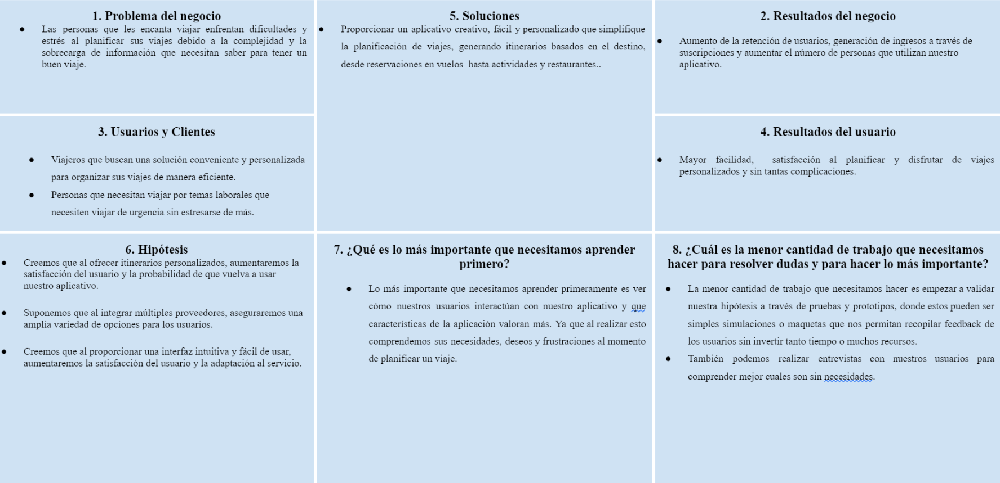</img>

## 1.3. Segmentos objetivo

Nuestro segmento objetivo está compuesto por dos tipos de usuarios:
- **Viajeros Turísticos:**

    Personas que viajan ocasionalmente ya sea por placer, vacaciones o negocios. Suelen tener muy poca experiencia en la planificación de viajes y por ello buscan soluciones que les pueda facilitar organizar sus itinerarios de manera rápida y eficiente.
</img>

- **Viajes escolares:**

    Padres de familia que desean planificar los viajes de los estudiantes de una promoción escolar, necesitando coordinar paquetes que incluyan a un conjunto de chicos menores de edad, respetando su presupuesto limitado.
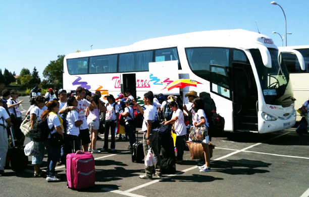</img>

# Capítulo II: Requirements Elicitation & Analysis

## 2.1. Competidores

El mercado de software para viajes ofrece soluciones innovadoras para organizar tu viaje sin estrés, de forma rápida y eficaz. Existen diversas opciones que compiten por ser la mejor alternativa para los viajeros que buscan una experiencia personalizada y sin complicaciones. A continuación, se mencionan los principales competidores identificados para “WanderLog”.

### 2.1.1 Análisis Competitivo

|  Competitive Analysis Landscape |
|:--------------:|

| ¿Por qué llevar a cabo el análisis? | Debido a que el entendimiento profundo de los competidores de WanderLog va a permitir anticipar las nuevas tendencias y diferenciarse del mercado ya establecido. Por otro lado, identificar las fortalezas y debilidades de nuestra competencia nos va a permitir mejorar y, a la par, enfrentar nuestras condiciones de mejor forma. para así ofrecer un valor único a los usuarios interesados. |
|:---------:|:---------:|

|  |  |  |  |  |  |
|-----------|-----------|-----------|-----------|-----------|-----------|
| **Perfil** | **Overview** | WandeLog es una startup con el objetivo de planear y generar un plan de viajes para aquellas personas con el deseo de organizar un viaje para explorar nuevos lugares en corto tiempo. | Booking.com se fundó en 1996 en Ámsterdam y se transformó de una start-up a una de las empresas viajeras más grandes del mundo, formando parte del grupo Booking Holdings Inc y teniendo como objetivo facilitar el descubrimiento del mundo para sus usuarios. | Skyscanner no es ni una aerolínea o buscador de vuelos, se trata de un metabuscador de servicios de viaje, enfocándose en los vuelos. Busca brindar la opción de comparar todas las opciones de viaje en un mismo lugar para así ahorrar tiempo y dinero, al filtrar las mejores opciones. | Expedia tuvo su debut en 1996 como una de las primeras agencias de viaje en línea. A partir del 2002, se convirtió en una corporación de viajes completa en diferentes partes del mundo. Tienen como objetivo construir productos que faciliten a los viajeros conectarse con el mundo a su alrededor. |
|  | **Ventaja competitiva ¿Qué valor ofrece a los clientes?** | Genera planes de viaje de forma semi-automática, ahorrando el tiempo de buscar entre cientas de opciones entre diferentes opciones de viaje. | Es la plataforma que presenta de lejos la mayor cantidad de planes de viaje alrededor del mundo. | Integra los apartados de alquiler de hoteles y renta de automóviles de forma natural con la reserva de vuelos, brindando a la par precios recomendados de estos servicios. | Presenta numerosas opciones de actividades en distintas provincias del Perú, en contraste de la poca o nula cantidad que ofrecen los otros competidores principales. |
| **Perfil de marketing** | **Mercado objetivo** | Viajeros ocasionales que buscan planear un viaje completo de forma rápida y eficiente. | Viajeros interesados en visitar distintas partes del mundo con una larga cantidad de filtros y opciones. | Ciudadanos con el deseo de viajar y centrarse principalmente en el vuelo y hospedaje ideal. | Personas que se centran en realizar actividades culturales o recreativas al estar de viaje. |
|  | **Estrategias de marketing** | Publicitar la startup por medio de distintas redes sociales y eventos de empresas. | Utiliza el sistema de publicidad y marketing de Google, siendo patrocinador del sistema de búsqueda de Google y formando parte del sistema de Youtube Ads, mostrando videos publicitarios en el material de creadores de contenido populares. | Colaboración con creadores de contenido para atraer la atención de usuarios interesados en realizar viajes, además de distintos sitios web y blogs de turismo. Usan los servicios de anuncios de Google. | Ofrece el programa Expedia Rewards, incentivando a clientes reservar por su plataforma para acumular beneficios, además de publicidad en motores de búsqueda y colaboraciones con aerolíneas y hoteles para ofrecer paquetes de turismo completos. |
| **Perfil de producto** | **Productos & servicios** | Plataforma de planeación, filtración y creación de paquetes de viajes. | Plataforma de búsqueda de servicios turísticos. | Plataforma de búsqueda de servicios turísticos | Plataforma de búsqueda de servicios turísticos. |
|  | **Precios y Costos** | Servicio por suscripción y colaboraciones con plataformas de turismo | Comisiones por reserva y publicidad. | Comisiones por reserva y publicidad. | Comisiones por reserva y publicidad. |
|  | **Canales de distribución (Web y/o Móvil)** | Web | Web y móvil | Web y móvil | Web y móvill |
| **Análisis SWOT** | **Fortalezas** | Es eficiente y rápida a la hora de realizar búsqueda de planes de viaje.  | Fuerte presencia en el mundo por su amplia selección de alojamientos, con más de 500 millones de descargas de su aplicativo móvil en la PlayStore de Google. | Cuenta con una presencia por encima del promedio en el mercado de búsqueda de vuelos, adicionando funciones de reserva de autos y hoteles. | Brinda una gama amplia de servicios viajeros, como vuelos, hospedaje, alquiler de autos y numerosas actividades recreativas y/o culturales. |
|  | **Debilidades** |  | Vulnerable a cambios en regulaciones y políticas de viaje que puedan haber en distintos países. | Depende de ingresos por publicidad y comisiones de reservas de servicios turísticos. | Depende de las comisiones de reserva generadas para obtener ingresos. |
|  | **Oportunidades** | Opción de integración con nuevos mercados. | Tiene la opción de expandirse hacia nuevos mercados para diversificar sus servicios. | Expansión hacia el sector de viajes corporativos para pertenecer en nuevos mercados. | Expansión en mercados emergentes. |
|  | **Amenazas** |  | Tiene una fuerte competencia de otras plataformas de reservas de alojamiento como Expedia o Airbnb. | La competencia en el mercado de búsqueda de viajes es bastante notoria, incluyendo las mismas aerolíneas como competidores con reservas directas. | El mercado de búsqueda de viajes ya cuenta con una fuerte competencia. |

### 2.1.2. Estrategias y tácticas frente a competidores.

- Enfoque en nichos específicos de viaje: Se enfoca en los viajeros de Perú, un segmento de viajeros que permite satisfacer las necesidades de un mercado específico con la posibilidad de escalar la solución a nivel global.
- Automatización de planes de viaje: Prioriza facilitar y automatizar la planeación de viajes en base a filtros y características específicas.

## 2.2. Entrevistas

Las entrevistas son esenciales para que las startups tomen decisiones informadas y creen productos o servicios que realmente satisfagan las necesidades de sus usuarios.

### 2.2.1 Diseño de entrevistas

__*Segmento Objetivo Viajeros Ocasionales*__

**Preguntas Generales:**

- ¿Cuál es su nombre completo?
- ¿Dónde vive actualmente?
- ¿Cuál es su fecha de nacimiento?
- ¿Cuál es su ocupación actual?
- ¿Qué tipo de viajes suele realizar con más frecuencia?

**Preguntas Especificas:**

- ¿Con qué frecuencia viajas por placer?
- ¿Cuál es tu presupuesto promedio para un viaje?
- ¿Prefieres viajar solo, con pareja, en familia o con amigos?
- ¿Qué tipo de destinos te gustan más? (Ciudades, playas, naturaleza, aventura, etc.)
- ¿Cuánto tiempo de planificación dedicas a tus viajes?
- ¿Qué aspectos te resultan más importantes a la hora de planificar un viaje? (Precio, comodidad, seguridad, actividades, etc.)
- ¿Utilizas habitualmente herramientas online para planificar tus viajes?
- ¿Qué dificultades o problemas encuentras a la hora de planificar un viaje?
- ¿Qué te gustaría que una herramienta online de planificación de viajes te ofreciera?
- ¿Estarías dispuesto a utilizar una herramienta online que te comparara precios y te proporcionara enlaces a otras páginas web para reservar vuelos y alojamiento?

 

__*Segmento Objetivo Viajes Escolares*__

**Preguntas Generales:**

- ¿Cuál es su ocupación actual?
- ¿Cuál es su nombre completo?
- ¿Dónde vive actualmente?
- ¿Cuál es su fecha de nacimiento?
- ¿Qué tipo de viajes suele realizar con más frecuencia?

**Preguntas Especificas**

- ¿Con qué frecuencia organiza viajes escolares?
- ¿Cuál es el presupuesto promedio para los viajes escolares que organiza?
- ¿Cuántos estudiantes suelen participar en los viajes que organiza?
- ¿Qué tipo de destinos suele elegir para los viajes escolares? (Ciudades, playas, naturaleza, aventura, etc.)
- ¿Cuánto tiempo de planificación dedica a organizar un viaje escolar?
- ¿Qué aspectos te resultan más importantes a la hora de organizar un viaje escolar? (Precio, seguridad, actividades educativas, comodidad, etc.)
- ¿Utilizas habitualmente herramientas online para organizar viajes escolares?
- ¿Qué dificultades o problemas encuentras a la hora de organizar un viaje escolar?
- ¿Qué te gustaría que una herramienta online de planificación de viajes escolares te ofreciera?
- ¿Estarías dispuesto a utilizar una herramienta online que te comparara precios y te proporcionara enlaces a otras páginas web para reservar transporte, alojamiento y actividades para viajes escolares?

### 2.2.2. Registro de entrevistas

URL del video completo:[ Open Source - Entrevista completa](https://drive.google.com/drive/folders/1N0SYjBNWEK05kbmaSSTfYlFZL9oWeSun?usp=sharing)

**Segmento objetivo 1:** Viajeros Ocasionales

**Entrevista 1:**[ Open source - Entrevista 1](https://drive.google.com/drive/folders/1N0SYjBNWEK05kbmaSSTfYlFZL9oWeSun?usp=sharing)

    Resumen:
    El entrevistado, indica que es un viajero ocasional, tiene 20 años,radica en europa, le encantaría una aplicación que haga la gestión por él, ya que suele demorarse mucho para planificar un viaje. Es un amante de las culturas, y sus viajes principalmente se dan por dicha razón. 

**Entrevista 2:**[ Open source - Entrevista 2](https://drive.google.com/drive/folders/1N0SYjBNWEK05kbmaSSTfYlFZL9oWeSun?usp=sharing)

    Resumen: 
    La entrevistada  indica que es una viajera ocasional, tiene 46  años,radica en Lima. Es una amante de los viajes al extranjero,  en definitiva, usaría una aplicación que le elabore el plan de viaje por ella, ya que suele demorarse mucho en organizar un viaje. De igual manera, indica que nunca ha utilizado una herramienta online que le permita hacer dicha organización. 

**Entrevista 3:**[ Open source - Entrevista 3](https://drive.google.com/drive/folders/1N0SYjBNWEK05kbmaSSTfYlFZL9oWeSun?usp=sharing)

    Resumen: 
    En esta entrevista, se pudo hablar con una persona que realiza viajes ocasionalmente. Le gustaría una web para que le facilite la creación de un plan de viaje. Adicionalmente, nos da sus opiniones sobre las facilidades que le daría una web como esa y sus opiniones al respecto.

### 2.2.3. Análisis de entrevistas

## 2.3. Needfinding

- Posteriormente a las entrevistas, pudimos obtener la información sobre sus deseos, frustraciones, situación y múltiples datos que nos van a servir para satisfacer sus necesidades, mejorando la experiencia a nuestros usuarios.
- Esta información también nos ayudará a realizar los esquemas para las secciones de User Personas, User Task Matrix, User Journey Maps y el Empathy Mapping.

### 2.3.1. User Persona

- **Viajeros Ocacionales**

  

- **Viajes Escolares**

  

### 2.3.2. User Task Matrix

### 2.3.3. User Journey Mapping

En esta sección se presenta el Empathy Mapping, herramienta para crear un perfil detallado de los user personas y desarrollar una comprensión profunda de su perspectiva y experiencia.

**_User Journey Mapping 1: Viajeros Ocasionales_**

**_User Journey Mapping 2: Viajes Escolares_**

### 2.3.4. Empathy Mapping

En esta sección se presenta el Empathy Mapping, herramienta para crear un perfil detallado de los user personas y desarrollar una comprensión profunda de su perspectiva y experiencia.

**_Empathy Mapping 1: Viajeros Ocasionales_**

**_Empathy Mapping 2: Viaje Escolar_**

### 2.3.5. As-is Scenario Mapping

En esta sección se presentan los As-is Scenario mapping para ambos segmentos objetivos donde se identifican y comprenden los puntos de contacto entre el usuario y el software. Para la elaboración se ha utilizado la herramienta Miro.

**_As-is Scenario Mapping 1: Viajeros Ocasionales_**

- **Link Miro:**

  https://miro.com/welcomeonboard/R1hPclRQRnB2NDZ2Z2pNc0tlcVBpZEphY2ZCM2R2b3Z3bXk5ZVJqVVdmb3lhemJoNFJUTGtHSDZ3dk8wSVd6S3wzNDU4NzY0NTIzMzkyNzcyNTQxfDI=?share_link_id=951002780585

**_As-is Scenario Mapping 2: Viajes Escolares_**

- **Link Miro**

  https://miro.com/welcomeonboard/Vmg4NVhLcEo2cERoU0psTWlXYm1XN013VXZ4SDd0SGluUkIwckRPMmNtb2RWM0RvcXRPaDBQQ0s4Wm1iQm90YnwzNDU4NzY0NTIzMzkyNzcyNTQxfDI=?share_link_id=742893825014

# Capítulo III: Requirements Specification

## 3.1. To-Be Scenario Mapping

**To-Be Scenario Mapping 1: Viajeros Ocasionales**

**To-Be Scenario Mapping 2: Viajes Escolares**

## 3.2. User Stories

**Epics:**  

**EP01:** Autenticación y autorización  
**EP02:** Visualización de Apartados

## 3.3. Impact Mapping

**Impact Mapping 1:**

## 3.4. Product Backlog

<table>
    <tr>
        <th>#Orden</th>
        <th>User Story/Technical Story Id</th>
        <th>Título</th>
        <th>Descripción</th>
        <th>Story Points (1 / 2 / 3 / 5 / 8)</th>
    </tr>
    <tr>
    <td>1</td>
        <td>HU10</td>
        <td>Exploración de destinos populares</td>
        <td>Como viajero ocasional, quiero poder explorar una variedad de destinos populares y obtener recomendaciones personalizadas para inspirarme en mi próximo viaje.</td>
        <td>8</td>
    </tr>
    <tr>
        <td>2</td>
        <td>HU15</td>
        <td>Agregar botón de “Explorar ahora”</td>
        <td>Como viajero ocasional, quiero un botón de "Explorar Ahora" en la página de inicio para comenzar a buscar destinos y actividades emocionantes.</td>
        <td>8</td>
        </tr>
         <tr>
        <td>3</td>
        <td>HU20</td>
        <td>Sección de paquetes estudiantiles</td>
        <td>Como padre interesado en los servicios ofrecidos por el aplicativo, quiero encontrar una sección dedicada a los paquetes estudiantiles en el sitio web, para obtener información sobre ofertas especiales, descuentos y servicios dirigidos específicamente a estudiantes como mis hijos.</td>
        <td>8</td>
    </tr>
    <tr>
        <td>4</td>
        <td>HU34</td>
        <td>Recuperación de contraseña</td>
        <td>Como viajero ocasional, quiero poder recuperar mi contraseña en caso lo olvide para poder volver acceder a mi cuenta.</td>
        <td>8</td>
    </tr>
    <tr>
        <td>5</td>
        <td>HU35</td>
        <td>Autenticación de dos pasos para viajes de negocios</td>
        <td>Como viajero de negocios, quiero poder utilizar la autenticación de dos factores para acceder a mi cuenta y garantizar la seguridad de mis datos de viaje.</td>
        <td>8</td>
    </tr>
     <tr>
        <td>6</td>
        <td>HU36</td>
        <td>Sistema de almacenamiento seguro</td>
        <td>Como desarrollador del aplicativo Wanderlog, quiero implementar un sistema de almacenamiento seguro para la información del usuario en el servicio web.</td>
        <td>8</td>
    </tr>
<tr>
    <td>7</td>
        <td>HU22</td>
        <td>Implementación de sección de “Viajes Escolares”</td>
        <td>Como miembro de una institución educativa interesada en organizar viajes escolares, quiero encontrar una sección dedicada a "Viajes Escolares" en el sitio web de Wanderlog, para obtener información sobre los servicios ofrecidos, destinos disponibles y procedimientos para la planificación de viajes escolares.</td>
        <td>8</td>
    </tr>
    <tr>
        <td>8</td>
        <td>HU33</td>
        <td>Sección de informes y gastos</td>
        <td>Como usuario de viajes laborales, quiero una sección de informes y gastos en el aplicativo web para rastrear y administrar mis gastos durante el viaje de negocios.</td>
        <td>8</td>
    </tr>
    <tr>
        <td>9</td>
        <td>HU38</td>
        <td>Almacenamiento de destinos populares</td>
        <td>Como desarrollador, quiero una base de datos de destinos populares para que la interfaz de usuario pueda acceder a ellos.</td>
        <td>8</td>
    </tr>
    <tr>
        <td>10</td>
        <td>HU39</td>
        <td>Almacenamiento de ofertas especiales</td>
        <td>Como desarrollador, quiero una base de datos de ofertas especiales para que la interfaz de usuario pueda acceder a ellos fácilmente.</td>
        <td>8</td>
    </tr>
    <tr>
        <td>11</td>
        <td>HU40</td>
        <td>Listado de vuelos, hostales y atracciones</td>
        <td>Como desarrollador, quiero que al iniciar un nuevo viaje se muestre una lista de vuelos, hostales y atracciones disponibles para que los usuarios puedan planificar su viaje fácilmente.</td>
        <td>8</td>
    </tr>
    <tr>
        <td>12</td>
        <td>HU41</td>
        <td>Consulta de plan de suscripción</td>
        <td>Como desarrollador, quiero que el sistema proporcione detalles del plan al que el usuario está suscrito a través de una api para que el usuario pueda ver la información actualizada de su plan.</td>
        <td>8</td>
    </tr>
    <tr>
        <td>13</td>
        <td>HU42</td>
        <td>API de registro de usuario</td>
        <td>Como desarrollador, quiero una API para el registro de cuentas de usuario para que los datos del usuario se almacenen de forma segura y accesible.</td>
        <td>8</td>
    </tr>
    <tr>
        <td>14</td>
        <td>HU43</td>
        <td>API de inicio de sesión de usuario</td>
        <td>Como desarrollador, quiero una API para el inicio de sesión de usuario que autentique a los usuarios y proporcione un token de acceso para que puedan acceder a recursos protegidos.</td>
        <td>8</td>
    </tr>
    <tr>
        <td>15</td>
        <td>HU44</td>
        <td>Resumen del viaje planificado</td>
        <td>Como desarrollador, quiero que el sistema proporcione un resumen del viaje planificado al finalizar la planificación para que el usuario pueda revisar y confirmar los detalles de su viaje.</td>
        <td>8</td>
    </tr>
    <tr>
        <td>16</td>
        <td>HU45</td>
        <td>Almacenamiento de últimos viajes</td>
        <td>Como desarrollador, quiero que el sistema almacene el último viaje creado por el usuario en una base de datos de últimos viajes para que los usuarios puedan revisar fácilmente sus viajes más recientes.</td>
        <td>5</td>
    </tr>
    <tr>
        <td>17</td>
        <td>HU13</td>
        <td>Agregar botón de “Inicio de sesión”.</td>
        <td>Como viajero ocasional, quiero un botón de "Inicio de Sesión" prominente en la página de inicio para acceder fácilmente a mi cuenta existente.</td>
        <td>5</td>
    </tr>
    <tr>
        <td>18</td>
        <td>HU14</td>
        <td>Registro de cuenta de usuario</td>
        <td>Como viajero ocasional, quiero poder registrarme fácilmente en la plataforma para acceder a todas las funcionalidades del aplicativo.</td>
        <td>5</td>
    </tr>
    <tr>
        <td>19</td>
        <td>HU16</td>
        <td>Sección de ofertas especiales.</td>
        <td>Como viajero ocasional, quiero ver una sección de ofertas especiales en la página de inicio para acceder a descuentos exclusivos en vuelos y alojamientos.</td>
        <td>5</td>
    </tr>
    <tr>
        <td>20</td>
        <td>HU23</td>
        <td>Implementación de sección de “Planes”</td>
        <td>Como usuario registrado en WanderLog, quiero tener acceso a una sección donde pueda ver mi plan actual y los planes disponibles, para tener claridad sobre mi suscripción actual y explorar opciones para actualizar o cambiar de plan si fuera necesario.</td>
        <td>5</td>
    </tr>
    <tr>
        <td>21</td>
        <td>HU24</td>
        <td>Exploración de destinos populares</td>
        <td>Como viajero ocasional, quiero poder explorar una variedad de destinos populares y obtener recomendaciones personalizadas para inspirarme en mi próximo viaje.</td>
        <td>5</td>
    </tr>
    <tr>
        <td>22</td>
        <td>HU25</td>
        <td>Registro de cuenta de usuario por google</td>
        <td>Como viajero ocasional, quiero poder registrarme fácilmente por mi cuenta de google en la plataforma para acceder a todas las funcionalidades del aplicativo.</td>
        <td>5</td>
    </tr>
    <tr>
        <td>23</td>
        <td>HU27</td>
        <td>Búsqueda avanzada con filtros</td>
        <td>Como usuario del aplicativo WanderLog, quiero una función de búsqueda avanzada en el aplicativo web para encontrar rápidamente destinos y actividades específicas.</td>
        <td>5</td>
    </tr>
    <tr>
        <td>24</td>
        <td>HU26</td>
        <td>Acceso a información detallada</td>
        <td>Como usuario interesado en un servicio turístico específico, quiero acceder a información detallada sobre dicho servicio en el sitio web de WanderLog, para obtener una comprensión completa de lo que incluye y decidir si es adecuado para mis necesidades de viaje.</td>
        <td>5</td>
    </tr>
    </tr>
        <tr>
        <td>25</td>
        <td>HU32</td>
        <td>Notificaciones automáticas en el aplicativo web</td>
        <td>Como usuario de viajes laborales, quiero recibir notificaciones automáticas en el aplicativo web para saber los cambios en los horarios de vuelo y eventos relacionados con mi viaje de negocios.</td>
        <td>5</td>
    </tr>
        <tr>
        <td>26</td>
        <td>HU21</td>
        <td>Implementación de logo de las colaboraciones con escuelas</td>
        <td>Como usuario interesado en conocer las colaboraciones del aplicativo con escuelas, quiero visualizar el logo de las principales colaboraciones con escuelas en el sitio web, para identificar las asociaciones establecidas y la credibilidad del aplicativo en el ámbito educativo.</td>
        <td>5</td>
    </tr>
        <tr>
        <td>27</td>
        <td>HU28</td>
        <td>Recomendaciones en base a viajes previos</td>
        <td>Como usuario del aplicativo WanderLog, quiero una sección de recomendaciones personalizadas en el aplicativo web basada en mis preferencias y actividades pasadas, para evitar volver a buscar un viaje desde cero.</td>
        <td>5</td>
    </tr>
    <tr>
        <td>28</td>
        <td>HU06</td>
        <td>Interfaz intuitiva para comprender la propuesta de Wanderlog</td>
        <td>Como usuario quiero una interfaz intuitiva y fácil de utilizar para comprender rápidamente la propuesta de negocio de la empresa y que es lo que me ofrece.</td>
        <td>3</td>
    </tr>
    <tr>
        <td>29</td>
        <td>HU07</td>
        <td>Implementación de responsive en la landing page.</td>
        <td>Como usuario quiero una interfaz intuitiva y fácil de utilizar para comprender rápidamente la propuesta de negocio de la empresa y que es lo que me ofrece.</td>
        <td>3</td>
    </tr>
    <tr>
        <td>30</td>
        <td>HU12</td>
        <td>Testimonios de otros usuarios</td>
        <td>Como viajero ocasional, quiero una sección de testimonios en la página de inicio para ver las experiencias positivas de otros viajeros.</td>
        <td>3</td>
    </tr>
    <tr>
        <td>31</td>
        <td>HU30</td>
        <td>Función de reseñas y valoraciones</td>
        <td>Como usuario del aplicativo WanderLog, quiero una función de reseñas y valoraciones en el aplicativo web para conocer las experiencias de otros viajeros con actividades y alojamientos.    </td>
        <td>3</td>
    </tr>
    <tr>
        <td>32</td>
        <td>HU31</td>
        <td>Sección de notas y recordatorios</td>
        <td>Como usuario de viajes laborales, quiero la opción de agregar notas y recordatorios en el aplicativo web para organizar mejor mi agenda durante el viaje.</td>
        <td>3</td>
    </tr>
    <tr>
        <td>33</td>
        <td>HU04</td>
        <td>Implementación de tipografía legible</td>
        <td>Como usuario en busca de información, quiero que la tipografía sea legible, para poder leer el contenido sin esfuerzo y sin fatiga visual.</td>
        <td>3</td>
    </tr>
    <tr>
        <td>34</td>
        <td>HU03</td>
        <td>Implementación de diseño moderno</td>
        <td>Como usuario que valora el diseño moderno, quiero un diseño web moderno y atractivo, para disfrutar de una experiencia visualmente agradable y actualizada.</td>
        <td>3</td>
    </tr>
    <tr>
        <td>35</td>
        <td>HU05</td>
        <td>Menor cantidad de texto</td>
        <td>Como usuario con poco tiempo para leer extensos bloques de texto, quiero que se utilice la menor cantidad de texto posible, para obtener la información que necesito de manera rápida y concisa.</td>
        <td>3</td>
    </tr>
    <tr>
        <td>36</td>
        <td>HU11</td>
        <td>Formulario de suscripción</td>
        <td>Como viajero ocasional, quiero un formulario de suscripción en la página de inicio para recibir noticias y promociones sobre viajes.</td>
        <td>3</td>
    </tr>
    <tr>
        <td>37</td>
        <td>HU29</td>
        <td>Compartir planes de viajes</td>
        <td>Como usuario del aplicativo WanderLog, quiero compartir mis planes de viaje en redes sociales desde el aplicativo web para invitar a amigos y familiares a unirse a mí.</td>
        <td>3</td>
    </tr>
        <tr>
        <td>38</td>
        <td>HU01</td>
        <td>Creación de Landing Page Atractiva</td>
        <td>Como usuario, quiero ver un landing page visualmente atractivo , para obtener una buena primera impresión de la empresa.</td>
        <td>3</td>
    </tr>
        <tr>
        <td>39</td>
        <td>HU02</td>
        <td>Material audiovisual</td>
        <td>Como usuario interesado en obtener más información, quiero material audiovisual, para tener una idea visual de los destinos y servicios ofrecidos.</td>
        <td>3</td>
    </tr>
        <tr>
        <td>40</td>
        <td>HU37</td>
        <td>Sistema de caché</td>
        <td>Como desarrollador del aplicativo WanderLog, quiero implementar un sistema de caché en el servicio web para mejorar el rendimiento y reducir la carga en la base de datos.</td>
        <td>2</td>
    </tr>
        <tr>
        <td>41</td>
        <td>HU08</td>
        <td>Sección de “Contacto” WanderLog en landing page </td>
        <td>Como usuario quiero que la landing page de WanderLog tenga una sección de contacto claramente visible, con información de contacto como correo, número telefónico, dirección, soporte etc.</td>
        <td>2</td>
    </tr>
        <tr>
        <td>42</td>
        <td>HU17</td>
        <td>Implementación de las redes sociales</td>
        <td>Como usuario interesado en mantenerte conectado con el aplicativo web, quiero encontrar fácilmente los botones de redes sociales en el footer del sitio web, para poder seguir las actualizaciones y noticias del aplicativo en mis plataformas sociales favoritas.</td>
        <td>2</td>
    </tr>
    <tr>
        <td>43</td>
        <td>HU19</td>
        <td>Sección “Sobre Nosotros” en el landing page</td>
        <td>Como usuario interesado en conocer más sobre el aplicativo, quiero encontrar fácilmente una sección "Sobre Nosotros" en el sitio web, para obtener información sobre la historia, misión, visión y equipo detrás del aplicativo WanderLog.</td>
        <td>2</td>
    </tr>
     <tr>
        <td>44</td>
        <td>HU09</td>
        <td>Sección “Sobre los creadores” en landing page.</td>
        <td>Como usuario quiero que la landing page de WanderLog tenga una sección de “Sobre los Creadores” que presente las personas que crearon el aplicativo.</td>
        <td>1</td>
    </tr>
    <tr>
        <td>45</td>
        <td>HU18</td>
        <td>Visualización de los derechos de autor</td>
        <td>Como usuario interesado en conocer los derechos de autor del contenido del sitio, quiero encontrar fácilmente la información de derechos de autor en el footer del sitio web, para entender los términos y condiciones de uso del contenido y respetar los derechos del autor.</td>
        <td>1</td>
    </tr>
    
</table>

# Capítulo IV: Product Design

## 4.1. Style Guidelines

Las guías de estilo serán la base para dar forma a nuestro producto, utilizando patrones que consideren los aspectos de arquitectura de la información y accesibilidad necesarios para la implementación exitosa de WanderLog tanto en una Landing Page como en una Aplicación Web.

### 4.1.1. General Style Guidelines

- **Branding**:
  Con el propósito de dar estilo y reconocimiento a nuestra aplicación web que posee una variedad de ajustes en los temas de colores, fuentes tipográficas y en el aspecto de diseño estructural, para el desarrollo correcto de nuestro banding hemos tomado en cuenta cada una de las características de nuestra solución .

- **Typography**:
  El tipo de tipografía escogida, sucesor de Raleway, resalta elegancia y modernidad. Ofreciendo así, una visión amigable y fácil de leer para nuestra plataforma.

- **Logo**:

  

- **Colors**:

  

- **Spacing**:
  El espaciado de la aplicación es un factor importante, ya que nuestra aplicación tiene como objetivo dar un aspecto de control y sencillez. Por lo tanto, el espaciado de las secciones y funcionalidades tienen un orden determinado, el cual el usuario podrá ver cada una de ellas de forma clara y detallada.

- **Dimension**:
  La dimensión para adoptar en cuanto al diseño es un tono formal y entusiasta, aplicando colores profesionales como el azul presentado y un tono entusiasta con colores naranjas. Asimismo, para el diseño de los íconos y formas adoptaremos diseños amigables al usuario utilizando bordes curvos en su mayoría.

### 4.1.2. Web Style Guidelines

- **Estudio de marca**:
  Para entender a nuestra marca, tuvimos que familiarizarnos con nuestro público objetivo, aquí vemos nuestro valores, misión y visión para transportarlos a la parte visual.

- **Reglas del Logotipo**:
  Se definirán un tamaño mínimo y uno normal y se variará con un estilo de logos de día y noche para diferenciar las estadías en que se encuentre el usuario.

- **Paleta de colores**:
  De manera similar se implementará una paleta de colores de día y de noche para que vaya acorde a el modo que el usuario elija por predeterminado en su aparato móvil.

- **Tipografía**:
  Se define los tipos de letra para los encabezados dependiendo de la importancia de estos y otros para el texto del cuerpo dependiendo de los subtemas a los que se esté ingresando en la aplicación.

- **Diseño y espaciado**:
  Se diseñará una ventana que tenga administrada los íconos y subtemas con un espaciado que no sienta al usuario en un ambiente demasiado frustrante y deje un toque más liberal y fresco. Íconos: Se crean íconos principales que guiarán al usuario en la búsqueda de su objetivo que tenga puesto en la mira en ese momento; tales como: Búsqueda, cerrar, ubicación, llave de casa.

- **Ilustraciones e imágenes**:
  Para el uso de imágenes y/o ilustraciones se utilizará un margen redondo, además que será fotosensible para la vista del usuario. Estos se utilizarán para ver el interior de la casa.

- **Configuraciones Estilísticas**:
  Son las consideraciones que se tomarán en cuenta desde que se definen para darle un estilo único y personalizado dependiendo del usuario modelo.

## 4.2. Information Architecture

### 4.2.1. Organization Systems

Se aplicará los siguientes organizadores visuales:

- **Forma jerárquica**: Se usará para mostrar las opciones de filtrado de paquetes, según el plan del usuario y sus preferencias.

- **Forma matricial**: Se usará para que el usuario navegue a través de un mapa para que pueda conocer la ubicación exacta de los hoteles, restaurantes, lugares turísticos.

- **Organización secuencial**: Al momento de comenzar el registro de usuario o el proceso de formar un paquete, se mostrará en un orden establecido para imponer orden.

- **Alfabético**: Este esquema se usará en el orden en el que salen los destinos disponibles, o los lugares turísticos con paquetes disponibles.

- **Cronológico**: El esquema cronológico es importante para determinar desde qué fechas están disponibles los paquetes de viaje.

- **Por tópicos**: El siguiente esquema es crucial para ordenar los tipos de destino que el usuario desea, en base a sus preferencias.

- **Según audiencia**: La información se adecua al tipo de audiencia que el usuario está usando al momento de ingresar a la aplicación o web.

### 4.2.2. Labeling Systems

Un sistema de etiquetado efectivo es esencial para organizar y clasificar la información de manera coherente y accesible. De tal modo, se utilizarán ciertos parámetros para facilitar la experiencia del usuario.

- **Inicio**
  - Iniciar Sesión
  - Registrarse
  - Recuperar Contraseña

- **Página Principal**
  - Iniciar un nuevo viaje
    - Aplicar filtros de viaje
  - Menú de Navegación
    - Escolar
    - Turismo
    - Suscripción
    - Mis viajes

- **Perfil**
  - Tipo de suscripción
  - Cerrar sesión

### 4.2.3. SEO Tags and Meta

**Landing Page**

### 4.2.4. Searching Systems

El usuario podrá realizar diversas búsquedas con diferentes preferencias o ciertas limitaciones presupuestales, al igual que indicando el tiempo. Contamos con una barra de búsqueda bastante intuitiva, de igual manera , en la parte superior, se encuentran las opciones que estamos buscando.

### 4.2.5. Navigation Systems

El usuario va a poder navegar por nuestra página a través de las secciones, en las cuales podrá encontrar diversa información y funcionalidades útiles para que pueda interactuar con la aplicación.

## 4.3. Landing Page UI Design

### 4.3.1. Landing Page Wireframe

### 4.3.2. Landing Page Mock-up

## 4.4. Web Applications UX/UI Design

### 4.4.1. Web Applications Wireframes

**Link del figma**: https://www.figma.com/file/rP99xLB3zucajdvaxBP7Ax/Untitled?type=design&node-id=0%3A1&mode=design&t=qnaHxqkizVdElFjC-1

### 4.4.2. Web Applications Wireflow Diagrams

### 4.4.3. Web Applications Mock-Ups

**Link del figma**: https://www.figma.com/file/rP99xLB3zucajdvaxBP7Ax/Untitled?type=design&node-id=9%3A519&mode=design&t=qnaHxqkizVdElFjC-1

### 4.4.4. Web Applications User Flow Diagrams

## 4.5. Web Applications Prototyping

En esta sección se compartirán los prototipos relacionados a la aplicación web, donde se presentan el alcance de los user goals en ambos segmentos objetivos. A continuación se adjunta el link al video completo de Web Applications Prototyping.

**Web Applications Prototyping Video:**

**Link:** https://drive.google.com/file/d/1BWzI7dVY1skFZ6LU6fZ2nCBPjvyvQiI8/view?usp=sharing

## 4.6. Domain-Driven Software Architecture

### 4.6.1. Software Architecture Context Diagram

### 4.6.2. Software Architecture Container Diagrams

### 4.6.3. Software Architecture Components Diagrams

## 4.7. Software Object-Oriented Design

### 4.7.1. Class Diagrams

**Link:** https://lucid.app/lucidchart/a97d2deb-ec0e-4532-8974-aa3d18092ee9/edit?viewport_loc=-3398%2C-1105%2C3217%2C1297%2C0_0&invitationId=inv_6a093c88-89ba-4fd9-ab6f-3a8e5397ec82

### 4.7.2. Class Dictionary

- **User**: Es la clase que representa al usuario, sus atributos en su mayoría son sus datos personales, junto con la id. Sus métodos son generados por sus propios datos personales.

- **Register-Login**: Es el registro e inicio de sesión, contiene como único atributo un arreglo de usuarios y sus métodos son los de registrar un usuario nuevo e iniciar sesión con uno existente.

- **Page**: Es la clase principal, sus atributos consisten en la planilla, suscripción y un arreglo con todos los proyectos del usuario. Sus métodos, por otra parte, permiten ver los viajes anteriores, sus datos y ver los detalles de la suscripción.

- **Suscription**: La clase que representa la suscripción del usuario en la página. Su único método es el que contiene los datos del plan de suscripción y mediante sus métodos puede suscribirse, cancelar la suscripción o cambiar de tipo de suscripción.

- **TravelPlan**:

- **Flight**: Es la clase de los vuelos, sus atributos son la duración del viaje, si hace paradas y número de asiento. Mientras sus métodos son, será ver los detalles del vuelo y el servicio turístico.

- **TouristService**: Es la clase que representa los servicios turísticos.

- **Lodging**: Representa los alojamientos.

- **StudentPack**: Los atributos son lo siguiente, descripción del plan, día de inicio del plan y día de fin del plan. Sus métodos son ver los detalles del plan, suscripción, cancelar la suscripción y modificar la suscripción.

- **NumberOfService**: Es una clase auxiliar, no tiene atributos y solo tiene los métodos que muestran el plan de viaje, alojamiento, vuelo y atracciones turísticos.

## 4.8. Database Design

### 4.8.1. Database Diagram

**Link:** https://my.vertabelo.com/public-model-view/ZzfPB6kondo8KEVZnBz1sWtoaOAxCT7eHRUA3Iz0GMsB6yIu03HNTusq4u5hssX1?x=3144&y=3222&zoom=0.4568

# Capítulo V: Product Implementation, Validation & Deployment
## 5.1. Software Configuration Management
Aquí tienes una versión ampliada y detallada de la sección 5.1.1. Software Development Environment Configuration de tu proyecto:

### 5.1.1. Software Development Environment Configuration
En la siguiente sección se describe la ruta de referencia de cada uno de los productos de software que utilizaremos en el proyecto, de modo que cualquier miembro del equipo pueda desarrollar cada punto del trabajo de manera eficiente y coherente.

**UXPressia**
UXPressia es una plataforma en línea que nos permitirá crear user stories y realizar múltiples mapas para evaluar sus prioridades. Ofrece herramientas gráficas avanzadas que mejoran el aspecto visual de nuestro trabajo, facilitando la comprensión y comunicación de las historias de usuario y otros elementos clave del diseño de UX.

Se puede acceder a la plataforma en el siguiente enlace: https://uxpressia.com 

**Figma**
Es una herramienta colaborativa de diseño que permite a nuestro equipo desarrollar wireframes y mockups de nuestra Landing Page en tiempo real. Figma facilita la colaboración entre diseñadores y desarrolladores al permitir comentarios y ediciones simultáneas, asegurando que todos los miembros del equipo estén en la misma página durante el proceso de diseño.

Se puede acceder a la plataforma en el siguiente enlace: https://figma.com 

**Vertabelo**
Es una plataforma de modelado de bases de datos que nos permitirá diseñar y visualizar nuestro Diagrama de Base de Datos. La herramienta proporciona una interfaz intuitiva para crear y modificar esquemas de bases de datos, lo cual es esencial para el desarrollo estructurado y eficiente de nuestro sistema de gestión de datos.

Se puede acceder a la plataforma en el siguiente enlace: https://vertabelo.com

**LucidChart**
Es una aplicación web destinada a la creación de diagramas y gráficos de flujo, incluyendo wireflows, Lean UX Canvas, User Flows y diagramas de clases. Esta herramienta facilita la visualización de procesos y estructuras complejas, mejorando la planificación y comunicación dentro del equipo.

Se puede acceder a la plataforma en el siguiente enlace: https://lucidchart.com

**GitHub**
Es un repositorio colaborativo en la nube utilizado para almacenar y gestionar el código fuente de nuestro proyecto. Permite el control de versiones, facilitando la colaboración entre los desarrolladores y asegurando que todos los cambios se registren y puedan ser revertidos si es necesario.

Se puede acceder a la plataforma en el siguiente enlace: https://github.com

**Visual Studio Code**
Es un entorno de desarrollo integrado (IDE) utilizado por nuestro equipo para la programación y desarrollo del proyecto. VS Code soporta una amplia gama de extensiones y configuraciones que mejoran la productividad, incluyendo depuración, control de versiones integrado y múltiples lenguajes de programación.

Se puede acceder a la plataforma en el siguiente enlace: https://code.visualstudio.com 

**GitHub Pages**
Es una plataforma que permite realizar despliegues (deployments) sencillos y rápidos para nuestras páginas web directamente desde un repositorio de GitHub. Es ideal para alojar proyectos de sitios web estáticos y proporciona una forma eficiente de compartir nuestro progreso y versiones finales con los interesados.

Se puede acceder a la plataforma en el siguiente enlace: https://pages.github.com 

**HTML5**
Es un lenguaje de marcado utilizado para la estructura y contenido de nuestra página web. Ofrece nuevas funcionalidades y mejoras respecto a versiones anteriores de HTML, facilitando la creación de sitios web modernos y responsivos.

**CSS3**
Es la tecnología que utilizamos para aplicar estilos y diseño a nuestra página web. Proporciona una amplia gama de propiedades de estilo, animaciones y efectos, permitiendo un diseño visual atractivo y coherente con la identidad de nuestro proyecto.

  

Con esta información, cualquier miembro de nuestro equipo podrá familiarizarse rápidamente con las herramientas y plataformas utilizadas en el proyecto facilitando la colaboración y el desarrollo eficiente.

### 5.1.2. Source Code Management
El manejo del código fuente es crucial para el éxito del proyecto. Utilizamos Git como sistema de control de versiones y GitHub como plataforma para alojar nuestros repositorios. A continuación, se detalla el flujo de trabajo y las prácticas que seguimos:

- **Organización del equipo:** https://github.com/Open-Source-Wanderlog 
- **Repositorio landing page:**https://github.com/Open-Source-Wanderlog/landing-page 
- **Despliegue de landing page en Netlify:** https://graceful-mousse-7d861d.netlify.app
- **Repositorio Frontend:**  https://github.com/Open-Source-Wanderlog/frontend-project.git
- **Repositorio Backend:** https://github.com/Open-Source-Wanderlog/wanderlog-backend.git

Adicionalmente, para mejorar el control de nuestro proyecto usamos GitFlow para la creación de ramas y cambios en el código fuente. Es por ello que se manejan dos ramas principales: `main`, `develop`.

- **MAIN:** La rama `main` almacena el historial oficial de las publicaciones de nuestro repositorio listas para producción.
- **DEVELOP:** Esta rama sirve para integrar las características *(features)*.

    En nuestro caso hemos decidido implementar la rama `'develop'`.

    Esta rama es la rama principal donde se integra todas las características. Cuando se completa una característica, se fusionan con `'develop'`. Todas las rams de características deben fusionarse con `'develop'`.

    Ejemplo de flujo de trabajo con GitFlow:

    1. Se crea una rama de `"feature"` a partir de la rama develop
    2. Se trabaja en la rama de `'feature'`
    3. Se hace un merge de la rama de `'feature'` a la rama develop

**RAMAS AUXILIARES:**
- **Feature:** Para desarrollar nuevas funcionalidades o mejoras a partir de la rama develop y juntarlas con ellas al terminar. Estas ramas permiten trbajar en el código sin afectar a la estabilidad de la rama principal, en este caso `'develop'`. Y facilitan la revisión y el control de las características antes de integrarlas.
  
  Para la implementación de las ramas `'features'`, nosotros hemos implementado la siguiente nomenclatura: `'feature/feature-name'`.

  Donde:
    - **Feature:** Es el nombre de la rama.
    - **Feature-name:** Es el nombre de la características que se está desarrollando.
  
  Ejemplo Report:
    - `'feature/chapter-1.1'`. Indicando el capitulo a implementar.

  Ejemplo Landing Page:
    - `'feature/html-structure'`. Indicando la sección a implementar.

### 5.1.3. Source Code Style Guide & Conventions

**HTML Style Guide and Coding Conventions**
Es necesario seguir convenciones estandarizadas de HTML como estructura de la web. Entre las principales de W3 Schools (https://www.w3schools.com/html/html5_syntax.asp) podemos mencionar:

- Siempre declarar el tipo de documento con `<!DOCTYPE html>`
- Usar siempre letras en minúsculas para los nombres de los elementos (como `
`, `<h1>`, `<section>`, entre otros).
- Cerrar siempre con los elementos de HTML (por ejemplo `

`)
- Siempre poner entre comillas los atributos dentro de un elemento html ( `

` )
- Especificar alt, width, and height para imágenes.
- Espaciado y signo igual estandarizados.
- Evitar líneas de código extensas.
- No olvidar el `“<title></title>”` al principio.
- Es posible evitar el `“<head></head>”`.
- Utilizar meta tags al inicio.

**Google HTML/CSS Style Guide**
Algunas de las convenciones de Google en cuanto a HTML y CSS (https://google.github.io/styleguide/htmlcssguide.html) podemos mencionar:

- Usar la sintaxis y semántica de HTML5.
- Usar minúsculas para los nombres de elementos y atributos.
- Usar comillas dobles para los valores de atributos.
- Usar una nueva línea para cada elemento.
- Usar un espacio después de los dos puntos del nombre de cada propiedad.
- Usar códigos de color hexadecimal `(#000000)` en vez de nombres propios.
- Usar códigos de color hexadecimales abreviados siempre que sea posible.
- Evitar especificar unidades para valores 0. Por ejemplo, margin: 0px se incluye la unidad de pixeles.

**JavaScript:**

- Usamos ESLint para asegurar un código limpio y sin errores comunes.
- Adherimos a la guía de estilo de Airbnb para JavaScript.
- Usamos Prettier para formatear el código automáticamente.
  - Nombrar las variables y funciones con camelcase, como `"numberArray"`
  - Usar comillas simples para los string como `'This is a string'`
  - Usar punto y como `(;)` al final de cada sentencia
  - Evitar declarar variables con `var` y usar `let` o `const` en su lugar

### 5.1.4. Software Deployment Configuration
En esta sección, se describen los pasos para configurar y desplegar la landing page utilizando Visual Stuido Code, para el despliegar el Frontedn utilizando AngularCLI y para el Backend se usará IntelliJ IDEA Ultimate. Estos pasos son cruciales para asegurar que la aplicación web esté disponible y funcione sin problemas para los usuarios finales.

- Configuración del Entorno de Desarrollo para Landing Page:
  Instalar y configurar Visual Studio Code según las preferencias y necesidad del proyecto.

  Instalar extensiones útiles para el desarrollo web, como `"HTML CSS Support"` y `"Live Server"`, que faciliten la creación y visualización de la landing page.

  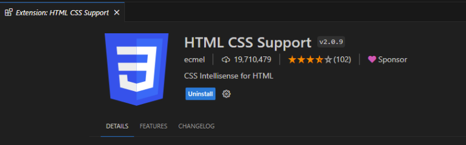</img>

  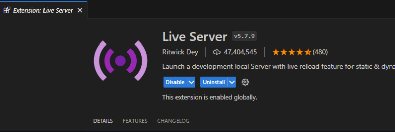</img>

</img>

 

- Configuración del Entorno de Desarrollo para Frontend:
  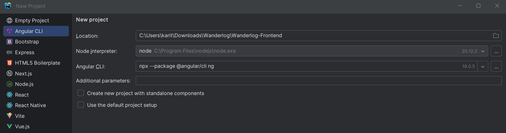</img>

 

- Configuración del Entorno de Desarrollo para Backend:
  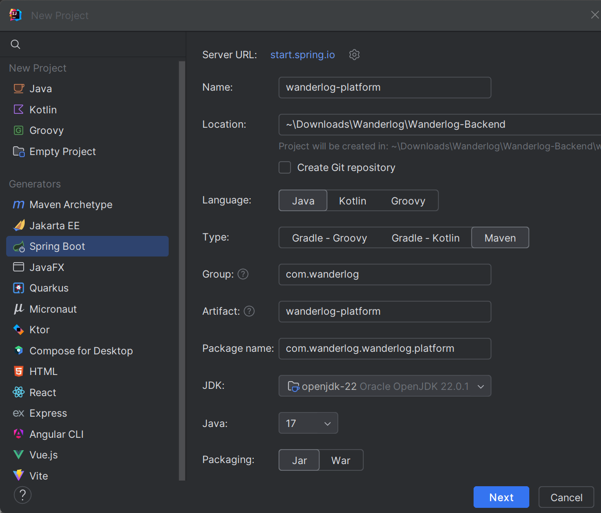</img>
  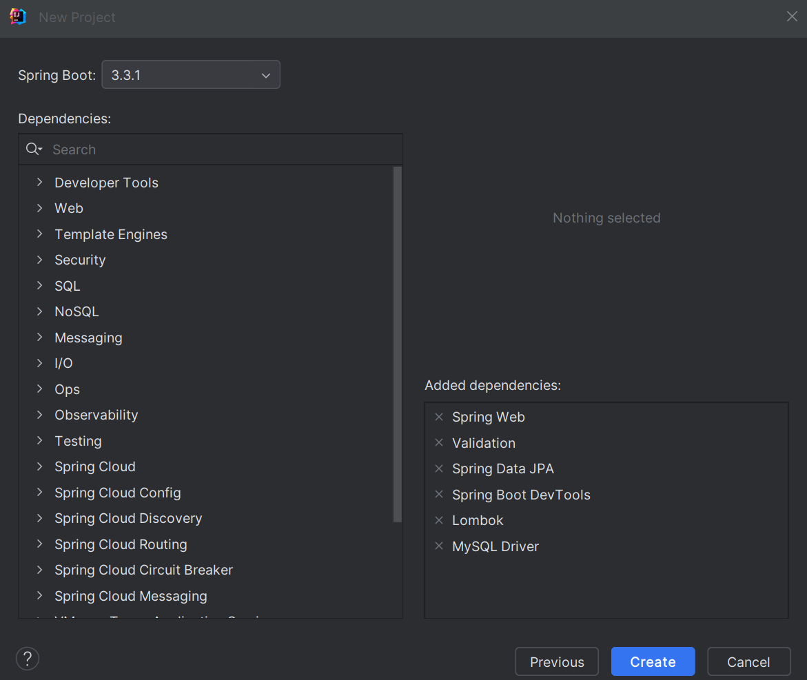</img>

 

## 5.2. Landing Page, Services & Applications Implementation
### 5.2.1. Sprint 1
#### 5.2.1.1. Sprint Planning 1
<table>
  <tr>
    <th>Sprint #</th>
    <td>Sprint 1</td>
  </tr>
  <tr>
    <th>Sprint Planning Background</th>
    <td>2024-04-22</td>
  </tr>
  <tr>
    <th>Time</th>
    <td>7 días</td>
  </tr>
  <tr>
    <th>Location</th>
    <td>Virtual</td>
  </tr>
  <tr>
    <th>Prepared By</th>
    <td> Cortés Casas, Joaquín Marcelo / Díaz Silva, Fernando Josué / Castilla Pachas, Cesar Antonio / Medina Chocce, Karito Dianeth </td>
  </tr>
  <tr>
    <th>Attendees</th>
    <td> Cortés Casas, Joaquín Marcelo / Díaz Silva, Fernando Josué / Castilla Pachas, Cesar Antonio / Medina Chocce, Karito Dianeth </td>
  </tr>
  <tr>
    <th>Sprint Review Summary</th>
    <td>El enfoque de este sprint estuvo centrado en desarrollar el landing page que sea dinámica y atractiva.</td>
  </tr>
  <tr>
    <th>Sprint Retrospective Summary</th>
    <td>En este sprint, se planea realizar el landing page</td>
  </tr>
  <tr>
    <th>Sprint Goal</th>
    <td>Desplegar la primera versión del Landing Page</td>
  </tr>
  <tr>
    <th>Sprint Velocity</th>
    <td>50 Puntos</td>
  </tr>
  <tr>
    <th>Sum of Story Points</th>
    <td>53 Puntos</td>
  </tr>
</table>

#### 5.2.1.2. Sprint Backlog 1

| User Story        |                   | Work Item/Task |               |                                                    |                   |                 |        |
|:------------------|:-----------------:|:--------------:|:-------------:|:--------------------------------------------------:|:-----------------:|:---------------:|:------:|
| **Id**            | **Title**         | **Id**         | **Title**     | **Description**                                    | **Estimation (Hours)**    | **Assigned To** | **Status** |
| US-01          | Creación de Landing Page Atractiva | TA-1   | Diseño inicial de la Landing Page | Se elabora un diseño inicial de la estructura del landing page. | (3hr)                 | Cortés Casas, Joaquín Marcelo   | Done   |
| US-01          | Creación de Landing Page Atractiva | TA-2   | Selección de paleta de colores y elementos gráficos | Se selecciona la paleta de colores previamente definida y elementos gráficos visualmente atractivos. | (1hr)                 | Cortés Casas, Joaquín Marcelo   | Done   |
| US-01          | Creación de Landing Page Atractiva | TA-3   | Implementación del diseño atractivo | Se implementa en el código el diseño atractivo. | (2hr)                 | Cortés Casas, Joaquín Marcelo   | Done   |
| US-02          | Material audiovisual | TA-4   | Selección y/o creación de material audiovisual  | Se selecciona y/o crea material audiovisual, ya sean imágenes, animaciones, o vídeos.  | (2hr)                 | Medina Chocce, Karito Dianeth   | Done   |
| US-02          | Material audiovisual | TA-5   | Implementación del material audiovisual en la Landing Page  | Se integra el material audiovisual seleccionado en el landing page.  | (2hr)                 | Medina Chocce, Karito Dianeth   | Done   |
| US-03          | Implementación de diseño moderno | TA-6   | Implementación de diseño moderno de Landing page  | Se aplican tendencias modernas de diseño web.  | (1hr)                 | Cortés Casas, Joaquín Marcelo   | Done   |
| US-04          | Implementación de tipografía legible | TA-7   | Selección e integración de tipografías legibles  | Se eligen tipografías fáciles de leer que complementen con el diseño de la landing page.  | (1hr)                 | Castilla Pachas, Cesar Antonio   | Done   |
| US-05          | Menor cantidad de texto | TA-8   | Reducción y Optimización de texto  | Se simplifica la cantidad de texto usada en el landing page, usando principalmente frases para comunicar la propuesta de valor.  | (1hr)                 | Medina Chocce, Karito Dianeth   | Done   |
| US-06          | Interfaz intuitiva para comprender la propuesta de Wanderlog | TA-9   | Diseño de la interfaz intuitiva  | Se diseña la estructura de la interfaz intuitiva del aplicativo.  | (2hr)                 | Medina Chocce, Karito Dianeth   | Done   |
| US-06          | Interfaz intuitiva para comprender la propuesta de Wanderlog | TA-10   | Implementación de la interfaz intuitiva  | Se implementa la interfaz intuitiva creada.  | (1hr)                 | Medina Chocce, Karito Dianeth   | Done   |
| US-07          | Implementación de responsive en la landing page | TA-11   | Diseño de interfaces para cada dispositivo  | Se crean las interfaces de la Landing Page que se adapten a  las pantallas de computadoras, tablets y celulares.  | (4hr)                 | Castilla Pachas, Cesar Antonio   | Done   |
| US-07          | Implementación de responsive en la landing page | TA-12   | Ajuste de la estructura web en base al tamaño de pantalla  | Se define la lógica que determina qué interfaz responsive se va a mostrar dependiendo del tamaño de pantalla del usuario.  | (1hr)                 | Castilla Pachas, Cesar Antonio   | Done   |
| US-08          | Sección de “Contacto” WanderLog en landing page | TA-13   | Diseño de la interfaz “Contacto”  | Se construye la interfaz donde se describen los medios de contacto con la Startup.  | (3hr)                 | Castilla Pachas, Cesar Antonio   | Done   |
| US-09          | Sección”Sobre Nosotros” en landing page | TA-14   | Diseño de la interfaz “Sobre los nosotros”  | Se construye la interfaz donde aparece información sobre los integrantes de la startup  | (3hr)                 | Medina Chocce, Karito Dianeth   | Done   |
| US-11          | Sección “Suscripción a noticias” en landing page | TA-15   | Diseño del formulario  | Se diseña la estructura y diseño del botón.  | (1hr)                 | Cortés Casas, Joaquín Marcelo   | Done   |
| US-11          | Sección “Suscripción a noticias” en landing page | TA-16   | Diseño de la interfaz “Suscripción”  | Se construye la interfaz donde el usuario puede ingresar su correo en el formulario para recibir noticias y promociones.  | (2hr)                 | Cortés Casas, Joaquín Marcelo   | Done   |
| US-12          | Sección “Testimonios” en landing page | TA-17   | Diseño de la interfaz “Testimonios”  | Se construye la interfaz donde se muestran testimonios surgientes de otros usuarios.  | (3hr)                 | Díaz Silva, Fernando   | Done   |
| US-13          | Agregar botón de “Inicio de sesión” | TA-18   | Diseño del botón  |Se diseña la estructura y diseño del botón.  | (1hr)                 | Cortés Casas, Joaquín Marcelo   | Done   |
| US-13          | Agregar botón de “Inicio de sesión” | TA-19   | Funcionalidad de routing  |Se aplica routing hacia la interfaz de “Inicio de Sesión”.  | (1hr)                 | Cortés Casas, Joaquín Marcelo   | Done   |
| US-17          | Implementación de las redes sociales | TA-20   | Diseño de íconos para las redes sociales  |Incorporación de los íconos de las redes sociales en el toolbar y footer.  | (2hr)                 | Cortés Casas, Joaquín Marcelo   | Done   |
| US-18          | Visualización de derechos de autor | TA-21   | Implementación de la sección de derechos de autor  |Diseñar la sección para mostrar la información sobre los derechos de autor de forma clara y visible.  | (1hr)                 | Cortés Casas, Joaquín Marcelo   | Done   |
| US-19          | Sección “Sobre la Startup” en el landing page | TA-22   | Redacción el contenido para la sección  |Elaborar textos descriptivos sobre la startup, su misión y visión.   | (2hr)                 | Díaz Silva, Fernando   | Done   |
| US-19          | Sección “Sobre la Startup” en el landing page | TA-23   | Diseño e implementación de la sección “Sobre la Startup”  |Diseñar y desarrollar la sección “Sobre la Startup” en el landing page.   | (3hr)                 | Díaz Silva, Fernando   | Done   |
| US-21          | Implementación de sección “Colaboradores” con escuelas | TA-24   | Diseño del espacio para los logos con las escuelas colaboradoras  |Crear un apartado en la landing page, donde se puedan visualizar todos los logos de las escuelas colaboradoras.   | (2hr)                 | Díaz Silva, Fernando   | Done   |
| US-22          | Implementación de sección de “Servicios” | TA-25   | Diseño e implementación de la sección “Servicios”   |CElaborar una sección en la cual se pueda visualizar y describir de manera clara , los servicios que tenemos disponibles (servicio de paquetes turísticos y paquetes escolares)   | (2hr)                 | Castilla Pachas, Cesar Antonio   | Done   |

#### 5.2.1.3. Development Evidence for Sprint Review

| Repository | Branch  | Commit Id | Commit Message| Commited on (Date) |
|------------|----------|-----------|---------------|-------------------|
| U202114545/Open-Source-Wanderlog/landing-page | main | 6b1aacf | Initial commit | 03/05/2024 |
| U202114545/Open-Source-Wanderlog/landing-page | u202114545/template-subscription | 6b1aacf | Initial commit | 03/05/2024 |
| U202114545/Open-Source-Wanderlog/landing-page | u202114545/template-subscription | 6b1aacf…4d6cc73 | My sprint 1 commits | 03/05/2024 |
| U202114545/Open-Source-Wanderlog/landing-page | main | 6b1aacf…3e85887 | Create index.html | 03/05/2024 |
| U202114545/Open-Source-Wanderlog/landing-page | main | 3e85887…486c436 | Create styles.css | 03/05/2024 |
| U202114545/Open-Source-Wanderlog/landing-page | main | 486c436…6318356 | Create script.js | 03/05/2024 |
| U202114545/Open-Source-Wanderlog/landing-page | develop | d0c4f96 | docs: Update Landing | 29/05/2024 |
| U202114545/Open-Source-Wanderlog/landing-page | main |  | Delete branch | 29/05/2024 |
| U202114545/Open-Source-Wanderlog/landing-page | develop | d0c4f96…d1ee071 | Últimos arreglos del Landing Page | 29/05/2024 |
| U202114545/Open-Source-Wanderlog/landing-page | develop | d1ee071…0c66064 | Create static.yml | 29/05/2024 |
| fernandoodiaz/Open-Source-Wanderlog/landing-page | u202112722/testimonials | 6318356 | Create script.js | 04/05/2024 |
| fernandoodiaz/Open-Source-Wanderlog/landing-page | u202112722/testimonials | 6318356…c031f99 | Testimonios añadidos. | 04/05/2024 |
| fernandoodiaz/Open-Source-Wanderlog/landing-page | u202112722/testimonials | c031f99…ea31907 | Testimonio - Sobre Nosotros - Sobre la Startup | 04/05/2024 |
| CesarrAnn/Open-Source-Wanderlog/landing-page | u202218735/contact-service | 6318356 | Create script.js | 04/05/2024 |
| CesarrAnn/Open-Source-Wanderlog/landing-page | u202218735/contact-service | 6318356…176726d | feat: Added contact and services | 04/05/2024 |
| CesarrAnn/Open-Source-Wanderlog/landing-page | u202218735/contact-service | 176726d…89bd616 | feat: Added images services | 04/05/2024 |
| CesarrAnn/Open-Source-Wanderlog/landing-page | main | 6318356…2e9020a | feat: Update version landing page | 17/05/2024 |
| CesarrAnn/Open-Source-Wanderlog/landing-page | main | 2e9020a…d0c4f96 | docs: Update Landing | 29/05/2024 |
| CesarrAnn/Open-Source-Wanderlog/landing-page | master | d0c4f96 | docs: Update Landing | 29/05/2024 |
| Karito07/Open-Source-Wanderlog/landing-page | u20221c769/about-us | 6318356 | Create script.js | 04/05/2024 |
| Karito07/Open-Source-Wanderlog/landing-page | u20221c769/about-us | f488643…959242a | feat: Added about-us in styles.css | 04/05/2024 |

#### 5.2.1.4. Testing Suite Evidence for Sprint Review
En el alcance del sprint 1, no se realizaron testing de la aplicación al haber solo trabajado en el landing page.

#### 5.2.1.5. Execution Evidence for Sprint Review

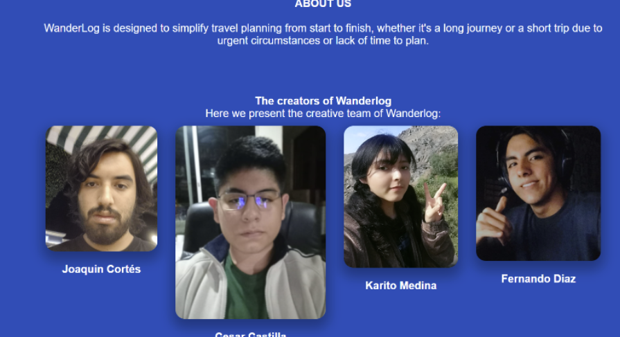</img>
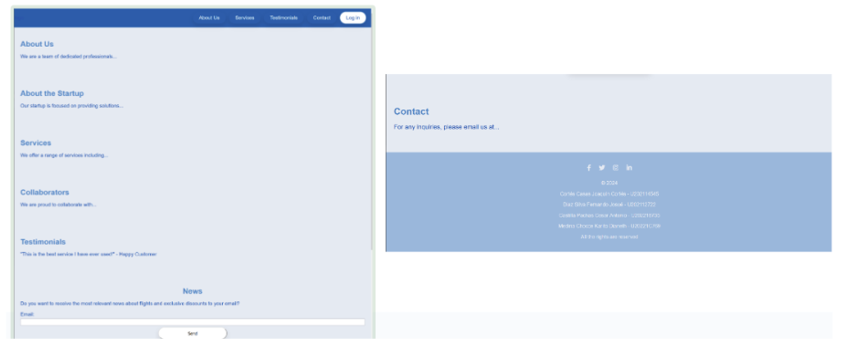</img>
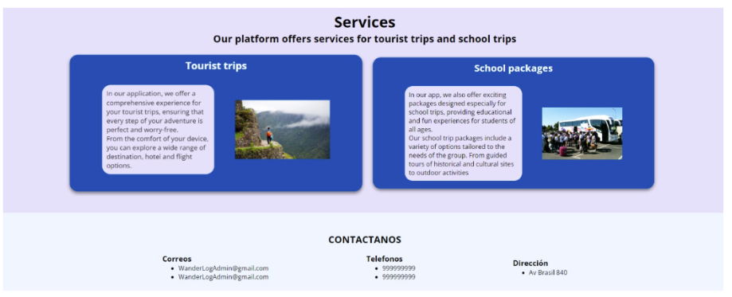</img>
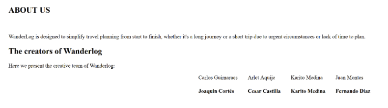</img>

#### 5.2.1.6. Services Documentation Evidence for Sprint Review

#### 5.2.1.7. Software Deployment Evidence for Sprint Review
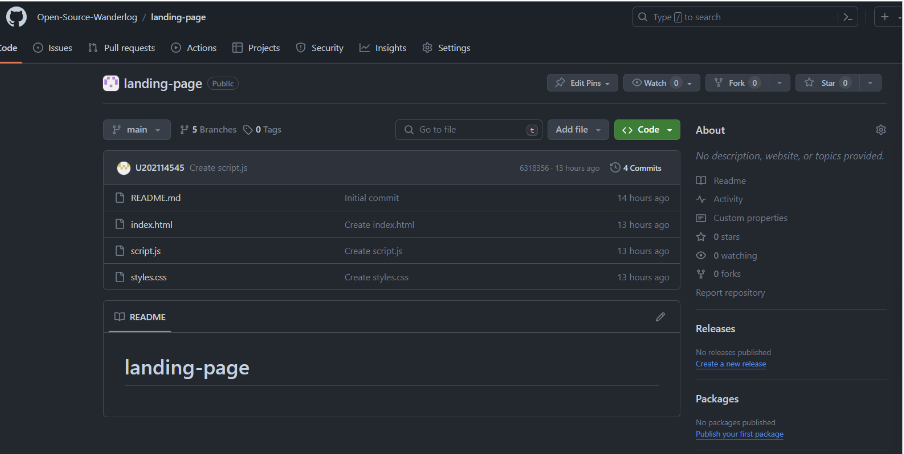</img>

#### 5.2.1.8. Team Collaboration Insights during Sprint 
A continuación se presentan capturas de los insights del repositorio del landing page en Github:

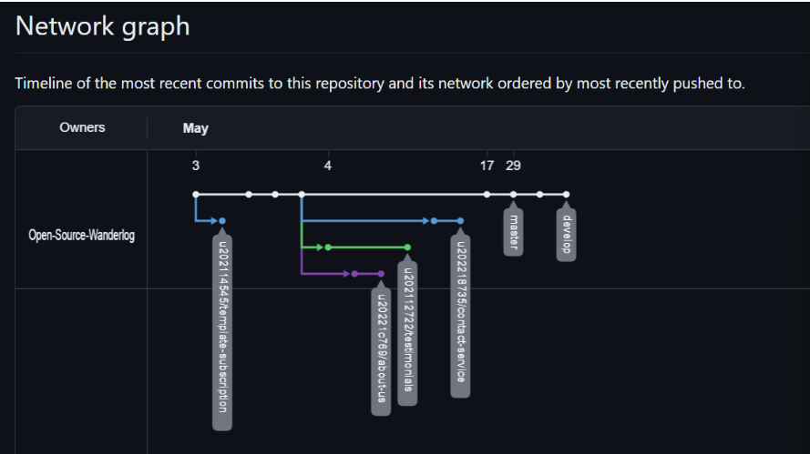</img>

### 5.2.2. Sprint 2
#### 5.2.2.1. Sprint Planning 2
<table>
  <tr>
    <th>Sprint #</th>
    <td>Sprint 2</td>
  </tr>
  <tr>
    <th>Sprint Planning Background</th>
    <td>26/04/2024</td>
  </tr>
  <tr>
    <th>Time</th>
    <td>9 días</td>
  </tr>
  <tr>
    <th>Location</th>
    <td>Virtual</td>
  </tr>
  <tr>
    <th>Prepared By</th>
    <td> Cortés Casas, Joaquín Marcelo / Díaz Silva, Fernando Josué / Castilla Pachas, Cesar Antonio / Medina Chocce, Karito Dianeth </td>
  </tr>
  <tr>
    <th>Attendees</th>
    <td> Cortés Casas, Joaquín Marcelo / Díaz Silva, Fernando Josué / Castilla Pachas, Cesar Antonio / Medina Chocce, Karito Dianeth </td>
  </tr>
  <tr>
    <th>Sprint Review Summary</th>
    <td>US- 10: Exploración de destinos populares (8 us. points)
  
Como viajero ocasional, quiero poder explorar una variedad de destinos populares y obtener recomendaciones personalizadas para inspirarme en mi próximo viaje.

US- 14: Registro de cuenta de usuario  (5 us. points)

Como viajero ocasional, quiero poder registrarme fácilmente en la plataforma para acceder a todas las funcionalidades del aplicativo

US- 16: Sección de ofertas especiales  (5 us. points)

Como viajero ocasional, quiero ver una sección de ofertas especiales en la página de inicio para acceder a descuentos exclusivos en vuelos y alojamientos

US- 20:Sección de paquetes estudiantiles (8 us. points)

Como padre interesado en los servicios ofrecidos por el aplicativo, quiero encontrar una sección dedicada a los paquetes estudiantiles en el sitio web, para obtener información sobre ofertas especiales, descuentos y servicios dirigidos específicamente a estudiantes como mis hijos.
</td>
  </tr>
  <tr>
    <th>Sprint Retrospective Summary</th>
    <td>En esta sección todos los integrantes mencionaron tener aciertos en partes del código y en otras partes poder mejorar sus habilidades realizando el FrontEnd Web Application</td>
  </tr>
  <tr>
    <th>Sprint Goal</th>
    <td>Desplegar la primera versión del Aplicativo web</td>
  </tr>
  <tr>
    <th>Sprint Velocity</th>
    <td>18 Puntos</td>
  </tr>
  <tr>
    <th>Sum of Story Points</th>
    <td>26 Puntos</td>
  </tr>
</table>

#### 5.2.2.2. Sprint Backlog 2

| User Story        |                   | Work Item/Task |               |                                                    |                   |                 |        |
|:------------------|:-----------------:|:--------------:|:-------------:|:--------------------------------------------------:|:-----------------:|:---------------:|:------:|
| **Id**            | **Title**         | **Id**         | **Title**     | **Description**                                    | **Estimation (Hours)**    | **Assigned To** | **Status** |
| US-10          | Exploración de destinos populares | TA-1   | Diseño de botón para la exploración de destinos populares | Se elabora un botón que llevará a la exploración de los destinos populares | (1hr)                 | Castilla Pachas, Cesar Antonio   | Done   |
| US-14          | Registro de cuenta de usuario | TA-2   | Diseño de interfaz de usuario | Se elabora el diseño de interfaz de usuario del perfil | (2hr)                 | Cortés Casas, Joaquín Marcelo   | Done   |
| US-15          | Agregar botón de “Explorar ahora” | TA-3   | Diseño del botón para “Explorar ahora” | Se elabora el diseño del botón para explorar ahora los viajes | (1hr)                 | Castilla Pachas Cesar Antonio   | Done   |
| US-16          | Sección de ofertas especiales | TA-4   | Diseño de la sección para el detalle de las ofertas especiales  | Se elabora el diseño para la interfaz de la sección de las ofertas especiales  | (2hr)                 | Castilla Pachas Cesar Antonio   | Done   |
| US-20          | Sección de paquetes estudiantiles | TA-5   | Sección de paquetes estudiantiles  | Se elabora los paquetes de los estudiantes  | (3hr)                 | Cortés Casas, Joaquín Marcelo   | To-do   |
| US-23          | Implementación de sección “Planes” | TA-6   | Diseño para la sección de los planes  | Se elabora el diseño de interfaz de la sección de planes  | (3hr)                 | Medina Chocce, Karito Dianeth   | Done   |
| US-24          | Visualización del costo total del plan de viajes | TA-7   | Visualización del costo total del plan de viajes  | Se elabora la visualización de los costos totales de los planes de viajes  | (3hr)                 | Medina Chocce, Karito Dianeth   | To-do   |
| US-26          | Implementación de apartado que incluya información detallada del servicio turístico seleccionado | TA-9   | Acceso a información detallada  | Se elabora el acceso a la información más detallada  | (3hr)                 | Díaz Silva, Fernando Josué   | To-do   |
| US-27          | Búsqueda avanzada de servicios turísticos con filtros | TA-10   | Búsqueda avanzada con filtros  | Se implementa una búsqueda accesible por filtros para una mayor comodidad de los usuarios  | (4hr)                 | Cortés Casas, Joaquín Marcelo   | To-do   |
| US-28          | Recomendación en base a viajes | TA-11   | Recomendación de viajes  | Se implementa las recomendaciones de viajes en base a viajes recientes  | (2hr)                 | Castilla Pachas, Cesar Antonio   | To-do   |
| US-29          | Compartir planes de viajes | TA-12   | Compartir viaje  | Se implementa la opción de compartir viajes  | (1hr)                 | Medina Chocce, Karito Dianeth   | To-do   |
| US-30          | Función de reseñas y valoraciones de servicios turísticos | TA-13   | Reseñas y Valoraciones  | Se implementa la opción de añadir reseñas y valoración sobre los servicios turísticos.  | (3hr)                 | Díaz Silva, Fernando Josué   | To-do   |

#### 5.2.2.3. Development Evidence for Sprint Review

| Repository | Branch  | Commit Id | Commit Message| Commited on (Date) |
|------------|----------|-----------|---------------|-------------------|
| CesarrAnn/Open-Source-Wanderlog/app-web | feature/Homepages | 69fa21d | feat: update styles | 04/05/2024 |
| CesarrAnn/Open-Source-Wanderlog/app-web | master | f25d5fb | Initial commit | 29/05/2024 |
| U202114545/Open-Source-Wanderlog/app-web | feature/UserProfile | f25d5fb | Initial commit | 04/05/2024 |
| U202114545/Open-Source-Wanderlog/app-web | feature/UserProfile | f25d5fb…db1858d | My sprint 2 contribution | 04/05/2024 |
| Karito07/Open-Source-Wanderlog/app-web | feature/plans | f25d5fb | Initial commit | 04/05/2024 |
| Karito07/Open-Source-Wanderlog/app-web | feature/plans | f25d5fb…5f9d2a3 | Create fiel plans | 04/05/2024 |
| Karito07/Open-Source-Wanderlog/app-web | feature/plans | 5f9d2a3…f6cf5db | Delete src/app/plans | 04/05/2024 |
| Karito07/Open-Source-Wanderlog/app-web | feature/plans | f6cf5db…e63d0a5 | Create plans.component.css | 04/05/2024 |
| Karito07/Open-Source-Wanderlog/app-web | feature/plans | e63d0a5…4d30fc6 | feat: Added plans.component | 04/05/2024 |
| Karito07/Open-Source-Wanderlog/app-web | feature/plans | 4d30fc6…e73c894 | Create assets | 04/05/2024 |
| Karito07/Open-Source-Wanderlog/app-web | feature/plans | e73c894…d1fcb0a | feat: Added assets images | 04/05/2024 |
| Karito07/Open-Source-Wanderlog/app-web | feature/plans | d1fcb0a…9f7ec04 | Delete src/assets/… | 04/05/2024 |

#### 5.2.2.4. Testing Suite Evidence for Sprint Review
En el alcance del sprint 2, no se realizaron testing de la aplicación al haber solo trabajado en el landing page.

#### 5.2.2.5. Execution Evidence for Sprint Review

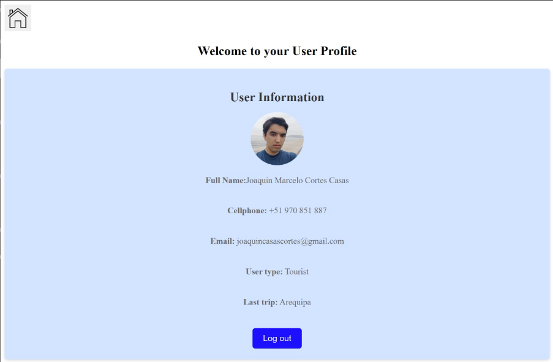</img>
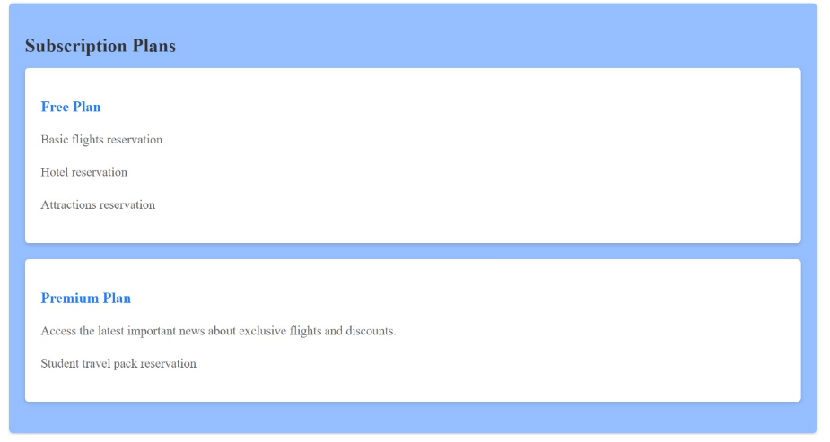</img>
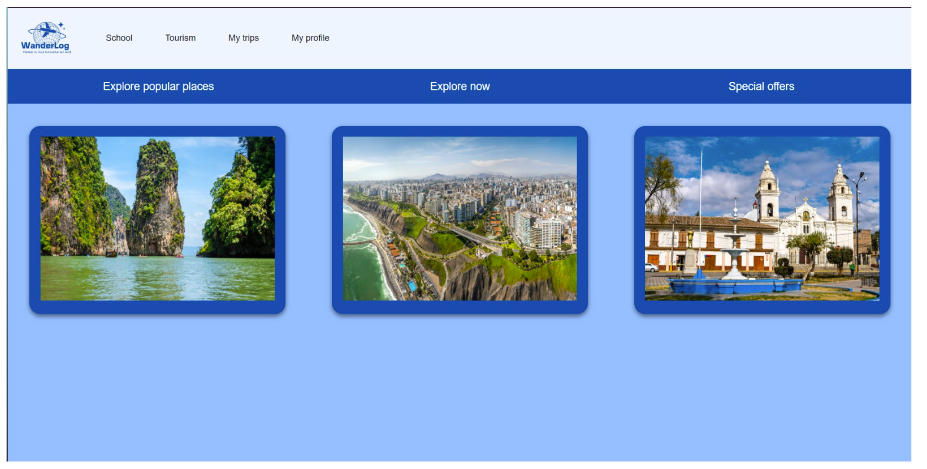</img>
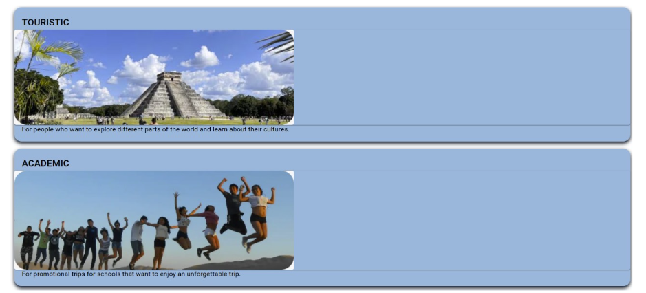</img>

#### 5.2.2.6. Services Documentation Evidence for Sprint Review

#### 5.2.2.7. Software Deployment Evidence for Sprint Review
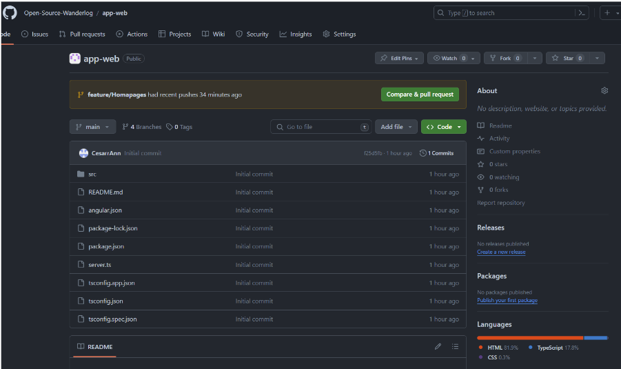</img>

#### 5.2.2.8. Team Collaboration Insights during Sprint 
A continuación se presentan capturas de los insights del repositorio del landing page en Github:

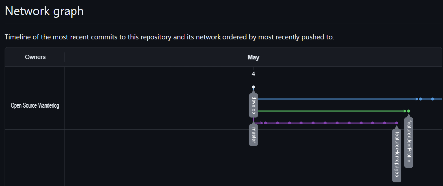</img>

### 5.2.3. Sprint 3
#### 5.2.3.1. Sprint Planning 3
<table>
  <tr>
    <th>Sprint #</th>
    <td>Sprint 3</td>
  </tr>
  <tr>
    <th>Sprint Planning Background</th>
    <td>3/06/2024</td>
  </tr>
  <tr>
    <th>Time</th>
    <td>5 días</td>
  </tr>
  <tr>
    <th>Location</th>
    <td>Virtual</td>
  </tr>
  <tr>
    <th>Prepared By</th>
    <td> Cortés Casas, Joaquín Marcelo / Díaz Silva, Fernando Josué / Castilla Pachas, Cesar Antonio / Medina Chocce, Karito Dianeth </td>
  </tr>
  <tr>
    <th>Attendees</th>
    <td> Cortés Casas, Joaquín Marcelo / Díaz Silva, Fernando Josué / Castilla Pachas, Cesar Antonio / Medina Chocce, Karito Dianeth </td>
  </tr>
  <tr>
    <th>Sprint Review Summary</th>
    <td>En el sprint anterior se ha logrado mejorar el landing page. Además, se ha adjuntado la primera versión del aplicativo web. 
</td>
  </tr>
  <tr>
    <th>Sprint Retrospective Summary</th>
    <td>Existe la oportunidad de mejora en ambos Landing Page y Aplicativo Web, para brindar un mayor nivel de calidad y consistencia.</td>
  </tr>
  <tr>
    <th>Sprint Goal</th>
    <td>Desplegar la tercera versión del Landing Page
Desplegar la segunda versión del Aplicativo web
Desplegar la primera versión del Backend
</td>
  </tr>
  <tr>
    <th>Sprint Velocity</th>
    <td>15 Puntos</td>
  </tr>
  <tr>
    <th>Sum of Story Points</th>
    <td>24 Puntos</td>
  </tr>
</table>

#### 5.2.3.2. Sprint Backlog 3

| User Story        |                   | Work Item/Task |               |                                                    |                   |                 |        |
|:------------------|:-----------------:|:--------------:|:-------------:|:--------------------------------------------------:|:-----------------:|:---------------:|:------:|
| **Id**            | **Title**         | **Id**         | **Title**     | **Description**                                    | **Estimation (Hours)**    | **Assigned To** | **Status** |
| US-10          | Exploración de destinos populares | TA-1   | Diseño de botón para la exploración de destinos populares | Se elabora un botón que llevará a la exploración de los destinos populares | (1hr)                 | Castilla Pachas, Cesar Antonio   | To-Do   |
| US-14          | Registro de cuenta de usuario | TA-2   | Diseño de interfaz de usuario | Se elabora el diseño de interfaz de usuario del perfil | (2hr)                 | Cortés Casas, Joaquín Marcelo   | Done   |
| US-15          | Agregar botón de “Explorar ahora” | TA-3   | Diseño del botón para “Explorar ahora” | Se elabora el diseño del botón para explorar ahora los viajes | (1hr)                 | Castilla Pachas Cesar Antonio   | Done   |
| US-16          | Sección de ofertas especiales | TA-4   | Diseño de la sección para el detalle de las ofertas especiales  | Se elabora el diseño para la interfaz de la sección de las ofertas especiales  | (2hr)                 | Castilla Pachas Cesar Antonio   | To-Do   |
| US-20          | Sección de paquetes estudiantiles | TA-5   | Sección de paquetes estudiantiles  | Se elabora los paquetes de los estudiantes  | (3hr)                 | Cortés Casas, Joaquín Marcelo   | To-do   |
| US-23          | Implementación de sección “Planes” | TA-6   | Diseño para la sección de los planes  | Se elabora el diseño de interfaz de la sección de planes  | (3hr)                 | Medina Chocce, Karito Dianeth   | Done   |
| US-24          | Visualización del costo total del plan de viajes | TA-7   | Visualización del costo total del plan de viajes  | Se elabora la visualización de los costos totales de los planes de viajes  | (3hr)                 | Medina Chocce, Karito Dianeth   | To-do   |
| US-28          | Recomendación en base a viajes previos | TA-11   | Registro y uso de viajes previos del usuario  | Se establece un historial en cuanto a los viajes previos del usuario y se muestra en pantalla los puntos de destino más deseables  | (2hr)                 | Castilla Pachas, Cesar Antonio   | Done   |

#### 5.2.3.3. Development Evidence for Sprint Review

| Repository | Branch  | Commit Id | Commit Message| Commited on (Date) |
|------------|----------|-----------|---------------|-------------------|
| U202114545/Open-Source-Wanderlog/frontend-project | origin/feature/signup | 9873f44 |Estructura básica del landing | 06/06/2024 |
| U202114545/Open-Source-Wanderlog/frontend-project | origin/feature/signup | 9873f44…6b1af0e |Formularios de acceso y registro | 06/06/2024 |
| U202114545/Open-Source-Wanderlog/frontend-project | origin/feature/user | 6b1af0e |Formularios de acceso y registro | 06/06/2024 |
| CesarrAnn/Open-Source-Wnaderlog/frontend-project | origin/feature/explore | 9873f44 |Estructura básica del landing | 06/06/2024 |
| CesarrAnn/Open-Source-Wnaderlog/frontend-project | origin/feature/explore |  |Deleted branch | 06/06/2024 |
| CesarrAnn/Open-Source-Wnaderlog/frontend-project | origin/feature/explore | 2677da6 |Merge the feature/principal | 06/06/2024 |
| CesarrAnn/Open-Source-Wnaderlog/frontend-project | origin/feature/principal | 9873f44 |Estructura básica del landing | 06/06/2024 |
| CesarrAnn/Open-Source-Wnaderlog/frontend-project | origin/feature/principal | 9873f44…9a80753 |docs: Added Homepages | 06/06/2024 |
| CesarrAnn/Open-Source-Wnaderlog/frontend-project | origin/feature/principal | 9a80753…ab28ca4 |docs: Added Homepages | 06/06/2024 |
| fernandoodiaz/Open-Source-Wanderlog/wanderlog-backend | main | 6fa45b8 |Initial commit | 06/06/2024 |
| CesarrAnn/Open-Source-Wanderlog/images-front | main | b4c337f…cd43057 |added images | 07/06/2024 |
| CesarrAnn/Open-Source-Wanderlog/images-front | main | cd43057…51ae949 |Added images | 07/06/2024 |
| CesarrAnn/Open-Source-Wanderlog/images-front | main | 51ae949…6a7bf09 |Added images | 07/06/2024 |
| U202114545/Open-Source-Wanderlog/images-front | main | 35e022c |Initial commit | 07/06/2024 |
| U202114545/Open-Source-Wanderlog/images-front | main | 35e022c…b4c337f  |Add files via updload | 07/06/2024 |

#### 5.2.3.4. Testing Suite Evidence for Sprint Review
En el alcance del sprint 3, se realizaron testing del backend.

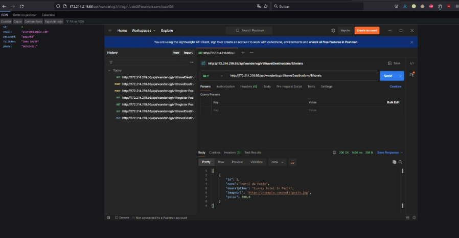</img>
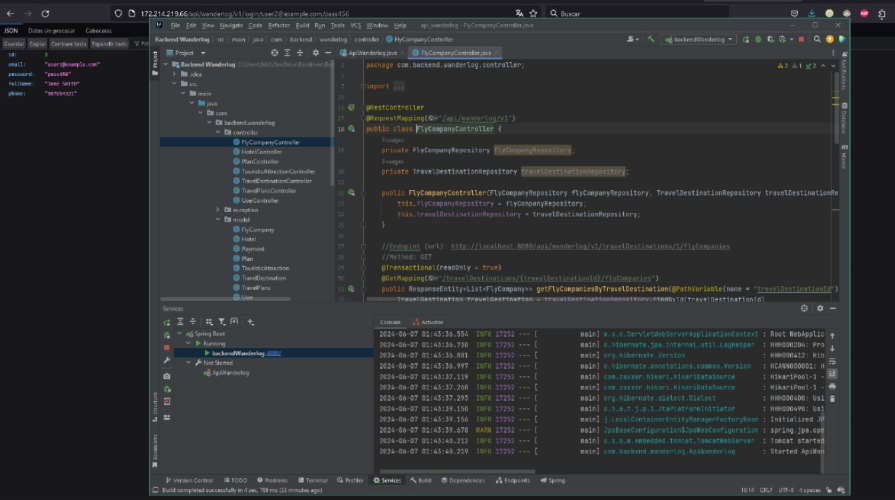</img>
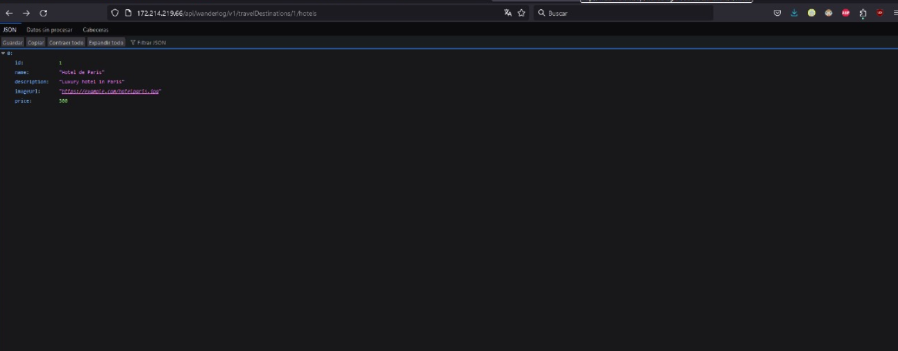</img>
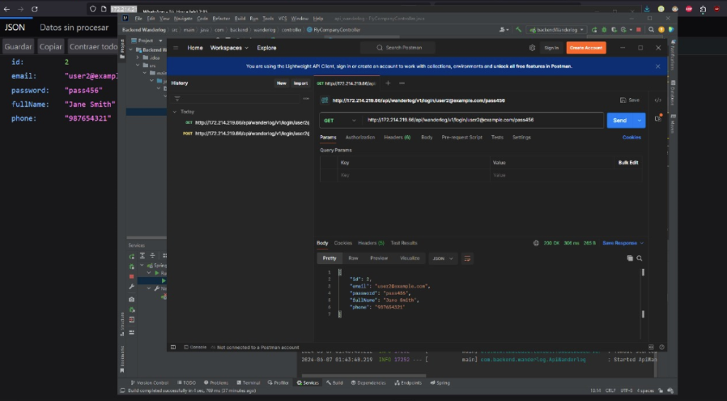</img>

#### 5.2.3.5. Execution Evidence for Sprint Review

</img>
</img>
</img>
</img>
</img>
</img>
</img>
</img>

#### 5.2.3.6. Services Documentation Evidence for Sprint Review

#### 5.2.3.7. Software Deployment Evidence for Sprint Review
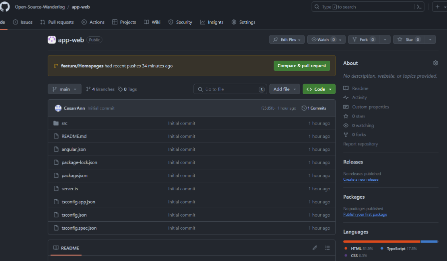</img>

#### 5.2.3.8. Team Collaboration Insights during Sprint 
A continuación se presentan capturas de los insights del repositorio del landing page en Github:

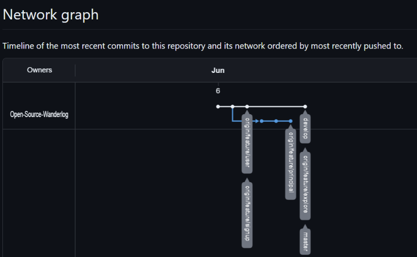</img>
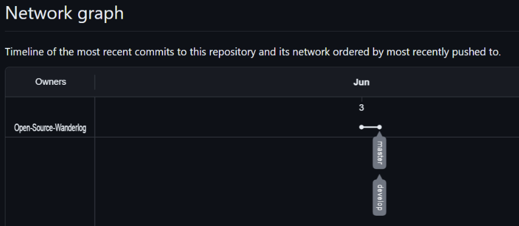</img>
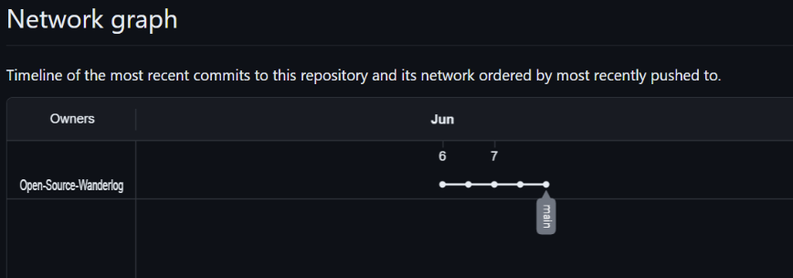</img>

### 5.2.4. Sprint 4
#### 5.2.4.1. Sprint Planning 4
<table>
  <tr>
    <th>Sprint #</th>
    <td>Sprint 4</td>
  </tr>
  <tr>
    <th>Sprint Planning Background</th>
    <td>10/06/2024</td>
  </tr>
  <tr>
    <th>Time</th>
    <td>5 días</td>
  </tr>
  <tr>
    <th>Location</th>
    <td>Virtual</td>
  </tr>
  <tr>
    <th>Prepared By</th>
    <td> Cortés Casas, Joaquín Marcelo / Díaz Silva, Fernando Josué / Castilla Pachas, Cesar Antonio / Medina Chocce, Karito Dianeth </td>
  </tr>
  <tr>
    <th>Attendees</th>
    <td> Cortés Casas, Joaquín Marcelo / Díaz Silva, Fernando Josué / Castilla Pachas, Cesar Antonio / Medina Chocce, Karito Dianeth </td>
  </tr>
  <tr>
    <th>Sprint Review Summary</th>
    <td>En el sprint anterior se empezó el backend para la creación de una API. 
</td>
  </tr>
  <tr>
    <th>Sprint Retrospective Summary</th>
    <td>Se trató de imp</td>
  </tr>
  <tr>
    <th>Sprint Goal</th>
    <td>Implementar el Backend con el Frontend, hacer el deploy de la aplicación.
</td>
  </tr>
  <tr>
    <th>Sprint Velocity</th>
    <td>15 Puntos</td>
  </tr>
  <tr>
    <th>Sum of Story Points</th>
    <td>24 Puntos</td>
  </tr>
</table>

#### 5.2.4.2. Sprint Backlog 4

| User Story        |                   | Work Item/Task |               |                                                    |                   |                 |        |
|:------------------|:-----------------:|:--------------:|:-------------:|:--------------------------------------------------:|:-----------------:|:---------------:|:------:|
| **Id**            | **Title**         | **Id**         | **Title**     | **Description**                                    | **Estimation (Hours)**    | **Assigned To** | **Status** |
| US-10          | Exploración de destinos populares | TA-1   | Diseño de botón para la exploración de destinos populares | Se elabora un botón que llevará a la exploración de los destinos populares | (1hr)                 | Castilla Pachas, Cesar Antonio   | To-Do   |
| US-14          | Registro de cuenta de usuario | TA-2   | Diseño de interfaz de usuario | Se elabora el diseño de interfaz de usuario del perfil | (2hr)                 | Cortés Casas, Joaquín Marcelo   | Done   |
| US-15          | Agregar botón de “Explorar ahora” | TA-3   | Diseño del botón para “Explorar ahora” | Se elabora el diseño del botón para explorar ahora los viajes | (1hr)                 | Castilla Pachas Cesar Antonio   | Done   |
| US-16          | Sección de ofertas especiales | TA-4   | Diseño de la sección para el detalle de las ofertas especiales  | Se elabora el diseño para la interfaz de la sección de las ofertas especiales  | (2hr)                 | Castilla Pachas Cesar Antonio   | To-Do   |
| US-20          | Sección de paquetes estudiantiles | TA-5   | Sección de paquetes estudiantiles  | Se elabora los paquetes de los estudiantes  | (3hr)                 | Cortés Casas, Joaquín Marcelo   | To-do   |
| US-23          | Implementación de sección “Planes” | TA-6   | Diseño para la sección de los planes  | Se elabora el diseño de interfaz de la sección de planes  | (3hr)                 | Medina Chocce, Karito Dianeth   | Done   |
| US-24          | Visualización del costo total del plan de viajes | TA-7   | Visualización del costo total del plan de viajes  | Se elabora la visualización de los costos totales de los planes de viajes  | (3hr)                 | Medina Chocce, Karito Dianeth   | To-do   |
| US-28          | Recomendación en base a viajes previos | TA-11   | Registro y uso de viajes previos del usuario  | Se establece un historial en cuanto a los viajes previos del usuario y se muestra en pantalla los puntos de destino más deseables  | (2hr)                 | Castilla Pachas, Cesar Antonio   | Done   |

#### 5.2.4.3. Development Evidence for Sprint Review

| Repository | Branch  | Commit Id | Commit Message| Commited on (Date) |
|------------|----------|-----------|---------------|-------------------|
| U202114545/Open-Source-Wanderlog/frontend-project | origin/feature/signup | 9873f44 |Estructura básica del landing | 06/06/2024 |
| U202114545/Open-Source-Wanderlog/frontend-project | origin/feature/signup | 9873f44…6b1af0e |Formularios de acceso y registro | 06/06/2024 |
| U202114545/Open-Source-Wanderlog/frontend-project | origin/feature/user | 6b1af0e |Formularios de acceso y registro | 06/06/2024 |
| CesarrAnn/Open-Source-Wnaderlog/frontend-project | origin/feature/explore | 9873f44 |Estructura básica del landing | 06/06/2024 |
| CesarrAnn/Open-Source-Wnaderlog/frontend-project | origin/feature/explore |  |Deleted branch | 06/06/2024 |
| CesarrAnn/Open-Source-Wnaderlog/frontend-project | origin/feature/explore | 2677da6 |Merge the feature/principal | 06/06/2024 |
| CesarrAnn/Open-Source-Wnaderlog/frontend-project | origin/feature/principal | 9873f44 |Estructura básica del landing | 06/06/2024 |
| CesarrAnn/Open-Source-Wnaderlog/frontend-project | origin/feature/principal | 9873f44…9a80753 |docs: Added Homepages | 06/06/2024 |
| CesarrAnn/Open-Source-Wnaderlog/frontend-project | origin/feature/principal | 9a80753…ab28ca4 |docs: Added Homepages | 06/06/2024 |
| fernandoodiaz/Open-Source-Wanderlog/wanderlog-backend | main | 6fa45b8 |Initial commit | 06/06/2024 |
| CesarrAnn/Open-Source-Wanderlog/images-front | main | b4c337f…cd43057 |added images | 07/06/2024 |
| CesarrAnn/Open-Source-Wanderlog/images-front | main | cd43057…51ae949 |Added images | 07/06/2024 |
| CesarrAnn/Open-Source-Wanderlog/images-front | main | 51ae949…6a7bf09 |Added images | 07/06/2024 |
| U202114545/Open-Source-Wanderlog/images-front | main | 35e022c |Initial commit | 07/06/2024 |
| U202114545/Open-Source-Wanderlog/images-front | main | 35e022c…b4c337f  |Add files via updload | 07/06/2024 |

#### 5.2.4.4. Testing Suite Evidence for Sprint Review
En el alcance del sprint 3, se realizaron testing del backend.

</img>
</img>
</img>
</img>

#### 5.2.4.5. Execution Evidence for Sprint Review

</img>
</img>
</img>
</img>
</img>
</img>
</img>
</img>

#### 5.2.4.6. Services Documentation Evidence for Sprint Review

#### 5.2.4.7. Software Deployment Evidence for Sprint Review
</img>

#### 5.2.4.8. Team Collaboration Insights during Sprint 
A continuación se presentan capturas de los insights del repositorio del landing page en Github:

</img>
</img>
</img>

## 5.3. Validation Interviews
En esta sección se detalla el proceso de validación mediante entrevistas con usuarios y expertos. Estas entrevistas son cruciales para evaluar la usabilidad, funcionalidad y eficacia de la aplicación Wnaderlog, garantizando que cumple con las necesidades y expectativas de nuestros segmentos de mercado.

### 5.3.1. Diseño de Entrevistas
Se decribe la metodología utilizada para diseñar las entrevistas de validación, incluyendo la selección de participantes, la formulación de preguntas y el enfoque adaptaddo para obtener información relevante y precisa sobre la experiencia del usuario con la aplicación Wnaderlog.

**Segmento Objetivo 1: Viajeros Turísticos:**  
- **Preguntas Generales**
  - ¿Cuál es su nombre?
  - ¿Cuál es su sexo?
  - ¿Cuántos años tiene?
  - ¿Cuál es su ocupación?
         
- **Preguntas Específicas**
  - Segun lo visto, ¿qué te parecio la estructuración de la página?
  - ¿Cuáles son los puntos de mejora?
  - ¿Crees que la aplicación es intuitiva y fácil de usar?
  - ¿Se te dificulto alguna sección de la aplicación?
  - ¿Cuáles son los puntos positivos y negativos que destacas de la aplicación?

**Segmento Objetivo 2: Viajeros Escolares**  
- **Preguntas Generales**
  - ¿Cuál es su nombre?
  - ¿Cuál es su sexo?
  - ¿Cuántos años tiene?
  - ¿Cuál es su ocupación?
         
- **Preguntas Específicas**
  - Segun lo visto, ¿qué te parecio la estructuración de la página?
  - ¿Cuáles son los puntos de mejora?
  - ¿Crees que la aplicación es intuitiva y fácil de usar?
  - ¿Se te dificulto alguna sección de la aplicación?
  - ¿Cuáles son los puntos positivos y negativos que destacas de la aplicación?

### 5.3.2. Registro de Entrevistas
Esta subsección presenta un registro detallado de las entrevistas realizadas, documentando las respuestas de los participantes, las observaciones clave y los comentarios obtenidos durante las sesiones de validación. Estos registros proporcionan una base sólida para el análisis y la mejora del producto.

**Segmento Objetivo 1: Viajeros Turísticos**
-------------------------------------------
**Entrevistado(a) #1:** 
**Sexo:** 
**Edad:** 
**Ocupación** 
**Minuto de la entrevista:** 
**Enlace del video completo de las entrevistas:** 

 

**Resumen de la entrevista:**

  

**Segmento Objetivo 2: Viajeros Escolares**
-------------------------------------------
**Entrevistado(a) #1:** 
**Sexo:** 
**Edad:** 
**Ocupación** 
**Minuto de la entrevista:** 
**Enlace del video completo de las entrevistas:** 

 

**Resumen de la entrevista:**

  

### 5.3.3. Evaluación según heurísticas
Aquí se explican las evaluaciones realizadas utilizando principios heurísticos de usabilidad. Se analizan los resultados obtenidos y se identifican áreas de mejora en la interfaz y la funcionalidad de la aplicación, con el fin de optimizar la experiencia del usuario y asegurar la eficacia del producto.

**UX Heuristics & Principles Evaluation Usability - Inclusive Design - Information Architecture**

**Carrera:** Ingeniería de Software
**Curso:** Desarrollo de Aplicaciones Open Source
**Sección:** WX56
**Profesores:** Todos
**Cliente(s):**

**Site o App a Evaluar:** Wanderlog

**Tareas a Evaluar:**
**Escala de Severidad:**
Los errores serán puntiados tomando en cuenta la siguiente escala de severidad

| Nivel | Descripción |
|-------|-------------|
|   1   | Problema superficial: puede ser fácilmente superado por el usuario ó ocurre con muy poco frecuencia. No necesita ser arreglado a no ser que exista disponibilidad de tiempo. |
|   2   | Problema menor: puede ocurrir un poco más frecuentemente o es un poco más difícil de superar para el usuario. Se le debería asignar una prioridad baja de cara resolverlo al siguiente release. |
|   3   | Problema mayor: ocurre frecuentemente o los usuarios no son capaces de resolverlos. Es importante que sean corregidos y se les debe asignar una prioridad alta. |
|   4   | Problema muy grave: un error de gran impacto que impide al usuario continuar con el uso de la herramienta. Es imperativo que sea corregido antes del lanzamiento. |

**Tabla Resumen:**

| # | Problema | Escala de Severidad | Heurística/Principio violada(o) |
|---|----------|---------------------|---------------------|
| 1 | | | |

 

**Descripción del Problemas:**
- **Problema #1:**
- **Severidad:**
- **Heurística/Principio violada(o):**
- **Problema:**
- **Recomendación:**
 

## 5.4. Video About-The-Product
En esta sección se presenta un video explicatiovo sobre la aplicación Wanderlog. El video destaca las principales características y beneficios del producto, demostrando cómo stisface las necesidad de los viajeros. Este recurso visual es esencial para comunicar de manera efectiva el valor de la apliación a potenciales usuarios e inversores.

# Bibliografía

- GitHub Documentation (2023). GitHub Pages. Retrieved from https://docs.github.com/en/pages 
- MDN Web Docs (2023). HTML: HyperText Markup Language. Retrieved from https://developer.mozilla.org/en-US/docs/Web/HTML 
- Nielsen, J., & Molich, R. (1990). Heuristic evaluation of user interfaces. Proceedings of the SIGCHI conference on Human factors in computing systems, 249-256. https://dl.acm.org/doi/10.1145/97243.97281 
- Cooper, A., Reimann, R., Cronin, D., & Noessel, C. (2014). About Face: The Essentials of Interaction Design. Wiley. https://www.wiley.com/en-us/About+Face%3A+The+Essentials+of+Interaction+Design%2C+4th+Edition-p-9781118766576 
- ISO/IEC 25010:2011. (2011). Systems and software engineering—Systems and software Quality Requirements and Evaluation (SQuaRE)—System and software quality models. International Organization for Standardization. https://www.iso.org/standard/35733.html 
- Krug, S. (2014). Don't Make Me Think, Revisited: A Common Sense Approach to Web Usability. New Riders. https://www.dontmakemethink.com 

# Conclusiones:

## TB1
En la primera parte del proyecto la TB1, se realizaron avances significativos en la elaboración del informe y en el desarrollo de la primera versión de la landing page de nuestro aplicativo WanderLog. Este periodo se centró en establecer las bases del proyecto, definiendo claramente los objetivos, los alcances y las herramientas que se utilizarán a lo largo del desarrollo.

***Avances del Informe:***

**Documentación Inicial:** Se completó una primera versión del informe que incluye una descripción detallada del entorno de desarrollo, la gestión del código fuente y las guías de estilo para asegurar la consistencia del código.
Configuración del Entorno: Se detallaron las herramientas y plataformas utilizadas, como UXPressia, Figma, Vertabelo, LucidChart, GitHub, Visual Studio Code, y GitHub Pages, proporcionando enlaces y explicaciones claras para que cualquier miembro del equipo pueda integrarse fácilmente al proyecto.

***Desarrollo de la Landing Page:***

**Diseño Inicial:** Se desarrolló la primera versión de la landing page utilizando HTML5 y CSS3, enfocándose en una estructura básica y una apariencia visual que atrajera a los usuarios.
Colaboración en Figma: Se utilizaron wireframes y mockups en Figma para planificar y validar el diseño de la landing page, permitiendo un desarrollo colaborativo y efectivo.

Estos avances sentaron las bases para el desarrollo futuro del aplicativo, asegurando que todos los miembros de nuestro equipo estén alineados y puedan trabajar de manera eficiente.

## TP1
En la segunda parte del proyecto, correspondiente a la TP, se avanzó significativamente en la mejora de la landing page y en la implementación del aplicativo web. Este periodo se centró en refinar los elementos existentes y en avanzar en las funcionalidades clave del aplicativo, cumpliendo con los objetivos establecidos para el sprint 2.

***Mejora de la Landing Page:***

**Optimización y Mejora Visual:** Se realizaron mejoras en el diseño y la usabilidad de la landing page, basadas en el feedback recibido y en pruebas de usuario, utilizando herramientas como LucidChart para mapear user flows y asegurar una experiencia de usuario óptima.
Implementación de Nuevas Funcionalidades: Se añadieron funcionalidades adicionales a la landing page, mejorando la interactividad y el atractivo visual, utilizando técnicas avanzadas de CSS3 y JavaScript.

***Implementación del Aplicativo Web:***

**Desarrollo Inicial:** Se comenzó con la implementación del aplicativo web, abarcando todas las tareas planificadas para el sprint 2. Esto incluyó la implementación de las primeras funcionalidades del frontend.
Integración Continua: Se utilizó GitHub para el control de versiones y GitHub Pages para el despliegue continuo de la landing page, asegurando que las mejoras y nuevas características estén disponibles para ser revisadas y testeadas por el equipo y los stakeholders.

Estos logros representan un avance significativo hacia la finalización del proyecto WanderLog. La mejora continua de la landing page y la implementación progresiva del aplicativo web han preparado el camino para los próximos sprints, manteniendo un enfoque en la calidad y la usabilidad del producto final.

## TB2
En la segunda parte del proyecto, correspondiente a la TP, se avanzó significativamente en la mejora de la landing page y en la implementación del aplicativo web. Este periodo se centró en refinar los elementos existentes y en avanzar en las funcionalidades clave del aplicativo, cumpliendo con los objetivos establecidos para el sprint 2.

## TF1
En la segunda parte del proyecto, correspondiente a la TP, se avanzó significativamente en la mejora de la landing page y en la implementación del aplicativo web. Este periodo se centró en refinar los elementos existentes y en avanzar en las funcionalidades clave del aplicativo, cumpliendo con los objetivos establecidos para el sprint 2.

## Anexos:
https://upcedupe-my.sharepoint.com/:v:/g/personal/u202218735_upc_edu_pe/ER82WZRpdZlDkHibR3MJudYBZjXlHqDMQWRt9k4gOY2_pQ?nav=eyJyZWZlcnJhbEluZm8iOnsicmVmZXJyYWxBcHAiOiJPbmVEcml2ZUZvckJ1c2luZXNzIiwicmVmZXJyYWxBcHBQbGF0Zm9ybSI6IldlYiIsInJlZmVycmFsTW9kZSI6InZpZXciLCJyZWZlcnJhbFZpZXciOiJNeUZpbGVzTGlua0NvcHkifX0&e=xai08m 

About The Team Video: https://drive.google.com/file/d/1VWajPaKk_53zcs6x5cnhkcA_iXew0tTj/view?usp=sharing

About The Product Video: https://drive.google.com/file/d/1glcTdkEZDnHPymEBUvxey_MVqTIJaRQ3/view?usp=sharing

Exposition Video: https://upcedupe-my.sharepoint.com/:v:/g/personal/u202114545_upc_edu_pe/Edp9_QfT2FJFh2zz2OFLRPUBtsir_uoLIcR6EAg4oQNL-w?e=GsYkYL&nav=eyJyZWZlcnJhbEluZm8iOnsicmVmZXJyYWxBcHAiOiJTdHJlYW1XZWJBcHAiLCJyZWZlcnJhbFZpZXciOiJTaGFyZURpYWxvZy1MaW5rIiwicmVmZXJyYWxBcHBQbGF0Zm9ybSI6IldlYiIsInJlZmVycmFsTW9kZSI6InZpZXcifX0%3D
