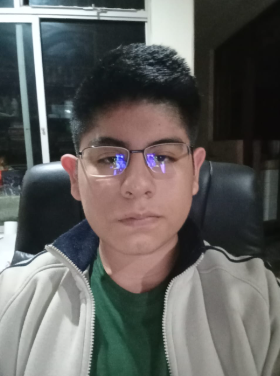

# Capítulo I: Introducción

## 1.1. StartUp Profile

Somos una empresa independiente formada por 5 estudiantes de la Universidad Peruana de Ciencias Aplicadas, dedicados a usar nuestras habilidades y conocimientos, adquiridos en los distintos cursos de Ingeniería, para ayudar a distintos grupos de personas que se puedan beneficiar de las aplicaciones que creemos.

### 1.1.1. Descripción de la StartUp

WanderLog es una startup que surge para ayudar a aquellas personas que necesitan simplificar la planificación de sus viajes de principio a fin, ya sea un viaje largo o corto por motivos de un viaje urgente o poco tiempo para planificar un viaje por ellos mismos.

Misión: Nuestra misión es hacer que viajar se sienta mucho más fácil, accesible y emocionante para todos nuestros usuarios. Por ellos nos comprometemos a ofrecer a nuestros usuarios una plataforma fácil de usar y personalizada que simplifique la planificación de viajes, permitiendo a nuestros usuarios descubrir el mundo sin muchas complicaciones.

Visión: En WanderLog visualizamos un mundo donde cada viaje que haga nuestros usuarios sea una experiencia muy agradable y sin muchas complicaciones. Por ello nos esforzamos por ser una gran industria de las planificaciones de viajes, creando soluciones innovadoras que además promuevan el turismo.

### 1.1.2. Perfiles de Integrantes del equipo

| Nombre Completo del integrante   | Descripcion de Carrera                                                                      | Fotografía                                    | Conocimientos y Habilidades a apuntar                                                                                                                                                                                                                                                     |
| -------------------------------- | ------------------------------------------------------------------------------------------- | --------------------------------------------- | ----------------------------------------------------------------------------------------------------------------------------------------------------------------------------------------------------------------------------------------------------------------------------------------- |
| Cortés Casas, Joaquin Marcelo   | Ingeniería de Software 5to Ciclo 2024-1 Universidad Peruana de Ciencias Aplicadas     |      | Mi edad es de 20 años, soy un estudiante de la carrera de Ingeniería de Software en la UPC. Desde una edad temprana, he tenido un interés por el manejo de la tecnología y la interacción con los videojuegos. Tengo un fuerte sentido de liderazgo al asumir la responsabilidad de coordinar y motivar a los equipos de trabajo en momentos clave. Siempre estoy dispuesto a enfrentar nuevos desafíos y desarrollar mis conocimientos en el entorno del Software.                                                                                                |
| Castilla Pachas, Cesar Antonio  | Ingeniería de Software  5to Ciclo 2024-1 Universidad Peruana de Ciencias Aplicadas |  | Tengo 20 años y estudió la carrera de Ingeniería de Software en la Universidad Peruana de Ciencias Aplicadas (UPC). Me encanta crear páginas web y dar soluciones creativas, soy una persona responsable y puntual. Además me encanta trabajar en equipo. Cada día me gusta aprender algo nuevo y poder ampliar mis conocimientos.                                                                                  |
| Medina Chocce, Karito Dianeth | Ingeniería de Software  5to Ciclo 2024-1 Universidad Peruana de Ciencias Aplicadas |    | Tengo 20 años y me encuentro realizando mis estudios de Ingeniería de Software en la Universidad Peruana de Ciencias Aplicadas (UPC). Desde muy pequeña me ha encantado el diseño de páginas web, la interacción de videojuegos y la inteligencia artificial. Soy una persona amable, responsable y comprometida.                                                                                                                                                           |
| Diaz Silva, Fernando Josué  | Ingeniería de Software  5to Ciclo 2024-1 Universidad Peruana de Ciencias Aplicadas |        | Soy Fernando Diaz, tengo 20 años, me apasiona la tecnología, actualmente estudio la carrera de  ingeniería de software en la Universidad Peruana de Ciencias Aplicadas(UPC). A lo largo de la carrera he desarrollado distintas habilidades, mi principal enfoque en esta carrera parte del software como tal y el ámbito empresarial, para lo cual planeo realizar un MBA. Soy una persona proactiva, responsable y disciplinada. Estoy preparado para desarrollar un buen trabajo junto a mi equipo y aplicar todo el conocimiento adquirido a lo largo de mi carrera.                                                                         |

## 1.2. Solution Profile

### 1.2.1. Antecedentes y Problemática

Actualmente el sector del turismo ha experimentado un gran crecimiento en los últimos años , con un número cada vez más grande de personas viajando ya sea por placer o por temas de trabajo. Sin embargo, cada vez que aumenta la demanda de viajes también aumentan los desafíos asociados con la planificación y organización de viajes. Normalmente la planificación de un viaje requiere una gran cantidad de tiempo y esfuerzo por parte de la persona que quiere viajar, ya sea desde la búsqueda de vuelos y lugar donde hospedarse hasta la selección de actividades y restaurantes en el destino, lo que puede resultar una tarea estresante, especialmente para las personas que tienen horarios muy llenos o sin experiencia de cómo planificar un viaje.
Para definir mejor la problemática, se usará la técnica de las 5W y 2H:

**What:**
La planificación de algún viaje sigue siendo una tarea muy compleja y que toma mucho tiempo para muchas personas que quieren viajar.

**Where:**
Este problema afecta a todos los viajeros de todo el mundo, ya que la planificación de viajes es una necesidad común independientemente del destino elegido.

**When:**
Esta problemática llega en el momento en que una persona o grupo de amigos o familiares decide emprender un viaje, lo que puede ser días o semanas antes de la fecha de partida de su viaje previsto.

**Who:**
La problemática afecta a una gran cantidad de personas, ya sean viajeros novatos o hasta expertos, las cuales buscan una solución eficiente para organizar sus viajes de manera efectiva.

**Why:**
Lo complejo que puede ser buscar mucha información relacionadas con la planificación de un viaje pueden llegar a ser muy abrumadoras, generando estrés y ansiedad en los viajeros y bajando mucho la calidad de la experiencia de viaje.

**How:**
Coordinar múltiples aspectos del viaje, como transporte, alojamiento y actividades, puede llegar a ser complicado y consumir mucho tiempo, especialmente para destinos desconocidos.

**How much:**
La cantidad de tiempo y esfuerzo que se requieren para planificar un viaje varía según la complejidad del itinerario y las preferencias del viajero, pero puede llevar horas o incluso días completos de investigación y reserva del viaje.

### 1.2.2. Lean UX Process

#### 1.2.2.1. Lean UX Problem Statements

Las personas que desean realizar un viaje se enfrentan a una experiencia complicada y estresante al planificar sus viajes que tanto han esperado debido a la falta a la falta de herramientas eficientes y personalizadas que simplifique la organización de itinerarios completos, ya sea desde la reserva de un vuelo y lugar de hospedaje hasta la selección de lugares turísticos al cual visitar. 
Para solucionarlo queremos proporcionar a los viajeros una solución fácil de usar que les permita planificar y organizar sus viajes de manera más eficiente, teniendo en cuenta sus preferencias individuales y ofreciendo recomendaciones personalizadas para una experiencia de viaje inolvidable.

#### 1.2.2.2. Lean UX Assumptions

**User Assumptions**

- **¿Quién es el usuario?**

    Nuestros usuarios son personas que disfrutan mucho viajar pero que encuentran muy estresante la planificación de viajes debido a la gran cantidad de detalles que deben tener en cuenta.

- **¿Dónde encaja nuestroservicio en su vida?**

    WanderLog se integra en la planificación de viajes de los usuarios, proporcionando una herramienta centralizada para organizar y gestionar cada aspecto de su itinerario y realizar reservaciones a través de nuestro aplicativo.

- **¿Qué problemas tiene nuestro producto y cómo se pueden resolver?**

    Resuelve la dificultad y la complejidad que da la planificación de viajes al proporcionar una solución fácil que genera itinerarios personalizados y reservaciones en función del destino y las preferencias de los usuarios.

- **¿Cuándo y cómo es usado nuestro producto?**

    Se utiliza principalmente durante la fase de planificación del viaje de nuestros usuarios, donde los usuarios necesitan organizar ya sea vuelos, buses, alojamiento, actividades y opciones de restauración para cada día de su viaje.

**User Outcomes**

- Los usuarios pueden planificar fácilmente cada aspecto de su viaje, desde vuelos/buses hasta actividades recreativas, ahorrando tiempo y esfuerzo en la planificación.
- Los usuarios disfrutan de una experiencia de viaje más personalizada y adaptada a sus intereses y preferencias individuales.
- Los usuarios pueden descubrir nuevas experiencias y destinos gracias a las recomendaciones y sugerencias proporcionadas por el aplicativo.

**Business Assumptions**

- Los usuarios valoran la conveniencia y la personalización en la planificación de sus viajes, buscando soluciones que les permitan organizar fácilmente cada aspecto de su itinerario y realizar reservas de manera más fácil.
- Proporcionar información precisa y actualizada sobre vuelos, buses, hoteles, restaurantes y  varias actividades recreativas aumentará la confianza del usuario en nuestro servicio y mejorará su experiencia.
- Una interfaz de usuario intuitiva y fácil de usar aumentará la satisfacción del usuario y la adaptación del servicio.
- La integración con múltiples proveedores de servicios de viaje asegurará una amplia variedad de opciones para los usuarios y aumentará la competitividad del servicio en el mercado.
- Al satisfacer las necesidades de los usuarios de manera efectiva, podemos expandir nuestra base de usuarios.
- La retroalimentación continua de los usuarios nos permitirá mejorar y adaptar nuestro servicio para satisfacer sus necesidades en constante evolución y mantenernos competitivos en el mercado.

**Business Outcomes**

- Aumento de la satisfacción del usuario debido a la conveniencia y personalización del servicio, lo que puede llevar a una mayor retención de usuarios y recomendaciones positivas.
- Generación de ingresos a través de acuerdos de afiliación con proveedores de servicios de viaje y posibles modelos de suscripción premium.
- Expansión de la base de usuarios a medida que el servicio se vuelve más conocido y valioso para viajeros de todo el mundo.

**Features**

- **¿Que características son importantes?**
    - Generación automática de itinerarios en base al destino y las preferencias del usuario.
    - Integración con múltiples proveedores de servicios de viaje para reservas de vuelos/buses, hoteles y actividades.
    - Funcionalidad de planificación de día a día, que permite a los usuarios organizar actividades, restaurantes y lugares de interés para cada día de su viaje

- **¿Cómo debería verse y comportarse nuestro servicio?**

    - Debe tener un diseño intuitivo y fácil de usar, con una navegación clara y opciones de búsqueda avanzadas para encontrar fácilmente información relevante y opciones de viaje.
    - Debe proporcionar recomendaciones personalizadas y sugerencias basadas en las preferencias y actividades pasadas del usuario, ofreciendo una experiencia de usuario altamente relevante y atractiva.

#### 1.2.2.3. Lean UX Hypothesis Statements

- Creemos que al ofrecer a nuestros usuarios itinerarios de viaje altamente personalizados basados en el destino elegido por el usuario y sus preferencias, aumentaremos aún más la probabilidad de que nuestros usuarios utilicen aun mas nuestros servicios para planificar sus viajes.
- Suponemos que al proporcionar información nutricional precisa y detallada sobre las opciones de alimentos en diversos restaurantes recomendados en nuestros itinerarios de viaje, aumentaremos la confianza del usuario en nuestro servicio y mejoramos su experiencia en su viaje.
- Si proporcionamos una interfaz de usuario creativa y fácil de usar, así como un sistema de filtrado avanzado para ayudar a los usuarios a encontrar mas rápido la información relevante y las opciones de viaje, aumentaremos la satisfacción del usuario y la adaptación al servicio.
- Creemos que al agregar múltiples proveedores de servicios de viaje para vuelos o buses, alojamiento, actividades y restaurantes, aseguraremos una amplia variedad de opciones para los usuarios y aumentaremos la competitividad del servicio en el mercado.
- Suponemos que al leer continuamente comentarios y sugerencias de los usuarios y utilizarlos para mejorar y adaptar nuestro servicio, podemos mantenernos competitivos en el mercado y satisfacer las necesidades de nuestros usuarios.

#### 1.2.2.4. Lean UX Canvas

## 1.3. Segmentos objetivo

Nuestro segmento objetivo está compuesto por dos tipos de usuarios:
- **Viajeros Turísticos:**

    Personas que viajan ocasionalmente ya sea por placer, vacaciones o negocios. Suelen tener muy poca experiencia en la planificación de viajes y por ello buscan soluciones que les pueda facilitar organizar sus itinerarios de manera rápida y eficiente.

- **Viajes escolares:**

    Padres de familia que desean planificar los viajes de los estudiantes de una promoción escolar, necesitando coordinar paquetes que incluyan a un conjunto de chicos menores de edad, respetando su presupuesto limitado.

