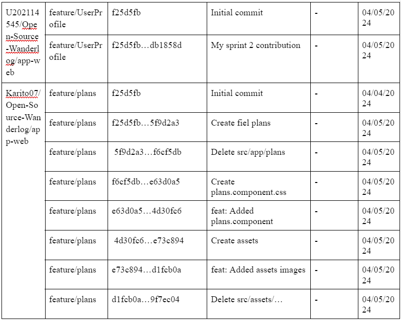

#### 5.2.2.1 Sprint Planning 2
<table>
<tr>
    <th colspan="5">Sprint #</th>
    <th colspan="9">Sprint 2</th>
  </tr>
      <tr>
    <td colspan="13">Sprint Planning Background</td>
  </tr>
  <tr>
    <td colspan="5">Date</td>
    <td colspan="8">26/04/2024</td>
</tr>
  <tr>
    <td colspan="5">Time</td>
    <td colspan="8">9 dias</td>
  </tr>
  <tr>
    <td colspan="5">Location</td>
    <td colspan="8">Virtual</td>
<tr>
    <td colspan="5">Prepared By</td>
    <td colspan="8">Cortés Casas Joaquín Marcelo, Díaz Silva Fernando Josué,
Castilla Pachas Cesar Antonio,
Medina Chocce Karito Dianeth</td>
</tr>
<tr>
    <td colspan="5">Attendees (to planning meeting)</td>
    <td colspan="8">Cortés Casas Joaquín Marcelo, Díaz Silva Fernando Josué,
Castilla Pachas Cesar Antonio,
Medina Chocce Karito Dianeth</td>
</tr>
<tr>
    <td colspan="5">Sprint n – 2 Review Summary</td>
    <td colspan="8">US- 10: Exploración de destinos populares (8 us. points)  
Como viajero ocasional, quiero poder explorar una variedad de destinos populares y obtener recomendaciones personalizadas para inspirarme en mi próximo viaje.    
US- 14: Registro de cuenta de usuario (5 us. points)  
Como viajero ocasional, quiero poder registrarme fácilmente en la plataforma para acceder a todas las funcionalidades del aplicativo     
US- 16: Sección de ofertas especiales (5 us. points)  
Como viajero ocasional, quiero ver una sección de ofertas especiales en la página de inicio para acceder a descuentos exclusivos en vuelos y alojamientos    
US- 20:Sección de paquetes estudiantiles (8 us. points)  
Como padre interesado en los servicios ofrecidos por el aplicativo, quiero encontrar una sección dedicada a los paquetes estudiantiles en el sitio web, para obtener información sobre ofertas especiales, descuentos y servicios dirigidos específicamente a estudiantes como mis hijos.</td>
</tr>
<tr>
    <td colspan="5">Sprint n – 2 Retrospective Summary</td>
    <td colspan="8">En esta sección todos los integrantes mencionaron tener aciertos en partes del código y en otras partes poder mejorar sus habilidades realizando el FrontEnd Web Application</td>
</tr>
<tr>
    <td colspan="13">Sprint Goal & User Stories</td>
</tr>
<tr>
    <td colspan="5">Sprint n Goal</td>
    <td colspan="8">Desplegar la primera versión del Aplicativo web</td>
</tr>
<tr>
    <td colspan="5">Sprint n Velocity</td>
    <td colspan="8">18 story points</td>
</tr>
<tr>
    <td colspan="5">Sum of Story Points</td>
    <td colspan="8">26 Story Points</td>
</tr>
</table>

#### 5.2.2.2 Sprint Backlog 2

#### 5.2.2.3 Development Evidence for Sprint Review 

#### 5.2.2.4. Testing Suite Evidence for Sprint Review

